# 许可证

本项目采用 **GNU Affero General Public License v3.0 (AGPL-3.0)** 进行许可。  

详见根目录 [`LICENSE`](./LICENSE) 文件。

# 时伴 SmartMate

> 越用越懂你的成长型 AI 排程伙伴 · 面向大学生的陪伴式日程管理平台

# 1 项目概览

## 1.1 总体介绍

时伴（SmartMate）是面向大学生的 AI 排程伙伴。通过自然语言对话管理课表与任务，更能在一次次交流中记住你的习惯、偏好和生活节奏——**越用越懂你，越排越贴心。**

核心能力包括：大规模智能排程、基于课表的任务编排、AI 驱动的"小事随口记"，以及跨会话的长期记忆积累——做到：**一个伙伴，包揽生活大小事。**

本项目采用前后端分离设计，并且有一个**完整的工业化设计链路**：写功能-墨刀画页面-根据页面写接口-写后端-写前端(AI)。

## 1.2 项目解决的痛点

> **问题1：** 传统的日程平台(类似于滴答清单等)要么设置重复任务(例如每日背单词、每日刷题等)，要么就需要手动设置任务，非常不方便。一旦遇到需要大规模安排任务的场景，例如期末考前半个月突击(涉及的科目多，手头的空余时间也多，每门课的任务又都不一样)，就需要先手动规划好任务，再手指点个不停给它排进日程软件里面，还得思考怎样排比较合理，一旦执行出问题需要调整，又像多米纳骨牌倒了一样，连着调整一大块。

**本项目带来的解决方案1：** 采用类似于老师备课-教务处排课的"备课-排课"模式。即假如你是学校上课的老师，你先在"备课区"把这门课程的"教学"大纲排好，然后再考虑后面安排上课的事情。

拿概率论举例子，你准备给它16节课时间复习，那你就在新增任务类的区域**创建新任务类**，并设置好在第x**任务块**看xx章节的速成课，然后第x任务块是真题练习。

设置完了之后，再通过我们的排课功能(会先设计一个保证能排的算法，第二批次开发还会考虑AI介入让课排的更好)，你设置一些排课的倾向(更倾向于在哪个时间点学、不想在哪个时间点学、想每天均匀推进还是快速突击等等)，点一下**智能一键编排**按钮，会将课直接以黄色打底的形式嵌入日程中，确认无误后你点击正式应用日程，课才会真正被排进去。

至于调整，本项目支持在课表区域直接拖拽调整时间。

> **问题2：** 期末周没课，确实可以按照上面一样操作。那我如果不是期末复习呢，我如果想安排一些别的事情呢，比如推进项目？我平时可是有课的，而且有不少水课。传统的日程软件可没法在水课处排课，要么忘记去上水课，要么忘记任务，十分恼火。

**本项目带来的解决方案2：** 本项目支持学校课表导入，甚至还支持水课嵌入任务。在导入课表之后，本项目支持勾选某些课程为"**可嵌入任务**"状态，此时就可以配合上面的排课系统，将水课作为可用的区域，排任务进去。

> **问题3：** 那么我作为一个规划能力比较差的懒人，也能用这个项目来让自己变的充实吗？

**本项目带来的解决方案3：** 当然可以，这就是本项目接入AI的意义。聊天区域的AI将会被调教成一个日程安排的小助手，既能满足你简单的对日程的增删改查，又能协助你从0开始一点点制定属于你的计划。(**第一批次开发计划**只支持AI随口记这一"增"的功能，以及大多数能想到的"查"功能，暂时无让AI改和删的想法)

> **问题4：** 我平时会突然冒出来一个能让自己活的更舒服亦或是变得更好的小想法(例如把桌面理一下、给自己挑一件新衣服等)，但是现在很忙，根本没时间做，然后等忙完了有时间了又忘记了。传统的日程软件确实能让我记录下来(比如将这个小想法记录在日程软件的四象限里面的"不重要不紧急"象限)，就是太麻烦了。
>
> 还有，平时上课时，接踵而至的实验报告、小组作业等，也面临着类似的情况，既容易忘记，又懒得记录。

**本项目带来的解决方案4：** 本项目支持AI驱动的"随口记"功能。

你可以和本项目的AI助手说："提醒我**有空的时候**给自己挑一件新衣服"(**请注意标粗的关键词**)，AI助手就会自动评估这件小事的难度以及执行所需花费的时间：如果这件事很简单或者不费时，会被加入"简单不重要"的队列中；如果比较费时或者困难，就会被加入"不简单不重要"队列中。

至于突发任务，也支持使用该"随口记"功能。你可以这么说："提醒我**下周周日之前**完成xx课程的大作业"(**请注意标粗的关键词**)，AI就会自动通过**截止时间和任务量**判断是否紧急，选择将其加入"重要并紧急"或者"重要不紧急"任务队列中(这里也是借鉴了四象限设计)。并且，系统会**每经过一个固定时间，就自动调整两个任务队列中未完成任务的位置**(比如：随着DDL临近，将重要不紧急队列中的未完成任务挪到重要并紧急队列中)。

当你在空闲时(做完你的大主线之后)，亦或是休息时间打开本项目，一眼就能看到这几个队列的事情，然后你就可以看心情选择做哪个，然后做完之后一划就完事。

> **问题5：** 每次打开 AI 助手，都要重新告诉它"我周三有课"、"我更喜欢早上学数学"。传统工具对你没有记忆，每次都从零开始，永远是个陌生人。

**本项目带来的解决方案5：** 时伴内置长期记忆系统，会在对话中自动抽取并积累关于你的事实与偏好（课程、习惯、目标等）。下次对话时自动召回相关记忆注入上下文，跨会话延续对你的了解，且支持全链路优雅降级——记忆检索失败不阻断正常对话。

## 1.3 项目实现的功能

1. **对用户目前时间尺度的适应。**

   如果用户是正在上学的大学生，时间尺度可以设置为以学校排课为主，通用时间为辅(以第1-2节，第3-4节这种的学校排课的时间方式为主，又能兼容某个特定时间的突发小事，做到对总体执行效率和事情安排效率的兼顾)；

   如果用户既想要自定义时间，又想要一键编排任务，本项目还支持用户自定义时间尺度，例如设置9:00-11:00为第一节课等。

2. **导入学校课表。** 如果用户选择以学校排课为主的时间尺度，本项目支持快速导入学校课表(只会尝试兼容CQUPT的课表格式)，以便后续以课表为基底的日程安排。

3. **"水课"任务嵌入。** 正如上方**问题2**所言，在导入课表后，支持设置某一门你想拿来干其它事情的课为"可嵌入任务"状态，此时这门课所占据的时间区域就是可以嵌入任务的了，但是仍然有区别于其它完全空白的时间区域，便于真正安排适合在嘈杂环境下做的事情。

4. **设置某一任务类，并提前安排其执行路线。** 正如上方**问题1**所言，用户可以先设置一个大的任务类(例如概率论复习、算法进阶计划等等)，再在这个任务类下方安排其在对应时间尺度下的执行计划(例如第1-2节干啥，第3-4节干啥)，方便后续的日程编排。

5. **一键编排任务。** 结合算法、用户偏好以及AI的建议，将任务基于上方的时间尺度、导入的课表，排进日程中，并给出这样排的理由(如果动用了AI)。  

6. **AI随口记。** 正如问题4所言，就是支持通过AI随手记录一些大小事。

7. **多用户。** 本系统可支持多个用户同时使用，并且记录AI对话、编排任务的Token使用情况等，并进行限额。

8. **动态任务和静态任务。**   **动态任务**包括学校的课和排入日程中的任务类，这些任务随着时间往后会默认已经完成，无需手动勾选；

   而**静态任务**为四个任务队列中的任务，这些任务需要手动勾选为完成状态。

9. **完成任务状态的撤回。** 无论是因为哪种情况，是误触给队列里面的任务打钩，还是水课翘课了被叫回去点名导致任务中断，都支持**撤回**这个"任务已完成"的状态。

   前者，用户只需要在队列的下沉列表中找到该任务然后点击一下灰色的勾即可(模仿了滴答清单的设计)。

   至于后者，由于后者为动态任务，所以用户需要手动去"最近已完成任务"的清单里面选择该任务然后恢复，此时任务会自动回到未安排状态。目前暂不支持课程的撤回，课程方面的改动目前仅支持删除，其它操作后续考虑开发。

10. **长期记忆积累。** 系统在对话中自动抽取用户相关事实与偏好，跨会话召回并注入对话上下文，实现"越用越懂你"的个性化体验。支持结构化检索 + 向量召回双路召回，全链路优雅降级。

# 2 产品逻辑与设计

## 2.1 业务流程图


## 2.2 原型展示

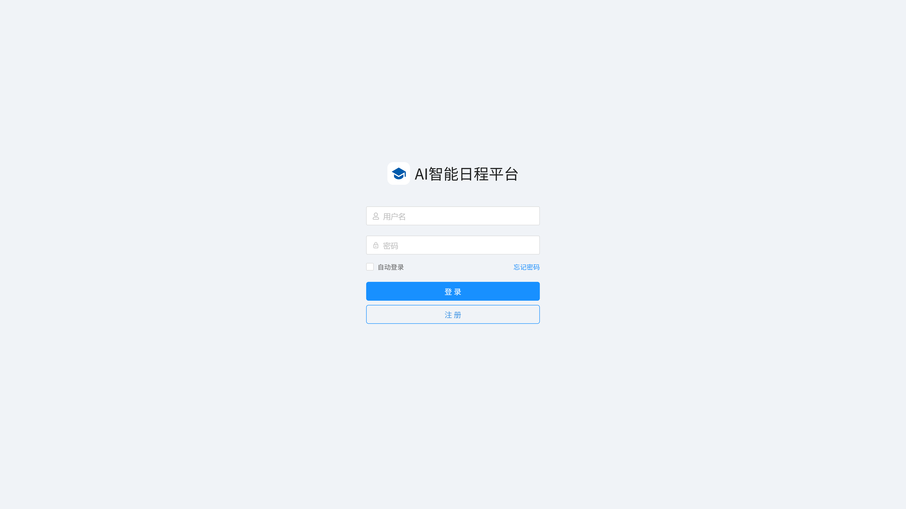

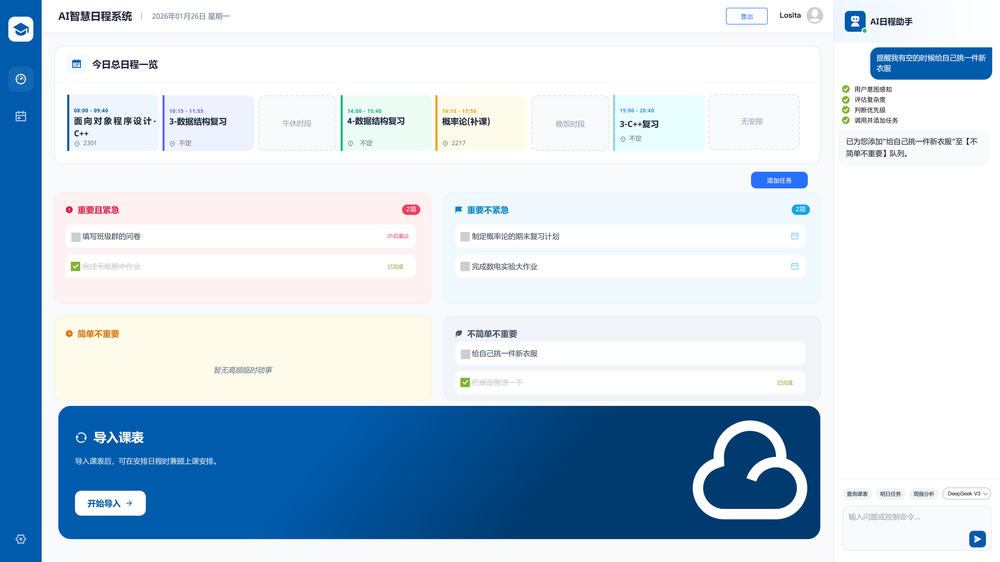

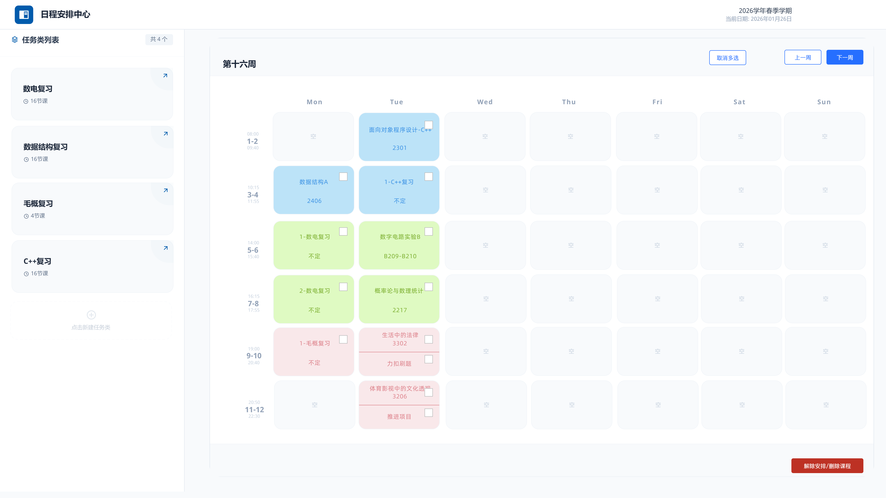

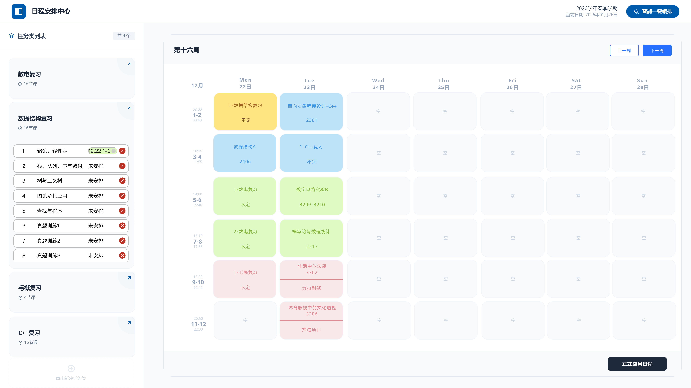

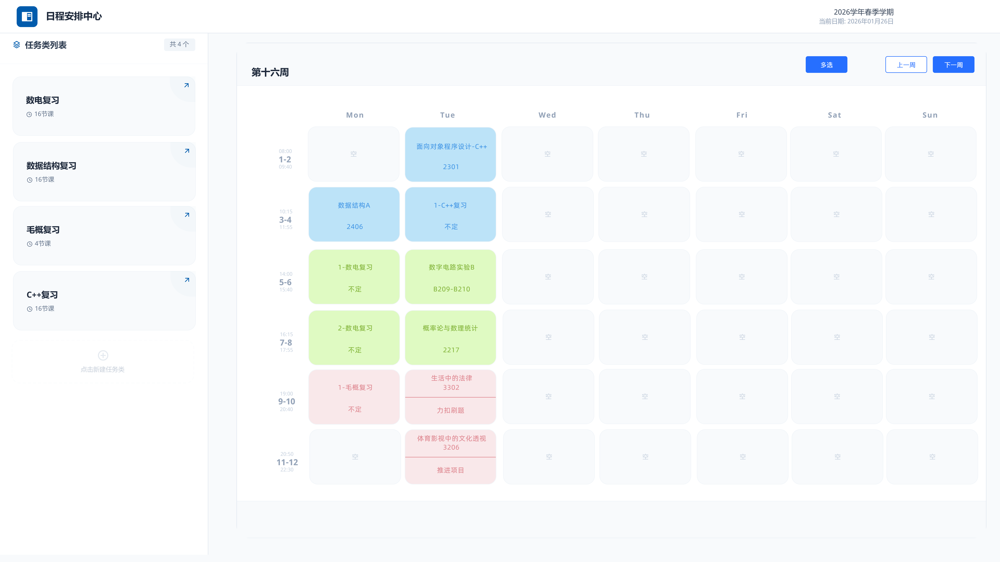

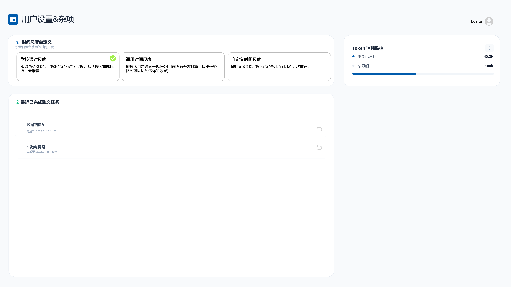

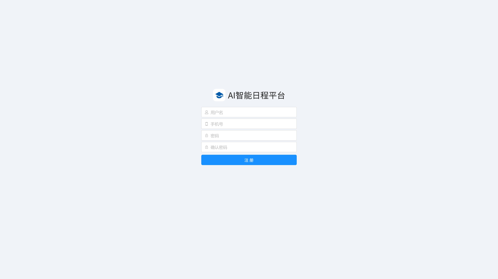

# 3 后端数据架构

## 3.1 ER图

PS：此图截至版本v0.3.3

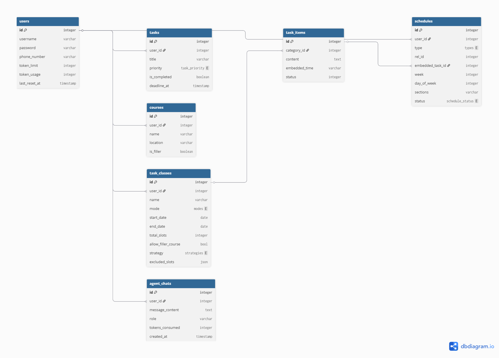

## 3.2 核心表结构

其实每个表都很核心。在此展示它们的创建语句：

```sql
CREATE TABLE `agent_chats`
(
    `id`              int       NOT NULL AUTO_INCREMENT,
    `user_id`         int            DEFAULT NULL,
    `message_content` text COMMENT '用户或AI的话',
    `role`            varchar(255)   DEFAULT NULL COMMENT 'user / assistant',
    `tokens_consumed` int            DEFAULT '0' COMMENT '单次消耗，用于累加到 users 表',
    `created_at`      timestamp NULL DEFAULT CURRENT_TIMESTAMP,
    PRIMARY KEY (`id`),
    UNIQUE KEY `uk_agent_chats_id` (`id`),
    KEY `user_id` (`user_id`),
    CONSTRAINT `agent_chats_ibfk_1` FOREIGN KEY (`user_id`) REFERENCES `users` (`id`)
) ENGINE = InnoDB
  DEFAULT CHARSET = utf8mb4
  COLLATE = utf8mb4_0900_ai_ci
  
CREATE TABLE `courses`
(
    `id`        int          NOT NULL AUTO_INCREMENT,
    `user_id`   int          DEFAULT NULL,
    `name`      varchar(255) NOT NULL,
    `location`  varchar(255) DEFAULT NULL,
    `is_filler` tinyint(1)   DEFAULT '0',
    PRIMARY KEY (`id`),
    UNIQUE KEY `uk_courses_id` (`id`),
    KEY `user_id` (`user_id`),
    CONSTRAINT `courses_ibfk_1` FOREIGN KEY (`user_id`) REFERENCES `users` (`id`)
) ENGINE = InnoDB
  DEFAULT CHARSET = utf8mb4
  COLLATE = utf8mb4_0900_ai_ci
  
CREATE TABLE `schedule_events`
(
    `id`              int                    NOT NULL AUTO_INCREMENT,
    `user_id`         int                    NOT NULL,
    `name`            varchar(255)           NOT NULL COMMENT '课程或任务名称',
    `location`        varchar(255)                    DEFAULT '' COMMENT '地点 (教学楼/会议室)',
    `type`            enum ('course','task') NOT NULL COMMENT '日程类型',
    `rel_id`          int                             DEFAULT NULL COMMENT '关联原始数据ID (如教务系统的课程ID)',
    `can_be_embedded` tinyint(1)             NOT NULL DEFAULT '0' COMMENT '是否允许在此时段嵌入其他任务',
    `created_at`      timestamp              NULL     DEFAULT CURRENT_TIMESTAMP,
    `updated_at`      timestamp              NULL     DEFAULT CURRENT_TIMESTAMP ON UPDATE CURRENT_TIMESTAMP,
    `start_time`      datetime                        DEFAULT NULL COMMENT '任务开始的绝对时间',
    `end_time`        datetime                        DEFAULT NULL COMMENT '任务结束的绝对时间',
    PRIMARY KEY (`id`),
    KEY `idx_user_events` (`user_id`),
    KEY `idx_user_endtime` (`user_id`, `end_time` DESC),
    CONSTRAINT `fk_event_user` FOREIGN KEY (`user_id`) REFERENCES `users` (`id`) ON DELETE CASCADE
) ENGINE = InnoDB
  AUTO_INCREMENT = 148
  DEFAULT CHARSET = utf8mb4
  COLLATE = utf8mb4_0900_ai_ci
  
CREATE TABLE `schedules`
(
    `id`               int NOT NULL AUTO_INCREMENT,
    `event_id`         int NOT NULL COMMENT '关联元数据ID',
    `user_id`          int NOT NULL COMMENT '冗余UID方便直接查询',
    `week`             int NOT NULL COMMENT '周次 (1-25)',
    `day_of_week`      int NOT NULL COMMENT '星期 (1-7)',
    `section`          int NOT NULL COMMENT '原子化节次 (1-12)',
    `embedded_task_id` int                           DEFAULT NULL COMMENT '若为水课嵌入，记录具体的任务项ID',
    `status`           enum ('normal','interrupted') DEFAULT 'normal' COMMENT '状态: 正常/因故中断',
    PRIMARY KEY (`id`),
    UNIQUE KEY `idx_user_slot_atomic` (`user_id`, `week`, `day_of_week`, `section`),
    KEY `idx_event_id` (`event_id`),
    KEY `fk_embedded_task` (`embedded_task_id`),
    CONSTRAINT `fk_embedded_task` FOREIGN KEY (`embedded_task_id`) REFERENCES `task_items` (`id`) ON DELETE SET NULL,
    CONSTRAINT `fk_schedule_event` FOREIGN KEY (`event_id`) REFERENCES `schedule_events` (`id`) ON DELETE CASCADE,
    CONSTRAINT `fk_schedule_user` FOREIGN KEY (`user_id`) REFERENCES `users` (`id`) ON DELETE CASCADE
) ENGINE = InnoDB
  AUTO_INCREMENT = 214
  DEFAULT CHARSET = utf8mb4
  COLLATE = utf8mb4_0900_ai_ci
  
CREATE TABLE `task_classes`
(
    `id`                  int NOT NULL AUTO_INCREMENT,
    `user_id`             int                     DEFAULT NULL,
    `name`                varchar(255)            DEFAULT NULL,
    `mode`                enum ('auto','manual')  DEFAULT NULL,
    `start_date`          date                    DEFAULT NULL,
    `end_date`            date                    DEFAULT NULL,
    `total_slots`         int                     DEFAULT NULL COMMENT '分配的总节数',
    `allow_filler_course` tinyint(1)              DEFAULT '1',
    `strategy`            enum ('steady','rapid') DEFAULT NULL,
    `excluded_slots`      json                    DEFAULT NULL COMMENT '不想要的时段切片',
    PRIMARY KEY (`id`),
    UNIQUE KEY `uk_task_classes_id` (`id`),
    KEY `idx_task_classes_user_id` (`user_id`),
    CONSTRAINT `task_classes_ibfk_1` FOREIGN KEY (`user_id`) REFERENCES `users` (`id`)
) ENGINE = InnoDB
  AUTO_INCREMENT = 15
  DEFAULT CHARSET = utf8mb4
  COLLATE = utf8mb4_0900_ai_ci
  
CREATE TABLE `task_items`
(
    `id`            int NOT NULL AUTO_INCREMENT,
    `category_id`   int  DEFAULT NULL,
    `content`       text,
    `embedded_time` json DEFAULT NULL COMMENT '目标时间{date,section_from,section_to}',
    `status`        int  DEFAULT NULL COMMENT '1:未安排, 2:已应用',
    `order`         int  DEFAULT NULL,
    PRIMARY KEY (`id`),
    UNIQUE KEY `uk_task_items_id` (`id`),
    KEY `task_items_ibfk_1` (`category_id`),
    CONSTRAINT `task_items_ibfk_1` FOREIGN KEY (`category_id`) REFERENCES `task_classes` (`id`) ON DELETE CASCADE
) ENGINE = InnoDB
  AUTO_INCREMENT = 43
  DEFAULT CHARSET = utf8mb4
  COLLATE = utf8mb4_0900_ai_ci
  
CREATE TABLE `tasks`
(
    `id`           int          NOT NULL AUTO_INCREMENT,
    `user_id`      int               DEFAULT NULL,
    `title`        varchar(255) NOT NULL,
    `priority`     int               DEFAULT NULL,
    `is_completed` tinyint(1)        DEFAULT '0',
    `deadline_at`  timestamp    NULL DEFAULT NULL,
    PRIMARY KEY (`id`),
    UNIQUE KEY `uk_tasks_id` (`id`),
    KEY `idx_user_id` (`user_id`),
    CONSTRAINT `tasks_ibfk_1` FOREIGN KEY (`user_id`) REFERENCES `users` (`id`),
    CONSTRAINT `chk_priority` CHECK ((`priority` in (1, 2, 3, 4)))
) ENGINE = InnoDB
  AUTO_INCREMENT = 23
  DEFAULT CHARSET = utf8mb4
  COLLATE = utf8mb4_0900_ai_ci
  
CREATE TABLE `users`
(
    `id`            int          NOT NULL AUTO_INCREMENT,
    `username`      varchar(255) NOT NULL,
    `password`      varchar(255) NOT NULL,
    `phone_number`  varchar(255)      DEFAULT NULL,
    `token_limit`   int               DEFAULT '100000',
    `token_usage`   int               DEFAULT '0',
    `last_reset_at` timestamp    NULL DEFAULT NULL COMMENT '上次周用量重置时间',
    PRIMARY KEY (`id`),
    UNIQUE KEY `username` (`username`),
    UNIQUE KEY `uk_users_id` (`id`)
) ENGINE = InnoDB
  AUTO_INCREMENT = 4
  DEFAULT CHARSET = utf8mb4
  COLLATE = utf8mb4_0900_ai_ci
```

# 4 接口契约

## 4.1 核心API列表(ApiFox)

链接如下：https://oqg5uiubh0.apifox.cn

## 4.2 Agent可调用的工具定义


# 5 后端实现

## 5.1 技术栈

| **分类**          | **选用技术**     | **在时伴中的应用场景**                          |
| ----------------- | ---------------- | ------------------------------------------------------------ |
| **Web 框架**      | **Gin**          | 负责全站 API 的路由分发，处理任务增删改查及智能排程的请求。  |
| **持久层数据库**  | **MySQL 8.0**    | 存储用户、任务、课表及日程运行图（Schedules）的核心数据。    |
| **ORM 框架**      | **GORM**         | 用于简化 Go 与数据库的交互，利用事务处理 `Apply` 接口的原子性操作。 |
| **高性能缓存**    | **Redis**        | 缓存用户的周日程视图（避免频繁扫表）、存储 Token 临时限额、实现分布式锁防止重复排程。 |
| **消息队列**      | **Outbox + Kafka** | **可靠异步解耦**：请求主链路先写 Outbox，后台再投递 Kafka 并消费落库，既降低首字延迟又避免消息瞬时丢失。 |
| **AI 编排框架**   | **Eino**         | 作为 AI Agent 的大脑，根据排程策略（Steady/Rapid）计算任务与水课的嵌入逻辑。 |
| **身份认证**      | **JWT**          | 实现无状态登录，将 `user_id` 封装在 Token 中，确保数据的用户隔离。 |
| **配置管理**      | **Viper**        | 管理数据库、Redis、Kafka 的连接参数，支持多环境（开发/生产）切换。 |
| **API 文档/调试** | **Apifox**       | 维护接口协议，进行前后端联调及自动化测试。                   |
| **日志监控**      | **Zap / Logrus** | 记录系统运行状态，特别是 Kafka 消费失败或 AI 接口超时的错误日志。 |

## 5.2 架构图

PS：截至v0.3.3。其中黑色箭头为请求数据链路，绿色箭头为返回数据，虚线箭头为控制流。

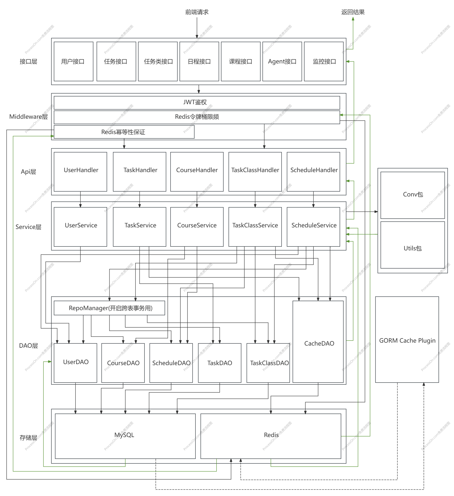

## 5.3 核心算法

### 5.3.1 智能排课算法

本系统采用 **“原子化时间网格（Atomic TimeGrid）”** 架构，实现了针对大学生复杂课表环境的智能任务填充。算法核心分为 **“沙盘模拟”、“边界感知探测”** 与 **“逻辑位移步进”** 三大模块。

**1. 原子化时间沙盘 (Grid Sandboxing)**

算法首先将物理时间窗口（StartDate 到 EndDate）抽象为一个三维矩阵 $Grid[Week][Day][Section]$。

- **多维状态标记**：每个格子（Slot）是携带 `Status` 和 `EventID` 的 `slotNode` 节点。
- **优先级注水（Hydration）**：
  1. **Blocked（屏蔽区）**：根据用户配置的 `ExcludedSlots` 强制锁定，优先级最高。
  2. **Filler（嵌入区）**：识别“水课”，标记为可利用资源。
  3. **Occupied（占用区）**：映射既有硬核课程，确保调度不产生物理冲突。

**2. 边界感知探测 (Boundary-Sensing Detection)**

为了解决“任务块跨课分身”的 Bug，算法引入了 **EventID 校验机制**。

- **容器自适应长度**：当算法探测到一个 `Filler` 槽位时，会向后贪心扫描，只有当相邻槽位的 `EventID` 相同且同为 `Filler` 时，才允许任务块拉伸。
- **逻辑闭环**：这保证了任务块（TaskItem）要么完美嵌入单门水课，要么占据空地，绝不会出现一个任务横跨两门不同课程的情况。

**3. 稳扎稳打：逻辑位移步进 (Logical-Offset Skipping)**

在 `Steady`（稳扎稳打）模式下，为了实现负载均衡，算法弃用了传统的“物理时间跳跃”，改用 **“逻辑坑位跳跃”**。

$$Gap = \frac{TotalAvailableSlots - (TaskCount \times 2)}{TaskCount + 1}$$

- **物理跳跃（旧版/错误）**：直接 $Time + Gap$，容易因遇到屏蔽时段或硬核课而导致游标溢出，从而“吞掉”后续任务。
- **逻辑跳跃（现行/优化）**：调用 `skipAvailableSlots` 函数，在 Grid 中沿时间轴向后数出 $Gap$ 个**真正可用**的格子作为下一个起点。
- **价值**：确保了在有限的 **2C4G** 服务器资源下，任务能像“等距列队”一样均匀分布在学期空隙中。

------

**🛠️ 算法运行流程**

1. **Build**：调用 `buildTimeGrid`，将数据库的离散 `Schedules` 映射为内存状态网格。
2. **Count**：统计当前窗口内所有 `Free` 与 `Filler` 的原子位总数。
3. **Allocate**：
   - 通过 `FindNextAvailable` 锁定首个合法坑位。
   - 进行 **容器探测** 决定任务块长度。
   - 执行 `skipAvailableSlots` 寻找下一个负载均衡点。
4. **Preview**：输出 DTO 到前端，标记 `status: "suggested"` 供用户预览高亮。

------

**⚡ 性能表现 (Optimization)**

- **时间复杂度**：$O(W \times D \times S)$，其中 $W$ 为任务类跨度周数。在处理典型的 16 周排程时，计算量仅在数千次操作级别，单机响应达毫秒级。
- **空间复杂度**：由于采用了按需创建周 Map 的策略，内存占用随任务跨度动态伸缩，极大地减轻了重庆邮电大学校园服务器环境下的 GC 压力。

------

**数据回填**

在执行完上述算法后，将任务块分成两类数据：

1. 需要新建`ScheduleEvent`的，插入纯空闲时段的数据；
2. 直接嵌入现有课程中的任务块；

然后分别调用不同的业务逻辑，开启大事务，批量插入，使得只需要连接2次数据库，并且若插入出错，支持批量回滚，不会存在任何脏数据。

## 5.4 Agent范式实现细节

### 1) 总分流图（消息识别后的去向）

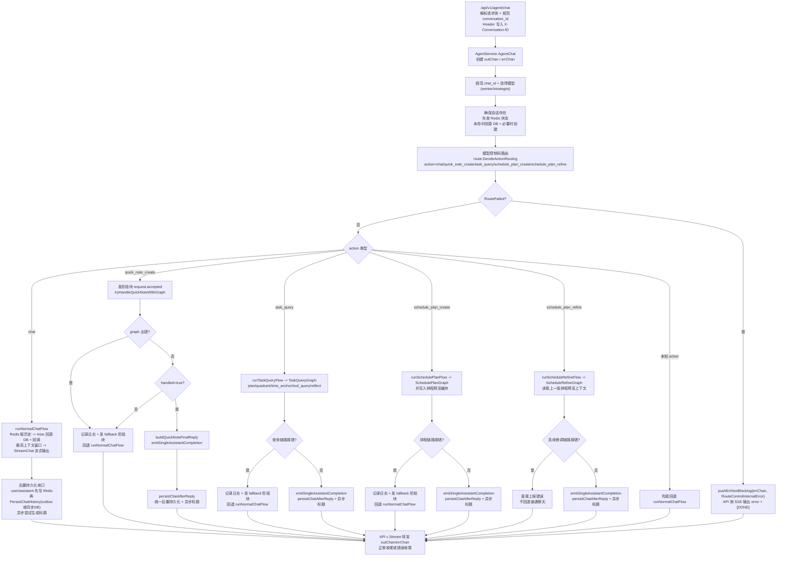

### 2) 命中“添加日程/随口记”后的业务流转

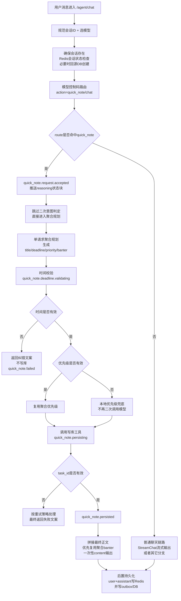

### 3) 命中“随口问/任务查询”后的业务流转

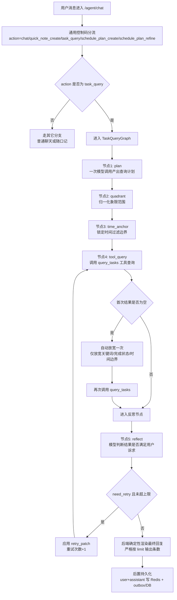

### 4) 命中新建“智能排程”后的业务流转图

```mermaid
flowchart TD
    A["命中 action=schedule_plan_create<br/>发 request.accepted 阶段块"] --> B["runSchedulePlanFlow 入口"]
    B --> B1{"依赖齐全?<br/>model + 3个函数注入"}
    B1 -- "否" --> B2["返回 error 给上层<br/>上层回退普通聊天"]
    B1 -- "是" --> C["清理旧预览缓存<br/>DeleteSchedulePlanPreview<br/>失败仅记日志"]
    C --> D["加载对话历史<br/>Redis 优先 -> miss 回源 DB<br/>失败降级为空历史继续"]
    D --> E["RunSchedulePlanGraph<br/>注入并发度与预算配置"]

    E --> P1["plan 节点<br/>合并 extra.task_class_ids + 模型提取约束/策略/标签<br/>模型失败时可用 extra 兜底"]
    P1 --> P1B{"FinalSummary 非空<br/>或 task_class_ids 为空?"}
    P1B -- "是" --> PX["exit 节点 -> END<br/>直接返回已有失败文案"]
    P1B -- "否" --> P2["rough_build 节点<br/>HybridScheduleWithPlanMulti 构建 HybridEntries<br/>可选解析全局窗口(起止周/天)"]

    P2 --> P2B{"HybridEntries 为空<br/>或构建失败?"}
    P2B -- "是" --> PX
    P2B -- "否" --> P3{"len(task_class_ids) >= 2 ?"}

    P3 -- "是" --> P4["daily_split<br/>按周天拆 DayGroup + 注入 ContextTag<br/>suggested<=2 标记 SkipRefine"]
    P4 --> P5["daily_refine(并发)<br/>按天并发 ReAct<br/>单天失败回退原天结果"]
    P5 --> P6["merge<br/>合并 DailyResults<br/>冲突则整体回退 merge 前快照"]
    P6 --> P7["weekly_refine(并发按周)<br/>有效周保底预算 + 负载加权分配"]

    P3 -- "否" --> P7
    P7 --> P7A["单周 worker 循环<br/>每轮只允许 1 个 Move/Swap 或 done<br/>总预算(成功/失败都扣) + 有效预算(仅成功扣)<br/>Move 受本周与全局窗口硬约束"]

    P7A --> P8["final_check<br/>physicsCheck(冲突/节次越界/数量核对)<br/>失败回退 MergeSnapshot<br/>再生成自然语言总结"]
    P8 --> P9["return_preview<br/>回填 AllocatedItems 嵌入时间<br/>生成 CandidatePlans + FinalSummary + Completed"]
    P9 --> F1["saveSchedulePlanPreview<br/>写 Redis 结构化快照<br/>失败仅记日志"]
    F1 --> F2["返回 FinalSummary 给 AgentChat"]

    F2 --> G1["emitSingleAssistantCompletion<br/>SSE 输出终审文本"]
    G1 --> G2["persistChatAfterReply<br/>user/assistant 写 Redis + outbox/DB"]
    G2 --> G3["ensureConversationTitleAsync"]

    F1 --> H1["结构化通道<br/>GET /api/v1/agent/schedule-preview?conversation_id=..."]
    H1 --> H2["GetSchedulePlanPreview<br/>按 user_id + conversation_id 读 Redis 快照<br/>未命中返回业务错误码"]

    B2 --> Z["上层发 fallback 阶段块<br/>回退 runNormalChatFlow"]
    PX --> F1
    G3 --> Z
    H2 --> Z
```

### 5) 命中“排程连续微调”后的业务流转图

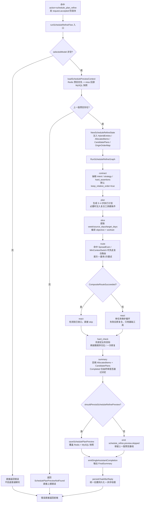

## 5.5 长期记忆系统

时伴的长期记忆系统采用**同步读 + 异步写**架构，确保对话体验不被记忆写入拖慢。

### 写路径（异步）

```
用户消息 → 聊天落库(同事务写 Outbox) → Kafka 投递 memory.extract.requested 事件
→ 幂等入队 memory_jobs → Worker 抢占执行 → LLM 抽取事实
→ 去重决策(ADD/UPDATE/DELETE/NONE) + UUID 映射防幻觉 → 持久化 memory_items
```

关键设计：

1. **Outbox 保证不丢消息**：聊天持久化与事件投递在同一事务内，失败整体回滚，由 Outbox 重试。
2. **去重决策状态机**：LLM 对抽取的事实判断是新增、更新、删除还是跳过，避免重复记忆。
3. **UUID 映射**：为每条记忆分配唯一 ID，LLM 引用时必须使用该 ID，防止幻觉篡改。

### 读路径（同步）

```
用户消息到达 → injectMemoryContext → 结构化检索(按用户/类别过滤)
+ 向量召回(Milvus) → 重排序 → 拼接为 pinned block 注入 Prompt → LLM 生成回复
```

关键设计：

1. **双路召回**：结构化检索保证精确匹配，向量召回覆盖语义关联，两者合并后重排序取 Top-K。
2. **优雅降级**：记忆检索失败时不阻断主对话链路，仅降级为无记忆模式，不影响正常功能。
3. **访问时间刷新**：被召回的记忆会更新最近访问时间，热点记忆更不容易被淘汰。

# 6 前端实现

PS:当前前端进度大幅度落后于后端，将在后端闭环跑通后开始维护。

## 6.1 当前前端技术栈与工程约定

当前前端位于 `frontend/` 目录，已经落地为一个可独立运行的 Vue 单页应用。

技术栈如下：

| 分类 | 当前选型 | 说明 |
| --- | --- | --- |
| 前端框架 | Vue 3 | 统一使用 Composition API 与 `<script setup>` 编写页面与组件 |
| 构建工具 | Vite 6 | 本地开发、代理联调、生产构建均由 Vite 提供 |
| 语言 | TypeScript | 页面、接口层、类型定义均已类型化 |
| UI 组件库 | Element Plus | 用于表单、输入框、下拉框、消息提示、弹窗等基础交互 |
| 状态管理 | Pinia | 当前主要承载登录态与 token 持久化 |
| 路由 | Vue Router 4 | 已配置鉴权守卫、访客页守卫与页面跳转 |
| HTTP | Axios + 原生 fetch | 常规 JSON 接口走 Axios；AI 对话流式 SSE 走原生 `fetch` |
| Markdown 渲染 | markdown-it + highlight.js | AI 回复正文支持 Markdown 渲染与代码高亮 |

当前前端工程结构如下：

```text
frontend/src
├─ api/                  # 接口封装：auth / task / schedule / scheduleCenter / agent
├─ components/
│  ├─ dashboard/         # 首页与 AI 面板相关组件
│  └─ schedule/          # 智能排程页相关组件
├─ router/               # 路由定义与前置守卫
├─ stores/               # Pinia store（当前主要是 auth）
├─ types/                # 页面与接口类型定义
├─ utils/                # 日期、HTTP 错误、Markdown、幂等 key 等工具
└─ views/                # Auth / Dashboard / Assistant / Schedule 四个主视图
```

工程约定如下：

1. 所有业务请求默认走 `/api/v1` 前缀。
2. 本地开发通过 Vite 代理把 `/api` 转发到 `http://127.0.0.1:8080`。
3. 常规接口统一走 `frontend/src/api/http.ts`，内置 `401 -> refresh token -> 原请求重放`。
4. 对话流接口 `POST /api/v1/agent/chat` 因为要消费 SSE，所以单独用原生 `fetch`。
5. 写操作尽量补 `X-Idempotency-Key`，当前任务创建、日程应用、日程删除、任务块删除都已经这样处理。

## 6.2 当前页面与路由状态

当前前端已经接通的页面路由如下：

| 路由 | 页面状态 | 说明 |
| --- | --- | --- |
| `/auth` | 已完成 | 登录/注册同页切换，登录成功后按 `redirect` 返回目标页 |
| `/dashboard` | 已完成 | 首页工作台，展示四象限任务、今日日程、快捷创建任务、左侧导航 |
| `/assistant` | 已完成 | 独立 AI 对话页，复用同一套 AI 面板组件，支持历史会话与流式消息 |
| `/schedule` | 已完成 | 周课表与任务编排中心，支持任务类、粗排、预览、拖拽、应用 |

当前仍处于占位/未独立成页的入口：

1. 左侧导航里的“任务”按钮目前还是占位提示，没有独立路由页。
2. 侧边栏底部“设置”按钮目前也是视觉占位，没有接出 `/settings`。

## 6.3 认证页 `/auth`

对应文件：

- `frontend/src/views/AuthView.vue`
- `frontend/src/stores/auth.ts`
- `frontend/src/api/auth.ts`

当前行为：

1. 登录与注册共用一页，通过 tab 切换。
2. 登录成功后会写入 `access_token`、`refresh_token` 与最近一次登录用户名。
3. 路由守卫会阻止未登录用户进入 `/dashboard`、`/assistant`、`/schedule`。
4. 登录态失效时，Axios 拦截器会自动尝试刷新 token；刷新失败则清空本地登录态并跳回登录页。

## 6.4 首页工作台 `/dashboard`

对应文件：

- `frontend/src/views/DashboardView.vue`
- `frontend/src/components/dashboard/TaskQuadrantCard.vue`
- `frontend/src/components/dashboard/TodayTimeline.vue`

当前已实现能力：

1. 左侧导航栏与顶部欢迎区已经落地，首页与 `/assistant` 使用统一的主视觉语言。
2. 中心区展示四象限任务卡片，支持获取任务列表、创建任务、完成任务、撤销完成任务。
3. 右侧展示“今日日程”，通过 `/schedule/today` 拉取当天事件。
4. 首页整体做了缩放适配，目标是在 100% 缩放下尽量完整展示主要内容，而不是依赖用户手动缩放浏览器。
5. 首页右侧已经不再承载完整 AI 对话页；AI 对话已收口到独立 `/assistant` 页面。

## 6.5 AI 对话页 `/assistant`

对应文件：

- `frontend/src/views/AssistantView.vue`
- `frontend/src/components/dashboard/AssistantPanel.vue`
- `frontend/src/api/agent.ts`

当前已实现能力：

1. 页面拆成“左侧主导航 + 右侧 AI 面板”两部分，最左侧侧栏样式已与首页统一。
2. AI 面板同时支持嵌入态和独立页态；`/assistant` 使用独立页态。
3. 已接通的对话相关接口包括：
   - `POST /api/v1/agent/chat`
   - `GET /api/v1/agent/conversation-list`
   - `GET /api/v1/agent/conversation-meta`
   - `GET /api/v1/agent/conversation-history`
4. 支持流式 SSE 回复，并区分深度思考内容、正文内容，以及刷新后从历史接口恢复的 `reasoning_duration_seconds`。
5. 历史消息支持重试分页元数据：`retry_group_id`、`retry_index`、`retry_total`。
6. 助手消息底部已支持复制、重新生成、版本分页切换。
7. 用户消息底部已支持复制、修改消息；当前“修改消息”的语义是“复制到输入框后重新发送一条新消息”，不会覆盖旧消息。
8. “重新生成”按钮当前的前端策略是：
   - 先尝试直接使用当前消息上的持久化 ID；
   - 若命中的是本地乐观态消息，则先静默调用一次历史接口补抓真实 ID；
   - 仍然拿不到时，再提示：`消息正在处理，请稍后再重试，或者直接复制消息重新发送`。
9. 历史消息与本地乐观态消息会做合并，避免刷新历史时把当前页内正在看的消息直接抹掉。
10. 消息区实现了“自动跟随到底部 / 用户手动上滚后停止跟随”的双态滚动策略。

## 6.6 日程编排页 `/schedule`

对应文件：

- `frontend/src/views/ScheduleView.vue`
- `frontend/src/components/schedule/TaskClassSidebar.vue`
- `frontend/src/components/schedule/WeekPlanningBoard.vue`
- `frontend/src/components/schedule/CreateTaskClassDialog.vue`
- `frontend/src/api/scheduleCenter.ts`

当前已实现能力：

1. 左侧为任务类侧栏，右侧为周课表/排程画板。
2. 任务类侧栏支持获取任务类列表、展开任务类详情、删除单个任务块、新建任务类弹窗、单选与批量多选模式切换。
3. 当任务类较多时，左侧侧栏改为固定卡片高度 + 列表滚动，不再通过压缩卡片高度硬塞。
4. 单个任务类展开后，其内部任务块列表也支持独立滚动，避免详情直接溢出容器。
5. 周课表支持周次切换，当前前端限制为 `1 ~ 24` 周，不允许继续越界请求。
6. 已接通的课表/编排相关接口包括：
   - `GET /api/v1/schedule/week`
   - `GET /api/v1/task-class/list`
   - `GET /api/v1/task-class/get`
   - `POST /api/v1/task-class/add`
   - `DELETE /api/v1/task-class/delete-item`
   - `GET /api/v1/schedule/smart-planning`
   - `POST /api/v1/schedule/smart-planning-multi`
   - `PUT /api/v1/task-class/apply-batch-into-schedule`
   - `DELETE /api/v1/schedule/delete`
7. 智能编排结果当前分为单任务类粗排和多任务类批量粗排。
8. 预览态结果不会立刻写入正式课表，而是先保存在前端运行时内存中；用户确认后再应用到后端。
9. 预览态结果的生命周期是“当前单页应用存活期间”，刷新页面会丢失，因此页面已挂载 `beforeunload` 原生拦截提示。
10. 已请求过的周课表会缓存在前端内存中，当前页切换周次时优先复用缓存，避免反复打后端。
11. 周请求增加了序列号保护，快速切周时只认最后一次请求结果，用来降低闪动。
12. 预览态 `suggested` 任务支持拖拽调整位置，并且拖拽会同步修改前端持有的预览 JSON，保证“用户看到的布局”和“最终提交给后端的布局”一致。
13. 对于嵌入课程中的预览任务，只有拖到嵌入任务本身时才允许把它单独拖出来，不会整块课程卡一起被拖动。
14. 预览态支持批量应用；如果是多任务类批量粗排，前端会先把预览结果按任务类分桶，再逐桶调用现有应用接口。

## 6.7 当前前后端衔接边界

当前前端已经覆盖的主业务链路：

1. 登录 / 注册 / 自动续签
2. 首页任务获取、创建、完成、撤销
3. 今日日程展示
4. AI 对话、历史会话、深度思考展示、重新生成、消息复制、消息修改
5. 任务类管理、智能粗排、批量粗排、预览拖拽、正式应用、删除日程

当前仍明确留给后续迭代的部分：

1. “任务”独立页面与“设置”独立页面尚未接出。
2. 课表导入流程入口已在首页预留，但还没有完整的导入页与导入向导。
3. 用户消息“修改后原地提交并替换旧消息”的真正后端语义尚未实现，目前按“发送一条新消息”处理。
4. 更多 AI 工具态页面（例如结构化预览页、设置面板、统计页）尚未独立拆页。

# 7 部署与监控

## 7.1 容器化部署方案


## 7.2 性能监控&统计


# 8 快速开始

## 8.1 启动前端开发环境

前端目录在 `frontend/`，本地开发步骤如下：

```bash
cd frontend
npm install
npm run dev
```

默认启动信息：

1. Vite 开发端口：`5173`
2. 开发代理目标：`http://127.0.0.1:8080`
3. 因此前端本地联调前，需要先确保后端服务已经启动在 `8080`

## 8.2 前端生产构建

```bash
cd frontend
npm run build
npm run preview
```

说明：

1. `npm run build` 会先执行 `vue-tsc -b` 做类型检查，再执行 `vite build`。
2. 当前构建是可通过的；但由于主包仍然偏大，Vite 会给出 chunk size warning，这属于现阶段可接受状态。

## 8.3 建议的前后端联调顺序

建议按下面顺序启动和验证：

1. 启动后端服务，确认 `http://127.0.0.1:8080` 可用。
2. 启动前端 `npm run dev`。
3. 先验证 `/auth` 的登录注册链路。
4. 再验证 `/dashboard` 的任务与今日日程。
5. 再验证 `/assistant` 的 SSE 对话、历史消息、重试分页与深度思考展示。
6. 最后验证 `/schedule` 的任务类、周课表、智能粗排、拖拽预览与正式应用。
