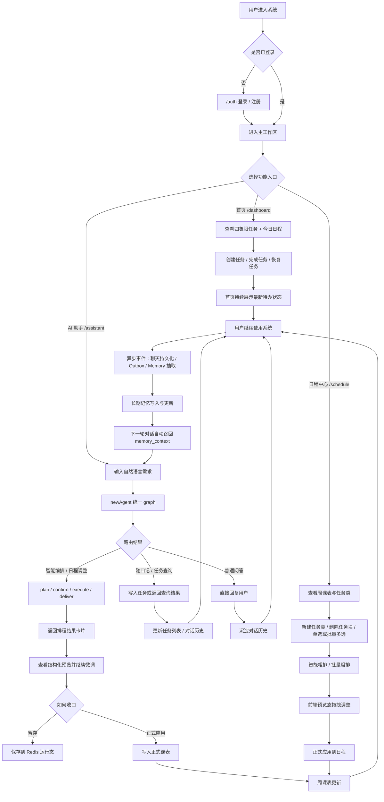
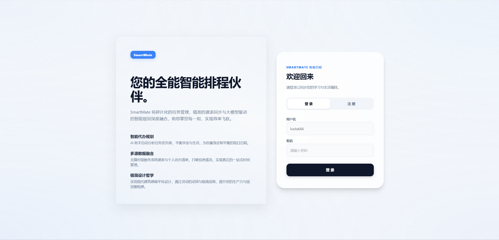
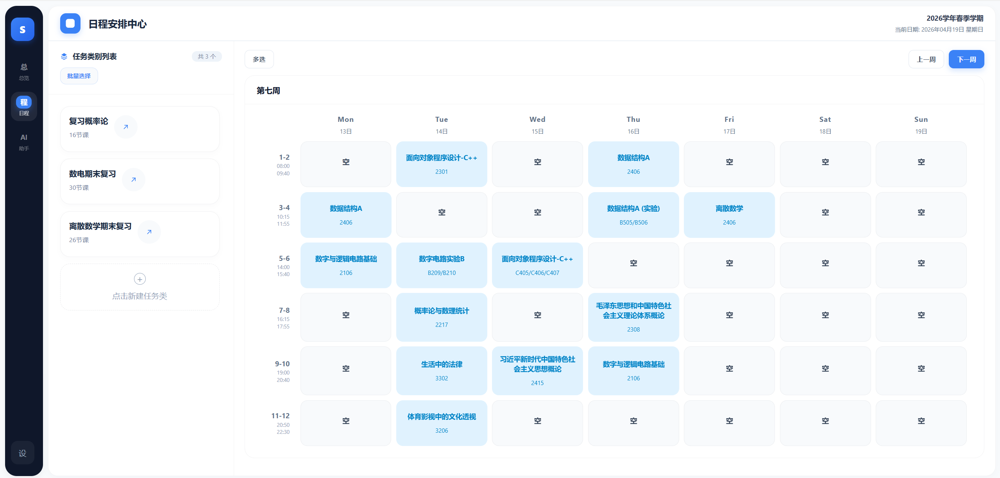
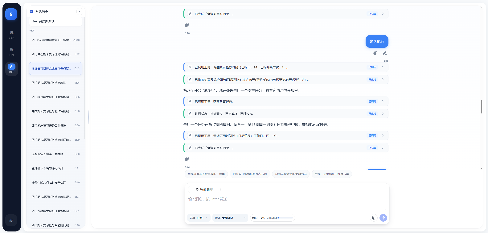
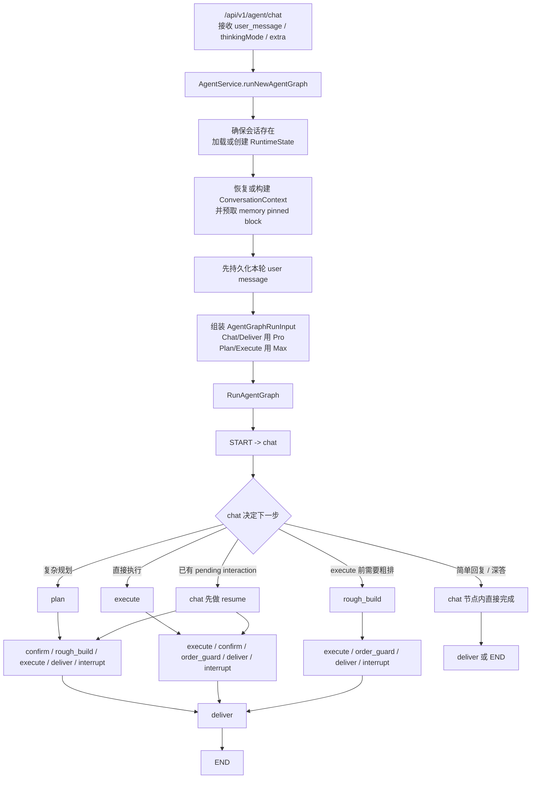
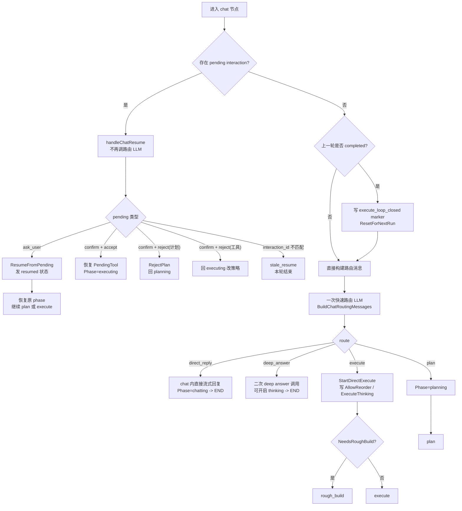
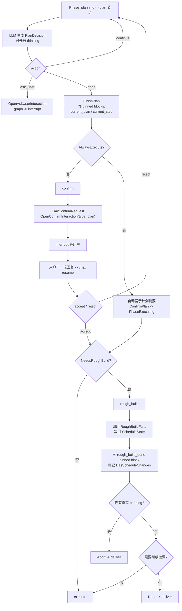
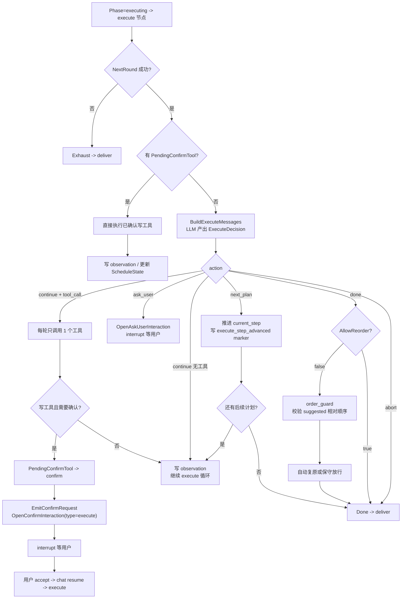
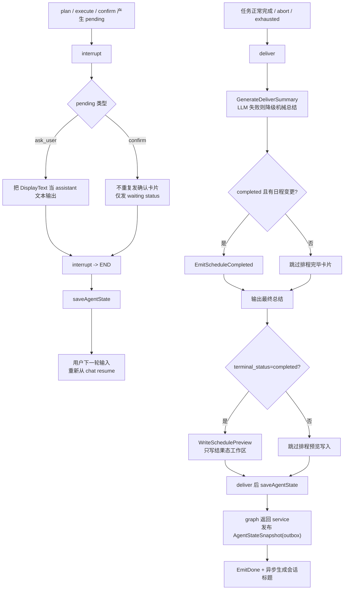

# 许可证

本项目采用 **GNU Affero General Public License v3.0 (AGPL-3.0)** 进行许可。  

详见根目录 [`LICENSE`](./LICENSE) 文件。

# 时伴 SmartMate

> 越用越懂你的成长型 AI 排程伙伴 · 面向大学生的陪伴式日程管理平台

# 1 项目概览

## 1.1 总体介绍

时伴（SmartMate）是面向大学生的 AI 排程伙伴。通过自然语言对话管理课表与任务，更能在一次次交流中记住你的习惯、偏好和生活节奏——**越用越懂你，越排越贴心。**

核心能力包括：大规模智能排程、基于课表的任务编排、AI 驱动的"小事随口记"，以及跨会话的长期记忆积累——做到：**一个伙伴，包揽生活大小事。**

本项目采用前后端分离设计，并且有一个**完整的工业化设计链路**：写功能-墨刀画页面-根据页面写接口-写后端-写前端(AI)。

## 1.2 项目解决的痛点

> **问题1：** 传统的日程平台(类似于滴答清单等)要么设置重复任务(例如每日背单词、每日刷题等)，要么就需要手动设置任务，非常不方便。一旦遇到需要大规模安排任务的场景，例如期末考前半个月突击(涉及的科目多，手头的空余时间也多，每门课的任务又都不一样)，就需要先手动规划好任务，再手指点个不停给它排进日程软件里面，还得思考怎样排比较合理，一旦执行出问题需要调整，又像多米纳骨牌倒了一样，连着调整一大块。

**本项目带来的解决方案1：** 采用类似于老师备课-教务处排课的"备课-排课"模式。即假如你是学校上课的老师，你先在"备课区"把这门课程的"教学"大纲排好，然后再考虑后面安排上课的事情。

拿概率论举例子，你准备给它16节课时间复习，那你就在新增任务类的区域**创建新任务类**，并设置好在第x**任务块**看xx章节的速成课，然后第x任务块是真题练习。

设置完了之后，再通过我们的排课功能(会先设计一个保证能排的算法，第二批次开发还会考虑AI介入让课排的更好)，你设置一些排课的倾向(更倾向于在哪个时间点学、不想在哪个时间点学、想每天均匀推进还是快速突击等等)，点一下**智能一键编排**按钮，会将课直接以黄色打底的形式嵌入日程中，确认无误后你点击正式应用日程，课才会真正被排进去。

至于调整，本项目支持在课表区域直接拖拽调整时间。

> **问题2：** 期末周没课，确实可以按照上面一样操作。那我如果不是期末复习呢，我如果想安排一些别的事情呢，比如推进项目？我平时可是有课的，而且有不少水课。传统的日程软件可没法在水课处排课，要么忘记去上水课，要么忘记任务，十分恼火。

**本项目带来的解决方案2：** 本项目支持学校课表导入，甚至还支持水课嵌入任务。在导入课表之后，本项目支持勾选某些课程为"**可嵌入任务**"状态，此时就可以配合上面的排课系统，将水课作为可用的区域，排任务进去。

> **问题3：** 那么我作为一个规划能力比较差的懒人，也能用这个项目来让自己变的充实吗？

**本项目带来的解决方案3：** 当然可以，这就是本项目接入AI的意义。聊天区域的AI将会被调教成一个日程安排的小助手，既能满足你简单的任务记录、任务查询与部分日程调整需求，又能协助你从0开始一点点制定属于你的计划。(当前版本已支持AI随口记、任务查询，以及部分日程调整的确认流；更完整的自动规划与更复杂的读写能力仍在继续迭代)

> **问题4：** 我平时会突然冒出来一个能让自己活的更舒服亦或是变得更好的小想法(例如把桌面理一下、给自己挑一件新衣服等)，但是现在很忙，根本没时间做，然后等忙完了有时间了又忘记了。传统的日程软件确实能让我记录下来(比如将这个小想法记录在日程软件的四象限里面的"不重要不紧急"象限)，就是太麻烦了。
>
> 还有，平时上课时，接踵而至的实验报告、小组作业等，也面临着类似的情况，既容易忘记，又懒得记录。

**本项目带来的解决方案4：** 本项目支持AI驱动的"随口记"功能。

你可以和本项目的AI助手说："提醒我**有空的时候**给自己挑一件新衣服"(**请注意标粗的关键词**)，AI助手就会自动评估这件小事的难度以及执行所需花费的时间：如果这件事很简单或者不费时，会被加入"简单不重要"的队列中；如果比较费时或者困难，就会被加入"不简单不重要"队列中。

至于突发任务，也支持使用该"随口记"功能。你可以这么说："提醒我**下周周日之前**完成xx课程的大作业"(**请注意标粗的关键词**)，AI就会自动通过**截止时间和任务量**判断是否紧急，选择将其加入"重要并紧急"或者"重要不紧急"任务队列中(这里也是借鉴了四象限设计)。并且，系统会**每经过一个固定时间，就自动调整两个任务队列中未完成任务的位置**(比如：随着DDL临近，将重要不紧急队列中的未完成任务挪到重要并紧急队列中)。

当你在空闲时(做完你的大主线之后)，亦或是休息时间打开本项目，一眼就能看到这几个队列的事情，然后你就可以看心情选择做哪个，然后做完之后一划就完事。

> **问题5：** 每次打开 AI 助手，都要重新告诉它"我周三有课"、"我更喜欢早上学数学"。传统工具对你没有记忆，每次都从零开始，永远是个陌生人。

**本项目带来的解决方案5：** 时伴内置长期记忆系统，会在对话中自动抽取并积累关于你的事实与偏好（课程、习惯、目标等）。下次对话时自动召回相关记忆注入上下文，跨会话延续对你的了解，且支持全链路优雅降级——记忆检索失败不阻断正常对话。

## 1.3 项目实现的功能

1. **对用户目前时间尺度的适应。**

   当前版本以学校排课节次为主，采用第1-2节、第3-4节这种时间组织方式，同时兼容首页任务管理与周课表日程编排两套视图，方便把任务管理和日程安排放在同一系统中；

   目前暂未开放用户自定义时间尺度配置，当前仍以固定节次模型为主。后续会有更新计划的！

2. **导入学校课表。** 本项目后端已提供学校课表导入能力(当前主要尝试兼容CQUPT的课表图片识别与导入格式)，前端也已在 `/schedule` 页面接入完整导入流程，便于后续直接以课表为基底进行日程安排。

3. **"水课"任务嵌入。** 正如上方**问题2**所言，在已导入课表的前提下，支持设置某一门你想拿来干其它事情的课为"可嵌入任务"状态，此时这门课所占据的时间区域就是可以嵌入任务的了，但是仍然有区别于其它完全空白的时间区域，便于真正安排适合在嘈杂环境下做的事情。

4. **设置某一任务类，并配置其编排参数。** 正如上方**问题1**所言，用户可以先设置一个大的任务类(例如概率论复习、算法进阶计划等等)，再为这个任务类配置任务块内容、起止日期、总节数、编排策略等信息，方便后续的日程编排。

5. **一键编排任务。** 结合算法与用户配置，将任务基于导入的课表和任务类设置先生成预览结果；确认无误后，再正式应用到日程中。  

6. **AI 对话与排程辅助。** 当前版本支持通过 AI 进行对话、查看历史会话与思考过程，并结合结构化工具完成排程分析、日程微调与确认流。

7. **多用户。** 本系统可支持多个用户同时使用，并且记录AI对话、编排任务的Token使用情况等，并进行限额。

8. **四象限任务与日程编排并行管理。** 首页的四象限任务用于日常待办管理；

   而周课表中的课程与排入日程的任务类则用于日程编排，两类信息分别展示、相互配合。

9. **完成任务状态的恢复。** 当前首页四象限任务支持将"已完成"恢复为"未完成"状态。

   用户只需要在队列中找到该任务，然后再次点击对应状态按钮即可完成恢复。

   至于日程侧，当前主要支持删除、解除安排与预览后再正式应用，其它更完整的恢复能力仍在后续迭代中。

10. **长期记忆积累。** 系统在对话中自动抽取用户相关事实与偏好，跨会话召回并注入对话上下文，实现"越用越懂你"的个性化体验。支持结构化检索 + 向量召回双路召回，全链路优雅降级。

# 2 产品逻辑与设计

## 2.1 业务流程图

当前版本主业务闭环如下，重点体现“首页任务管理 / AI 助手 / 日程编排 / 长期记忆”四条主线如何互相联动：



## 2.2 页面展示








# 3 后端数据架构

## 3.1 ER图

PS：此图截至版本v0.3.3


## 3.2 核心表结构

以下结构以 **2026 年 5 月 7 日** 对运行中的 `smartflow-mysql` 容器执行 `SHOW TABLES`、`SHOW CREATE TABLE` 与 `information_schema.columns` 查询结果为准。

### 3.2.0 全量表简述总览

| 领域 | 表名 | 简述 |
| --- | --- | --- |
| 用户与账户 | `users` | 用户主表，保存账号、密码、手机号与 token 配额。 |
| 用户与账户 | `user_token_usage_adjustments` | 用户 token 用量调整流水，按事件记录增减量。 |
| 用户与账户 | `user_notification_channels` | 用户通知通道配置表，保存 webhook、鉴权方式与最近一次测试结果。 |
| 任务与课表 | `tasks` | 首页任务池主表，承载优先级、DDL、预计节数与紧迫阈值。 |
| 任务与课表 | `task_classes` | 任务类定义表，保存任务类模式、策略、节数与学习属性配置。 |
| 任务与课表 | `task_items` | 任务类下的任务块明细表，记录内容、顺序、嵌入时间与状态。 |
| 任务与课表 | `schedule_events` | 课程 / 任务事件元数据表，是正式日程块的事实来源。 |
| 任务与课表 | `schedules` | 节次级日程展开表，把事件落到周次、星期与节次坐标。 |
| Agent | `agent_chats` | AI 会话头表，保存会话标题、模型、状态、消息数与 token 汇总。 |
| Agent | `chat_histories` | AI 消息明细表，保存正文、角色、推理内容、重试分支与 token 消耗。 |
| Agent | `agent_timeline_events` | Agent 时间线事件表，给前端时间线、状态流与调试回放使用。 |
| Agent | `agent_schedule_states` | Agent 排程状态快照表，保存会话内的排程运行态与 revision。 |
| Agent | `agent_state_snapshot_records` | Agent 阶段性状态快照归档表，按 phase 留存排障用 snapshot。 |
| 主动调度 | `active_schedule_jobs` | 主动调度后台任务表，管理定时触发、扫描状态、去重键与错误信息。 |
| 主动调度 | `active_schedule_triggers` | 主动调度触发表，记录触发来源、目标对象、幂等键、处理状态与 trace。 |
| 主动调度 | `active_schedule_previews` | 主动调度预览结果表，保存候选方案、决策结果、风险说明与 apply 结果。 |
| 主动调度 | `active_schedule_sessions` | 主动调度会话表，串起 trigger、preview 与对话侧 session 状态。 |
| Memory / RAG | `memory_items` | 记忆条目主表，保存内容、置信度、重要度、敏感级别与向量状态。 |
| Memory / RAG | `memory_jobs` | 记忆任务表，保存提取 / 管理类任务的 payload、重试与错误状态。 |
| Memory / RAG | `memory_audit_logs` | 记忆审计日志表，记录 memory 条目的变更前后内容与操作原因。 |
| Memory / RAG | `memory_user_settings` | 用户级记忆配置表，控制 memory 总开关与隐式 / 敏感记忆开关。 |
| 通知 | `notification_records` | 通知发送记录表，保存触发源、摘要、兜底文案、重试状态与供应商响应。 |
| 社区 / 任务类分享 | `forum_posts` | 社区帖子主表，对应任务类分享内容及其点赞 / 评论 / 导入统计。 |
| 社区 / 任务类分享 | `forum_post_templates` | 帖子对应的任务类模板表，固化分享时的任务类配置快照。 |
| 社区 / 任务类分享 | `forum_post_template_items` | 帖子模板下的任务块明细表，保存来源 task_item 与排序。 |
| 社区 / 任务类分享 | `forum_likes` | 帖子点赞记录表，记录点赞人、作者、事件 ID 与取消状态。 |
| 社区 / 任务类分享 | `forum_comments` | 帖子评论表，支持父子评论结构、幂等键与软删除。 |
| 社区 / 任务类分享 | `forum_imports` | 社区模板导入记录表，记录导入目标任务类、状态与失败原因。 |
| Credit / 计费 | `credit_accounts` | 用户 Credit 账户表，维护余额与累计充值 / 奖励 / 消耗。 |
| Credit / 计费 | `credit_ledger` | Credit 台账流水表，记录每次变动的来源、方向、前后余额与描述。 |
| Credit / 计费 | `credit_orders` | Credit 购买订单表，保存商品快照、数量、金额、支付状态与入账状态。 |
| Credit / 计费 | `credit_products` | Credit 商品表，定义 SKU、额度、价格、排序与上下架状态。 |
| Credit / 计费 | `credit_price_rules` | 模型计费规则表，定义 provider / model 的价格与利润率映射。 |
| Credit / 计费 | `credit_reward_rules` | Credit 奖励规则表，定义奖励来源、额度、状态与配置。 |
| Outbox | `agent_outbox_messages` | Agent 域 Outbox 表，承接聊天持久化、时间线与状态事件投递。 |
| Outbox | `task_outbox_messages` | 任务域 Outbox 表，承接任务相关异步事件投递。 |
| Outbox | `memory_outbox_messages` | Memory 域 Outbox 表，承接记忆提取 / 管理类异步事件投递。 |
| Outbox | `active_scheduler_outbox_messages` | 主动调度域 Outbox 表，承接调度触发相关异步事件。 |
| Outbox | `notification_outbox_messages` | 通知域 Outbox 表，承接外部通知发送事件。 |
| Outbox | `taskclass_forum_outbox_messages` | 社区 / 任务类分享域 Outbox 表，承接点赞、导入等异步事件。 |
| Outbox | `llm_outbox_messages` | LLM 域 Outbox 表，承接模型计费 / 记账等异步事件。 |
| Outbox | `token_store_outbox_messages` | Token / Credit 域 Outbox 表，承接 token 或 credit 账务类异步事件。 |

当前库中与主业务链路最相关的核心表包括：

- `users`
- `tasks`
- `task_classes`
- `task_items`
- `schedule_events`
- `schedules`
- `agent_chats`
- `chat_histories`

### 3.2.1 `users`

```text
id bigint unsigned PK AUTO_INCREMENT
username varchar(255) NOT NULL UNIQUE
password varchar(255) NOT NULL
phone_number varchar(255) NULL
token_limit bigint DEFAULT 100000
token_usage bigint DEFAULT 0
last_reset_at datetime(3) NULL
```

### 3.2.2 `tasks`

```text
id bigint PK AUTO_INCREMENT
user_id bigint NULL
title varchar(255) NULL
priority bigint NOT NULL
is_completed tinyint(1) DEFAULT 0
deadline_at datetime(3) NULL
urgency_threshold_at datetime(3) NULL
estimated_sections bigint NOT NULL DEFAULT 1
索引:
- idx_tasks_user_id(user_id)
- idx_user_done_threshold_priority(user_id, is_completed, urgency_threshold_at, priority)
```

### 3.2.3 `task_classes`

```text
id bigint PK AUTO_INCREMENT
user_id bigint NULL
name varchar(255) NULL
mode enum('auto','manual') NULL
start_date datetime(3) NULL
end_date datetime(3) NULL
total_slots bigint NULL
allow_filler_course tinyint(1) DEFAULT 1
strategy enum('steady','rapid') NULL
excluded_slots json NULL
subject_type varchar(32) NULL
difficulty_level varchar(16) NULL
cognitive_intensity varchar(16) NULL
excluded_days_of_week json NULL
索引:
- idx_task_classes_user_id(user_id)
```

### 3.2.4 `task_items`

```text
id bigint PK AUTO_INCREMENT
category_id bigint NULL
order bigint NULL
content text NULL
embedded_time json NULL
status bigint NULL
索引 / 约束:
- fk_task_classes_items(category_id -> task_classes.id)
```

### 3.2.5 `schedule_events`

```text
id bigint PK AUTO_INCREMENT
user_id bigint NOT NULL
name varchar(255) NOT NULL
location varchar(255) DEFAULT ''
type enum('course','task') NOT NULL
rel_id bigint NULL
can_be_embedded tinyint(1) NOT NULL DEFAULT 0
start_time datetime(3) NULL
end_time datetime(3) NULL
task_source_type varchar(32) NOT NULL DEFAULT ''
makeup_for_event_id bigint NULL
active_preview_id varchar(64) NULL
索引:
- idx_user_events(user_id)
- idx_schedule_event_task_source(task_source_type)
- idx_schedule_event_makeup_for(makeup_for_event_id)
- idx_schedule_event_active_preview(active_preview_id)
```

### 3.2.6 `schedules`

```text
id bigint PK AUTO_INCREMENT
event_id bigint NOT NULL
user_id bigint NOT NULL
week bigint NOT NULL
day_of_week bigint NOT NULL
section bigint NOT NULL
embedded_task_id bigint NULL
status enum('normal','interrupted') DEFAULT 'normal'
索引 / 约束:
- UNIQUE idx_user_slot_atomic(user_id, week, day_of_week, section)
- idx_event_id(event_id)
- fk_schedules_embedded_task(embedded_task_id -> task_items.id)
- fk_schedules_event(event_id -> schedule_events.id)
```

### 3.2.7 `agent_chats`

```text
id bigint PK AUTO_INCREMENT
chat_id varchar(36) NOT NULL UNIQUE
user_id bigint NOT NULL
title varchar(255) NULL
system_prompt text NULL
model varchar(100) NULL
message_count bigint NOT NULL DEFAULT 0
tokens_total bigint NOT NULL DEFAULT 0
last_message_at datetime(3) NULL
status varchar(32) NOT NULL DEFAULT 'active'
created_at datetime(3) NULL
updated_at datetime(3) NULL
deleted_at datetime(3) NULL
compaction_summary text NULL
compaction_watermark bigint NOT NULL DEFAULT 0
context_token_stats json NULL
last_history_event_id varchar(64) NULL
last_token_adjust_event_id varchar(64) NULL
索引:
- idx_user_last(user_id)
- idx_user_status(user_id, status)
```

### 3.2.8 `chat_histories`

```text
id bigint PK AUTO_INCREMENT
chat_id varchar(36) NOT NULL
user_id bigint NOT NULL
message_content text NULL
role varchar(32) NULL
tokens_consumed bigint NOT NULL DEFAULT 0
created_at datetime(3) NULL
reasoning_content text NULL
reasoning_duration_seconds bigint NOT NULL DEFAULT 0
retry_group_id varchar(64) NULL
retry_index bigint NULL
retry_from_user_message_id bigint NULL
retry_from_assistant_message_id bigint NULL
source_event_id varchar(64) NULL UNIQUE
索引:
- idx_user_chat(user_id, chat_id)
- idx_chat_id(chat_id)
- idx_retry_group(retry_group_id)
```

补充说明：

1. 运行库里已经不存在 README 旧版那种“`agent_chats` 直接承载单条消息正文”的结构；现在是 `agent_chats` 管会话头，`chat_histories` 管消息明细。
2. `task_classes.start_date` / `end_date` 在运行库中是 `datetime(3)`，不是旧文档里的 `date`。
3. `tasks` 现在多了 `urgency_threshold_at` 与 `estimated_sections`，`task_classes` 现在多了 `subject_type`、`difficulty_level`、`cognitive_intensity`、`excluded_days_of_week`。
4. README 此处如果后续再更新，建议继续以运行中的 MySQL 查询结果为准，而不是只看代码结构体。

# 4 接口契约

## 4.1 核心API列表(ApiFox)

链接如下：https://oqg5uiubh0.apifox.cn

## 4.2 Agent可调用的工具定义

以下定义基于当前代码实现（`backend/services/agent/tools/registry.go` + `backend/cmd/start.go` 注入），不是规划态文档。

### 4.2.1 调用契约

1. `tool_call` 必须是单个对象，格式为：

```json
{"tool_call":{"name":"工具名","arguments":{}}}
```

2. 日程写工具默认走 `confirm` 确认闸门（`always_execute=true` 时可跳过确认）。
3. 非日程类工具（如 `context_tools_add`、`context_tools_remove`、`web_search`、`web_fetch`）走 `continue + tool_call`；其中 `upsert_task_class` 虽不依赖 `ScheduleState`，但仍属于真实写库入口。
4. 当前每轮只允许调用一个工具，不支持同轮批量工具数组。

### 4.2.2 工具清单（当前版本）

| 工具名 | 类型 | 是否需确认 | 是否依赖 ScheduleState | 核心参数 | 作用与约束 |
| --- | --- | --- | --- | --- | --- |
| `context_tools_add` | 上下文控制 | 否 | 否 | `domain`, `packs`, `mode` | 激活 `schedule` / `taskclass` 工具域；`schedule` 可按 pack 增量注入 `mutation / analyze / detail_read / deep_analyze / queue / web` |
| `context_tools_remove` | 上下文控制 | 否 | 否 | `domain`, `packs`, `all` | 移除指定工具域或 pack；`core` 固定包不允许 remove |
| `get_overview` | 读 | 否 | 是 | 无 | 获取当前规划窗口总览（任务视角，全量返回） |
| `query_range` | 读 | 否 | 是 | `day`(必填), `slot_start`, `slot_end` | 查询某天 / 某时段占用详情 |
| `query_available_slots` | 读 | 否 | 是 | `span`, `duration`, `limit`, `day_scope`, `week_filter` 等 | 查询候选空位池（纯空位优先，不足再补可嵌入位） |
| `query_target_tasks` | 读 | 否 | 是 | `status`, `category`, `task_ids`, `enqueue`, `reset_queue` 等 | 过滤任务集合，可选自动入队供后续队列工具处理 |
| `queue_pop_head` | 队列读 | 否 | 是 | 无 | 取出 / 复用当前队首任务（一次只处理一个） |
| `queue_status` | 队列读 | 否 | 是 | 无 | 查看队列状态（pending / current / completed / skipped） |
| `get_task_info` | 读 | 否 | 是 | `task_id`(必填) | 查询单任务详细信息 |
| `analyze_rhythm` | 分析 | 否 | 是 | `category`, `include_pending`, `detail`, `hard_categories` | 分析学习节奏、连续同类任务与切换情况 |
| `analyze_health` | 分析 | 否 | 是 | `detail`, `dimensions`, `threshold` | 作为主动优化裁判入口，判断当前排程是否仍值得继续优化 |
| `place` | 写 | 是 | 是 | `task_id`, `day`, `slot_start`(均必填) | 将待安排任务预排到指定位置 |
| `move` | 写 | 是 | 是 | `task_id`, `new_day`, `new_slot_start`(均必填) | 仅允许移动 `suggested`；`existing` 不可 `move` |
| `swap` | 写 | 是 | 是 | `task_a`, `task_b`(均必填) | 交换两个已落位任务，要求时长一致 |
| `batch_move` | 写 | 是 | 是 | `moves[]`(必填) | 原子批量移动，当前最多 2 条，任一冲突整批回滚 |
| `queue_apply_head_move` | 队列写 | 是 | 是 | `new_day`, `new_slot_start`(均必填) | 移动当前队首并自动出队，不接受 `task_id` |
| `queue_skip_head` | 队列控制 | 否 | 是 | `reason` | 跳过当前队首并标记 `skipped`（不改日程） |
| `unplace` | 写 | 是 | 是 | `task_id`(必填) | 取消任务落位并恢复待安排状态 |
| `upsert_task_class` | 任务类写入 | 是 | 否 | `id`, `task_class`, `items`, `source` | 统一创建 / 更新任务类入口；会写库，但不直接修改当前日程预览 |
| `web_search` | 读 | 否 | 否 | `query`(必填), `top_k`, `domain_allow`, `recency_days` | Web 检索，返回结构化标题 / 摘要 / URL；未启用时优雅返回错误 observation |
| `web_fetch` | 读 | 否 | 否 | `url`(必填), `max_chars` | 抓取并清洗网页正文；服务不可用时优雅返回错误 observation |

### 4.2.3 当前实现中的关键规则

1. `context_tools_add` / `context_tools_remove` 是动态区协议入口：`schedule` 支持按 pack 精细注入，`taskclass` 当前只有 `core` 固定包。
2. 日程写工具默认走 `confirm` 确认闸门（`always_execute=true` 时可跳过）。
3. `upsert_task_class` 虽不依赖 `ScheduleState`，但属于真实写库入口，仍要求 confirm。
4. `batch_move` 有安全上限：当前最多支持 2 条移动请求，超出建议走队列化逐项处理。
5. `web_search` / `web_fetch` 失败不会打断主链路，都会回传结构化错误 observation 给模型继续决策。


# 5 后端实现

## 5.1 技术栈

| **分类**          | **选用技术**     | **在时伴中的应用场景**                          |
| ----------------- | ---------------- | ------------------------------------------------------------ |
| **API 网关**      | **Gin**          | 负责统一 HTTP 入口、JWT 鉴权、限流、幂等控制与前端 API 聚合。 |
| **服务间通信**    | **go-zero zrpc + gRPC** | `api` 网关通过 zrpc 调用 `userauth / task / schedule / agent / memory / llm` 等后端服务，支撑当前多服务拆分。 |
| **持久层数据库**  | **MySQL 8.0**    | 存储用户、任务、课表、Agent 会话、主动调度、社区、Credit、memory 等核心结构化数据。 |
| **ORM / 数据访问** | **GORM**        | 负责 MySQL 映射、事务处理、索引约束落地，以及日程 / Agent / memory 等域的数据访问。 |
| **缓存与运行态存储** | **Redis**     | 缓存周课表与会话状态，承接幂等键、限流、Agent 状态快照、日程预览与 memory 预取上下文。 |
| **异步事件总线**  | **Outbox + Kafka（segmentio/kafka-go）** | 用于聊天持久化、memory 抽取、主动调度触发、通知投递、Credit 记账等异步事件解耦。 |
| **AI / Agent 编排** | **CloudWeGo Eino** | 承担对话规划、工具调用、确认流、排程执行与 deliver/interrupt 状态机编排。 |
| **模型接入**      | **Volcengine Ark + OpenAI Compatible 接口** | `llm` / `course` / `memory` / `agent` 等服务通过统一模型层调用文本模型、推理模型与课表识别视觉模型。 |
| **向量检索**      | **Milvus**       | 为长期记忆与 RAG 检索提供向量索引、召回与相似度搜索能力。 |
| **向量依赖**      | **MinIO + etcd** | 作为 Milvus 的对象存储与元数据依赖，随容器编排一起部署。 |
| **身份认证**      | **JWT**          | 实现无状态登录，并把 `user_id` 等身份信息透传到 API 与服务层。 |
| **配置管理**      | **Viper**        | 管理数据库、Redis、Kafka、RPC、模型、memory/RAG、通知等多环境配置。 |
| **容器化交付**    | **Dockerfile + Docker Compose + Nginx** | 已支持基础设施容器化与整站容器化；前端镜像通过 Nginx 托管静态产物。 |
| **接口调试 / 文档** | **Apifox**      | 用于维护接口协议、联调接口与沉淀阶段性 API 文档。 |
| **日志与观测**    | **标准库 `log` + Gin Logger/Recovery** | 当前代码以标准库日志为主，HTTP 层使用 Gin 默认日志与恢复中间件；Kafka、RAG、memory、Agent 链路也会输出关键观测日志。 |

## 5.2 架构图

基于当前 `docker-compose.full.yml`、`backend/cmd/*` 与各服务 `dao/connect.go` 整理。实线表示同步 HTTP / RPC / 直连存储关系，虚线表示 Outbox + Kafka 异步事件链路；标注“迁移期”的连线表示该服务仍在直接读写其他域的表。

```mermaid
flowchart TB
    FE["Frontend (Vue)"] --> API["api / Gin Gateway<br/>JWT 鉴权 / 限流 / 幂等"]

    subgraph SVC["服务层"]
        direction LR
        UA["userauth"]
        TASK["task"]
        COURSE["course"]
        TCLASS["task-class"]
        SCH["schedule"]
        AGENT["agent"]
        MEM["memory"]
        AS["active-scheduler"]
        NOTI["notification"]
        FORUM["taskclassforum"]
        TOKEN["tokenstore"]
        LLM["llm"]
        RAG["RAG / Milvus"]
    end

    API --> UA
    API --> TASK
    API --> COURSE
    API --> TCLASS
    API --> SCH
    API --> AGENT
    API --> MEM
    API --> AS
    API --> NOTI
    API --> FORUM
    API --> TOKEN

    AGENT --> LLM
    AGENT --> TASK
    AGENT --> TCLASS
    AGENT --> SCH
    AGENT --> MEM
    AGENT --> RAG
    COURSE --> LLM
    MEM --> LLM
    MEM --> RAG
    AS --> LLM
    AS --> TASK
    AS --> SCH
    FORUM --> TCLASS
    LLM --> TOKEN

    subgraph REDIS["Redis"]
        direction TB
        R_API["限流 / 幂等响应缓存"]
        R_AUTH["JWT 黑名单 / Token 配额快照"]
        R_TASK["任务列表缓存 / 紧急性提升去重锁"]
        R_SCH["今日日程 / 周视图 / 最近完成 / 当前进行中缓存"]
        R_TCLASS["任务集列表缓存"]
        R_AGENT["会话历史 / Timeline / Schedule Preview / Agent State / Memory Prefetch"]
        R_FORUM["评论树缓存"]
        R_CREDIT["Credit 余额快照 / Blocked 标记"]
    end

    API --> R_API
    UA --> R_AUTH
    TASK --> R_TASK
    SCH --> R_SCH
    TCLASS --> R_TCLASS
    AGENT --> R_AGENT
    FORUM --> R_FORUM
    TOKEN --> R_CREDIT
    LLM --> R_CREDIT

    subgraph MYSQL["MySQL"]
        direction TB
        T_USERS["users<br/>user_token_usage_adjustments"]
        T_TASK["tasks"]
        T_TCLASS["task_classes<br/>task_items"]
        T_SCH["schedules<br/>schedule_events"]
        T_AGENT["agent_chats<br/>chat_histories<br/>agent_timeline_events<br/>agent_schedule_states<br/>agent_state_snapshot_records"]
        T_AS["active_schedule_jobs<br/>active_schedule_triggers<br/>active_schedule_previews<br/>active_schedule_sessions"]
        T_MEM["memory_items<br/>memory_jobs<br/>memory_audit_logs<br/>memory_user_settings"]
        T_NOTI["notification_records<br/>user_notification_channels"]
        T_FORUM["forum_posts<br/>forum_post_templates<br/>forum_post_template_items<br/>forum_likes<br/>forum_comments<br/>forum_imports"]
        T_CREDIT["credit_accounts<br/>credit_ledger<br/>credit_products<br/>credit_orders<br/>credit_price_rules<br/>credit_reward_rules"]

        OB_AGENT["agent_outbox_messages"]
        OB_TASK["task_outbox_messages"]
        OB_MEM["memory_outbox_messages"]
        OB_AS["active_scheduler_outbox_messages"]
        OB_NOTI["notification_outbox_messages"]
        OB_TOKEN["token_store_outbox_messages"]
    end

    UA --> T_USERS
    TASK --> T_TASK
    TCLASS --> T_TCLASS
    TCLASS -.->|迁移期直写| T_SCH
    SCH --> T_SCH
    SCH -.->|迁移期依赖| T_TASK
    SCH -.->|迁移期依赖| T_TCLASS
    COURSE -.->|课表导入写入| T_SCH
    AGENT --> T_AGENT
    AGENT -.->|读取任务| T_TASK
    AGENT -.->|读取任务集| T_TCLASS
    AGENT -.->|读取日程 / 预览| T_SCH
    AS --> T_AS
    AS -.->|读取会话与时间线| T_AGENT
    MEM --> T_MEM
    NOTI --> T_NOTI
    FORUM --> T_FORUM
    TOKEN --> T_CREDIT
    LLM -.->|读取价格规则 / Credit 守卫| T_CREDIT

    subgraph KAFKA["Outbox + Kafka"]
        direction TB
        K_AGENT["smartflow.agent.outbox"]
        K_TASK["smartflow.task.outbox"]
        K_MEM["smartflow.memory.outbox"]
        K_AS["smartflow.active-scheduler.outbox"]
        K_NOTI["smartflow.notification.outbox"]
        K_TOKEN["smartflow.token-store.outbox"]
    end

    AGENT -.->|聊天持久化 / 状态快照 / Timeline 持久化| OB_AGENT
    AGENT -.->|memory.extract.requested| OB_MEM
    TASK -.->|task.urgency.promote.requested| OB_TASK
    AS -.->|active_schedule.triggered| OB_AS
    AS -.->|notification.feishu.requested| OB_NOTI
    FORUM -.->|forum.post.liked / forum.post.imported| OB_TOKEN
    LLM -.->|credit.charge.requested| OB_TOKEN

    OB_AGENT -.->|relay| K_AGENT
    OB_TASK -.->|relay| K_TASK
    OB_MEM -.->|relay| K_MEM
    OB_AS -.->|relay| K_AS
    OB_NOTI -.->|relay| K_NOTI
    OB_TOKEN -.->|relay| K_TOKEN

    K_AGENT -.->|consume| AGENT
    K_TASK -.->|consume| TASK
    K_MEM -.->|consume| MEM
    K_AS -.->|consume| AS
    K_NOTI -.->|consume| NOTI
    K_TOKEN -.->|consume| TOKEN
```



## 5.3 核心算法

### 5.3.1 智能排课算法

本系统采用 **“原子化时间网格（Atomic TimeGrid）”** 架构，实现了针对大学生复杂课表环境的智能任务填充。算法核心分为 **“沙盘模拟”、“边界感知探测”** 与 **“逻辑位移步进”** 三大模块。

**1. 原子化时间沙盘 (Grid Sandboxing)**

算法首先将物理时间窗口（StartDate 到 EndDate）抽象为一个三维矩阵 $Grid[Week][Day][Section]$。

- **多维状态标记**：每个格子（Slot）是携带 `Status` 和 `EventID` 的 `slotNode` 节点。
- **优先级注水（Hydration）**：
  1. **Blocked（屏蔽区）**：根据用户配置的 `ExcludedSlots` 强制锁定，优先级最高。
  2. **Filler（嵌入区）**：识别“水课”，标记为可利用资源。
  3. **Occupied（占用区）**：映射既有硬核课程，确保调度不产生物理冲突。

**2. 边界感知探测 (Boundary-Sensing Detection)**

为了解决“任务块跨课分身”的 Bug，算法引入了 **EventID 校验机制**。

- **容器自适应长度**：当算法探测到一个 `Filler` 槽位时，会向后贪心扫描，只有当相邻槽位的 `EventID` 相同且同为 `Filler` 时，才允许任务块拉伸。
- **逻辑闭环**：这保证了任务块（TaskItem）要么完美嵌入单门水课，要么占据空地，绝不会出现一个任务横跨两门不同课程的情况。

**3. 稳扎稳打：逻辑位移步进 (Logical-Offset Skipping)**

在 `Steady`（稳扎稳打）模式下，为了实现负载均衡，算法弃用了传统的“物理时间跳跃”，改用 **“逻辑坑位跳跃”**。

$$Gap = \frac{TotalAvailableSlots - (TaskCount \times 2)}{TaskCount + 1}$$

- **物理跳跃（旧版/错误）**：直接 $Time + Gap$，容易因遇到屏蔽时段或硬核课而导致游标溢出，从而“吞掉”后续任务。
- **逻辑跳跃（现行/优化）**：调用 `skipAvailableSlots` 函数，在 Grid 中沿时间轴向后数出 $Gap$ 个**真正可用**的格子作为下一个起点。
- **价值**：确保了在有限的 **2C4G** 服务器资源下，任务能像“等距列队”一样均匀分布在学期空隙中。

------

**🛠️ 算法运行流程**

1. **Build**：调用 `buildTimeGrid`，将数据库的离散 `Schedules` 映射为内存状态网格。
2. **Count**：统计当前窗口内所有 `Free` 与 `Filler` 的原子位总数。
3. **Allocate**：
   - 通过 `FindNextAvailable` 锁定首个合法坑位。
   - 进行 **容器探测** 决定任务块长度。
   - 执行 `skipAvailableSlots` 寻找下一个负载均衡点。
4. **Preview**：输出 DTO 到前端，标记 `status: "suggested"` 供用户预览高亮。

------

**⚡ 性能表现 (Optimization)**

- **时间复杂度**：$O(W \times D \times S)$，其中 $W$ 为任务类跨度周数。在处理典型的 16 周排程时，计算量仅在数千次操作级别，单机响应达毫秒级。
- **空间复杂度**：由于采用了按需创建周 Map 的策略，内存占用随任务跨度动态伸缩，极大地减轻了重庆邮电大学校园服务器环境下的 GC 压力。

------

**数据回填**

在执行完上述算法后，将任务块分成两类数据：

1. 需要新建`ScheduleEvent`的，插入纯空闲时段的数据；
2. 直接嵌入现有课程中的任务块；

然后分别调用不同的业务逻辑，开启大事务，批量插入，使得只需要连接2次数据库，并且若插入出错，支持批量回滚，不会存在任何脏数据。

## 5.4 Agent范式实现细节

### 1) 统一入口与 graph 主链



### 2) `chat` 节点路由与恢复



### 3) `plan / confirm / rough_build` 链路



### 4) `execute / confirm / order_guard` 链路



### 5) `interrupt / deliver / 状态持久化` 链路



## 5.5 长期记忆系统

时伴的长期记忆系统采用**同步读 + 异步写**架构，确保对话体验不被记忆写入拖慢。

### 写路径（异步）

```
用户消息 → 聊天落库(同事务写 Outbox) → Kafka 投递 memory.extract.requested 事件
→ 幂等入队 memory_jobs → Worker 抢占执行 → LLM 抽取事实
→ 去重决策(ADD/UPDATE/DELETE/NONE) + UUID 映射防幻觉 → 持久化 memory_items
```

关键设计：

1. **Outbox 保证不丢消息**：聊天持久化与事件投递在同一事务内，失败整体回滚，由 Outbox 重试。
2. **去重决策状态机**：LLM 对抽取的事实判断是新增、更新、删除还是跳过，避免重复记忆。
3. **UUID 映射**：为每条记忆分配唯一 ID，LLM 引用时必须使用该 ID，防止幻觉篡改。

### 读路径（同步）

```
用户消息到达 → injectMemoryContext
→ 先读 Redis 预取缓存并注入 memory_context（上一轮检索结果，首字节零等待）
→ 后台完整检索：结构化检索(按用户/类别过滤) + 向量召回(Milvus) + 重排序
→ 渲染后的最新结果经 channel 交给 Plan/Execute 节点消费，同时回写 Redis
→ 作为下一轮 Chat 节点的预取记忆继续接力 → LLM 生成回复
```

关键设计：

1. **Redis 接力预取**：本轮 Chat 先消费上一轮写入 Redis 的记忆预取缓存，保证首字节几乎不受完整检索耗时影响；后台再把最新检索结果通过 channel 交给 Plan/Execute，并顺手回写 Redis，形成“上一轮服务下一轮”的接力链路。
2. **双路召回**：完整检索阶段仍采用结构化检索 + 向量召回的混合模式，先保证精确过滤，再补足语义相关性，最后统一重排序取 Top-K。
3. **优雅降级**：Redis 未命中、后台检索失败、短应答跳过检索等情况都不会阻断主链路；最差也只是本轮不注入记忆，而不是把对话打挂。

# 6 前端实现

当前前端位于 `frontend/` 目录，已经形成一个可独立运行的 Vue 单页应用，并且前端入口目前呈现为“两条主线并存”：

1. `/assistant`：承接 `newAgent` 对话、确认、时间线、排程结果卡片与微调链路。
2. `/schedule`：承接传统课表中心、任务类侧栏、粗排预览、拖拽调整与正式应用。

## 6.1 当前前端技术栈与整体结构

技术栈如下：

| 分类 | 当前选型 | 说明 |
| --- | --- | --- |
| 前端框架 | Vue 3 | 统一使用 Composition API 与 `<script setup>` |
| 构建工具 | Vite 6 | 本地开发、代理联调、生产构建统一由 Vite 提供 |
| 语言 | TypeScript | API、页面状态、排程数据结构已基本类型化 |
| UI 组件库 | Element Plus | 登录、表单、选择器、弹窗、消息提示等基础交互由其承接 |
| 状态管理 | Pinia | 当前主要用于认证态、token 与用户信息持久化 |
| 路由 | Vue Router 4 | 已配置 `requiresAuth` / `guestOnly` 守卫 |
| HTTP | Axios + 原生 `fetch` | 常规 JSON 接口走 Axios；`/agent/chat` 流式接口走原生 `fetch` |
| Markdown 渲染 | markdown-it + highlight.js | 助手正文支持 Markdown 渲染与代码高亮 |

当前前端工程结构如下：

```text
frontend/src
├─ api/                  # auth / task / schedule / scheduleCenter / agent / schedule_agent
├─ components/
│  ├─ assistant/         # 上下文窗口、排程结果卡片、微调弹窗、任务类选择器
│  ├─ common/            # 全局主侧边栏 MainSidebar
│  ├─ dashboard/         # 首页卡片与 AssistantPanel
│  └─ schedule/          # 任务类侧栏、周课表画板、创建弹窗、课表导入弹窗
├─ router/               # 路由定义与守卫
├─ stores/               # Pinia store（当前主要是 auth）
├─ types/                # dashboard / schedule / api 类型定义
├─ utils/                # 日期、Markdown、HTTP 错误、幂等 key 等工具
├─ views/                # Home / Auth / Dashboard / Assistant / Schedule / Forum / Store / PlanDetail / debug
├─ App.vue               # 全局布局壳层与 router-view 容器
└─ main.ts               # Vue / Pinia / Router / Element Plus 挂载入口
```

工程约定如下：

1. 所有业务请求默认走 `/api/v1` 前缀。
2. 本地开发通过 Vite 代理把 `/api` 转发到 `http://127.0.0.1:8080`。
3. 常规接口统一走 `frontend/src/api/http.ts`，内置 `401 -> refresh token -> 原请求重放`。
4. 对话流接口 `POST /api/v1/agent/chat` 单独走原生 `fetch`，并在前端手动处理一次 refresh token 重试。
5. 写操作尽量补 `X-Idempotency-Key`，当前任务类创建 / 更新、课表导入、日程应用、日程删除、任务块删除都已接入。
6. `App.vue` 会对 `/dashboard`、`/assistant`、`/schedule`、`/forum`、`/store` 与 `/forum/:id` 统一套用主壳层与 `MainSidebar`，而不是每个页面各自维护一套侧边栏。

## 6.2 当前页面与路由状态

当前已接通的页面路由如下：

| 路由 | 页面状态 | 说明 |
| --- | --- | --- |
| `/` | 已完成 | 独立 Home 落地页；CTA 会根据登录态跳转 `/auth` 或 `/dashboard` |
| `/auth` | 已完成 | 登录/注册同页切换，支持 `redirect` 回跳 |
| `/dashboard` | 已完成 | 首页工作台，承接四象限任务与今日日程 |
| `/assistant/:id?` | 已完成 | `newAgent` 对话主入口，支持按会话 ID 直达历史会话 |
| `/schedule` | 已完成 | 传统课表中心，支持任务类、课表导入、粗排、拖拽预览与正式应用 |
| `/forum` | 已接路由 | 社区 / 方案广场入口，不在首页工作台内重复承载 |
| `/forum/:id` | 已接路由 | 方案详情页，沿用主壳层与登录态守卫 |
| `/store` | 已接路由 | 商店页，沿用主壳层与登录态守卫 |
| `/debug/tool-card` | 调试页 | 单卡片调试页，不在主导航中暴露 |
| `/debug/tool-cards` | 调试页 | 工具卡片集合调试页，不在主导航中暴露 |
| `/debug/assistant/:id?` | 调试页 | 助手调试页，不在主导航中暴露 |

当前仍未纳入正式主导航 / 独立业务入口的部分：

1. “任务”独立页仍未落地，侧边栏没有 `/task` 路由。
2. 侧边栏底部“设置”按钮仍是视觉占位，尚未接出 `/settings`。
3. 调试页已经接出正式路由，但仍只用于内部联调，不纳入正式主导航。

## 6.3 认证页 `/auth`

对应文件：

- `frontend/src/views/AuthView.vue`
- `frontend/src/stores/auth.ts`
- `frontend/src/api/auth.ts`

当前行为：

1. 登录与注册共用一页，通过 tab 切换。
2. 登录成功后会把 `access_token`、`refresh_token` 与最近一次用户名写入 `localStorage`。
3. 路由守卫会阻止未登录用户进入 `/dashboard`、`/assistant`、`/schedule`、`/forum`、`/forum/:id` 与 `/store`。
4. 普通 JSON 接口走 Axios 自动续签；流式对话接口走 `fetch` 时也会在前端手动尝试一次 refresh token 重试。
5. 登出时会先尽力调用后端注销接口，再无条件清理本地登录态，避免前端出现“假在线”。

## 6.4 统一壳层与首页工作台 `/dashboard`

对应文件：

- `frontend/src/App.vue`
- `frontend/src/components/common/MainSidebar.vue`
- `frontend/src/views/DashboardView.vue`
- `frontend/src/components/dashboard/TaskQuadrantCard.vue`
- `frontend/src/components/dashboard/TodayTimeline.vue`

当前已实现能力：

1. `/dashboard`、`/assistant`、`/schedule`、`/forum`、`/store` 与 `/forum/:id` 已统一挂在同一套全局壳层下，由 `App.vue + MainSidebar` 负责外层布局。
2. 侧边栏当前提供“总览 / 日程 / 助手 / 社区 / 商店”五项主导航；底部“设置”按钮仍是视觉占位。
3. 首页中心区展示四象限任务卡片，支持获取任务列表、创建任务、完成任务、撤销完成任务。
4. 右侧展示“今日日程”，通过 `GET /api/v1/schedule/today` 拉取当天事件。
5. 首页顶部已具备退出登录、用户昵称展示、当前日期展示等基础工作台能力。
6. 首页整体做了缩放适配，目标是在常见笔记本分辨率下尽量完整展示主要内容，而不是依赖用户手动缩放浏览器。
7. 课表导入入口已经收敛到 `/schedule` 页工具栏，通过弹窗完成图片识别、确认与正式导入。

## 6.5 AI 对话页 `/assistant`

对应文件：

- `frontend/src/views/AssistantView.vue`
- `frontend/src/components/dashboard/AssistantPanel.vue`
- `frontend/src/components/assistant/ContextWindowMeter.vue`
- `frontend/src/components/assistant/TaskClassPlanningPicker.vue`
- `frontend/src/components/assistant/ScheduleResultCard.vue`
- `frontend/src/components/assistant/ScheduleFineTuneModal.vue`
- `frontend/src/api/agent.ts`
- `frontend/src/api/schedule_agent.ts`

当前已实现能力：

1. `/assistant` 页面本身很薄，核心能力基本都收敛在 `AssistantPanel` 中，便于后续继续复用为嵌入态或独立页态。
2. 已接通的对话与上下文接口包括：
   - `POST /api/v1/agent/chat`
   - `GET /api/v1/agent/conversation-list`
   - `GET /api/v1/agent/conversation-meta`
   - `GET /api/v1/agent/conversation-history`
   - `GET /api/v1/agent/context-stats`
   - `GET /api/v1/agent/conversation-timeline`
3. 已接通的排程结果相关接口包括：
   - `GET /api/v1/agent/schedule-preview`
   - `POST /api/v1/agent/schedule-state`
   - `PUT /api/v1/task-class/apply-batch-into-schedule`
4. 输入区支持两类核心控制参数：`thinking` 模式（`auto / true / false`）与执行模式（`manual / always`）。
5. 对于智能编排类对话，前端可通过 `TaskClassPlanningPicker` 透传 `task_class_ids`，让 `newAgent` 直接以指定任务类启动规划。
6. 流式回复已支持区分正文、思考内容和结构化 `extra` 事件，并可将 `tool_call / tool_result / status / confirm_request / schedule_completed` 转成前端时间线展示。
7. 对话页已经具备确认覆盖层：收到确认事件后，前端可以在卡片上直接确认、拒绝或补充说明，再把 `confirm_action / resume` 透传回后端。
8. 当后端发出 `schedule_completed` 信号后，消息流中会展示排程结果卡片；点击后可拉取结构化预览，并在 `ScheduleFineTuneModal` 中继续拖拽微调。
9. 微调弹窗已经支持两种收口方式：先“暂存到 Redis 状态”，或按任务类分桶后正式应用到数据库。
10. 对话页已具备上下文窗口计量器，可展示 `msg0 ~ msg3 / total / budget` 统计，用于观察当前对话窗口消耗。
11. 历史消息与本地乐观态消息会合并，避免刷新历史时把当前页内正在看的流式消息直接抹掉。
12. 助手消息底部支持复制、重新生成、版本分页切换；用户消息支持复制与“改写后重新发送”，但不会覆盖旧消息。
13. 消息区实现了“自动跟随到底部 / 用户手动上滚后停止跟随”的双态滚动策略。

## 6.6 日程编排页 `/schedule`

对应文件：

- `frontend/src/views/ScheduleView.vue`
- `frontend/src/components/schedule/TaskClassSidebar.vue`
- `frontend/src/components/schedule/WeekPlanningBoard.vue`
- `frontend/src/components/schedule/CreateTaskClassDialog.vue`
- `frontend/src/api/scheduleCenter.ts`

当前已实现能力：

1. `/schedule` 仍然是一套独立于 `newAgent` 对话页的传统编排中心，主要承接任务类管理、粗排预览与正式应用。
2. 左侧为任务类侧栏，右侧为周课表/排程画板，支持单选与批量多选两种任务类操作模式。
3. 任务类侧栏支持获取任务类列表、展开详情、删除任务块、新建 / 更新任务类弹窗；右侧工具栏已接入课表图片导入对话框。
4. 周课表支持周次切换，当前前端将请求范围限制在 `1 ~ 24` 周，并且加入请求序列号保护，快速切周时只认最后一次响应。
5. 已接通的课表/编排相关接口包括：
   - `GET /api/v1/schedule/week`
   - `GET /api/v1/task-class/list`
   - `GET /api/v1/task-class/get`
   - `POST /api/v1/task-class/add`
   - `PUT /api/v1/task-class/update`
   - `DELETE /api/v1/task-class/delete-item`
   - `GET /api/v1/schedule/smart-planning`
   - `POST /api/v1/schedule/smart-planning-multi`
   - `POST /api/v1/course/parse-image`
   - `POST /api/v1/course/import`
   - `PUT /api/v1/task-class/apply-batch-into-schedule`
   - `DELETE /api/v1/schedule/delete`
6. 智能编排结果当前分为单任务类粗排和多任务类批量粗排，结果先进入前端运行时预览态，而不会立即写入正式课表。
7. 预览态结果只保存在单页应用运行时内存中，不落 `localStorage / sessionStorage`；刷新页面会丢失，因此页面挂了 `beforeunload` 原生拦截提示。
8. 已请求过的周课表会缓存在前端内存中，切周时优先复用缓存，避免反复回源后端。
9. 预览态 `suggested` 任务支持拖拽调整位置，并会同步修改前端持有的预览 JSON，保证“用户看到的布局”和“最终提交给后端的布局”一致。
10. 对于可嵌入课程的预览任务，只有拖到允许嵌入的课程块上时才允许嵌入，不会把整块课程卡一起误拖走。
11. 多任务类粗排的正式应用采用“先按任务类分桶，再逐桶调用现有应用接口”的兼容策略，避免一次性重写整个后端应用协议。

## 6.7 当前前后端衔接边界

当前前端已经覆盖的主业务链路与调试入口：

1. 登录 / 注册 / 自动续签 / 安全登出。
2. 首页四象限任务获取、创建、完成、撤销与今日日程展示。
3. `newAgent` 对话、历史会话、思考内容展示、消息重试、结构化时间线、确认覆盖层、上下文窗口计量。
4. AI 对话页中的排程结果卡片、结构化预览拉取、弹窗微调、暂存到 Redis 状态、正式应用到课表。
5. 传统 `/schedule` 页面中的任务类管理、课表导入、智能粗排、批量粗排、拖拽预览、正式应用、删除日程。
6. `/debug/tool-card`、`/debug/tool-cards` 与 `/debug/assistant/:id?` 调试页，用于展示工具卡片与助手调试交互形态。

当前仍明确留给后续迭代的部分：

1. “任务”独立页面与“设置”独立页面尚未接出。
2. AI 输入区已经预留附件上传按钮，但上传、解析、落盘、发送给模型的完整链路尚未接通。
3. `/assistant` 与 `/schedule` 目前还是两套并行入口，状态模型与交互语义尚未完全统一。
4. 用户消息“修改后原地替换旧消息”的真正后端语义尚未实现，目前仍按“复制到输入框后再发送一条新消息”处理。
5. 调试页、预留目录和历史壳层代码还未进一步收敛清理，说明前端仍处在快速迭代期。

# 7 部署与监控

## 7.1 容器化部署方案
当前项目已经同时提供两档容器化形态：

1. **基础设施容器化**：使用 `docker-compose.yml` 只拉起 MySQL / Redis / Kafka / Milvus 等依赖栈，适合本地开发与脚本托管后端。
2. **整站容器化**：使用 `docker-compose.full.yml` 连同后端多服务与前端一起拉起，适合单机演示、联调和离线交付。

### 当前部署形态

当前根目录已经同时提供 `docker-compose.yml` 与 `docker-compose.full.yml`：

### 方案 A：基础设施容器化（本地开发）

`docker-compose.yml` 用于启动以下基础设施：

| 服务 | 端口 | 用途 |
| --- | --- | --- |
| MySQL 8.0 | `3306` | 主业务库，承载用户、任务、课表、对话、memory 等结构化数据 |
| Redis 7 | `6379` | 登录态、幂等键、会话缓存、Agent 快照、预览状态等 |
| Kafka 3.7 | `9092` | Outbox 事件总线，承接聊天持久化、token 统计、memory 抽取等异步事件 |
| etcd | `2379` | Milvus 元数据存储 |
| MinIO | `9000` / `9001` | Milvus 对象存储依赖 |
| Milvus Standalone | `19530` / `9091` | RAG / memory 向量检索引擎 |
| Attu | `8000` | Milvus 可视化管理台 |
| kafka-init | 无外部端口 | 启动时自动创建 `smartflow.*.outbox` 相关 topic |

其中，`docker-compose.yml` 已经为 MySQL、Redis、Kafka、etcd、MinIO、Milvus 配好了 `healthcheck`，并通过 `depends_on.condition: service_healthy` 保证依赖按健康状态顺序启动。

### 方案 B：整站容器化（单机部署 / 演示）

`docker-compose.full.yml` 会在上述基础设施之上，继续拉起：

1. 后端服务：`userauth`、`notification`、`active-scheduler`、`schedule`、`task`、`task-class`、`course`、`memory`、`agent`、`taskclassforum`、`tokenstore`、`llm`、`api`
2. 前端服务：`frontend`

对应镜像来源如下：

1. `backend/Dockerfile`：统一构建后端多服务二进制，运行时镜像默认以 `api` 为入口，可被 `docker-compose.full.yml` 复用为整套后端服务。
2. `frontend/Dockerfile`：构建 Vite 产物并通过 Nginx 提供静态站点服务。
3. `deploy/docker-pack.ps1`：可在 Windows 环境打出 `smartflow/backend-suite` 与 `smartflow/frontend` 镜像包。
4. `deploy/docker-load.sh`：可在目标机器批量导入镜像 tar 包。

### 推荐使用方式

1. **本地开发**：先执行 `docker compose up -d` 拉起 `docker-compose.yml` 里的依赖栈，然后按第 8 章的脚本流启动后端与前端开发环境。
2. **整站部署 / 演示**：先构建或导入应用镜像，再执行 `docker compose -f docker-compose.full.yml up -d` 拉起完整站点。

整站容器化默认暴露：

1. `api`：`8080`
2. `frontend`：`80`

### 当前方案的边界

1. **已具备完整应用层容器化能力**：仓库已提供后端 / 前端 Dockerfile 与 full-stack compose，旧版 README 中“应用层尚未容器化”的表述已不再适用。
2. **当前更偏单机编排**：`docker-compose.full.yml` 适合开发、演示与单机交付，尚未展开到多实例调度、灰度发布、集中式日志平台等更重的生产治理能力。
3. **本地开发入口已切换**：仓库根 `go run .` 现在只是兼容壳入口；当前推荐的本地后端启动方式以 `backend/scripts/*.ps1` 为准，避免和第 8 章冲突。

## 7.2 性能监控&统计
当前项目已经接入了一套**轻量级、以日志和内存计数器为主的观测方案**，但还没有完整接入 Prometheus / Grafana 这类统一监控平台。

### 当前已具备的监控能力

1. **基础健康检查**：
   - 后端提供 `GET /api/v1/health`。
   - Docker Compose 为 MySQL、Redis、Kafka、etcd、MinIO、Milvus 提供了容器级健康检查。
2. **应用日志观测**：
   - Gin 默认开启 `Logger + Recovery`，可覆盖 HTTP 请求与 panic 恢复。
   - Outbox / Kafka、RAG、memory、newAgent 执行链路都已在关键节点输出结构化或半结构化日志。
3. **RAG 运行观测**：
   - `backend/cmd/start.go` 中已为 RAG runtime 注入 `LoggerObserver`。
   - 当前可观测向量检索、召回、Milvus 建表/查表、fallback 等运行事件。
4. **Memory 模块计数器**：
   - memory 模块已经实现 `MetricsRegistry` 这类轻量内存计数器。
   - 当前已覆盖的统计项包括：
     - `memory_job_total`
     - `memory_job_retry_total`
     - `memory_decision_total`
     - `memory_decision_fallback_total`
     - `memory_retrieve_hit_total`
     - `memory_retrieve_dedup_drop_total`
     - `memory_inject_item_total`
     - `memory_rag_fallback_total`
     - `memory_manage_total`
     - `memory_cleanup_run_total`
     - `memory_cleanup_archived_total`
5. **Agent 链路观测**：
   - `newAgent` 主链路会记录 chat / plan / execute / rough_build / order_guard / deliver 等阶段日志。
   - 对话时间线、确认事件、排程结果卡片、schedule preview 状态，也都能通过业务接口和 Redis 快照回看。
6. **向量库侧辅助观测**：
   - Milvus 自带 `9091` 健康/指标端口。
   - Attu 已在 compose 中接入，可用于观察 collection、索引与向量数据状态。

### 当前更适合关注的关键指标

现阶段最有价值的观测重点，不是“大而全”的机器监控，而是以下业务指标：

1. **Agent 可用性**：`/api/v1/health` 是否可用，`/agent/chat` 首字延迟是否异常。
2. **事件总线稳定性**：Kafka topic 是否就绪，Outbox 是否持续消费，是否出现重试堆积。
3. **memory 质量**：命中率、fallback 次数、decision fallback 次数、job retry 次数。
4. **RAG 检索质量**：Milvus 查询是否超时、是否频繁降级到 MySQL、topK/threshold 是否合理。
5. **排程链路稳定性**：rough build 失败率、order guard 是否频繁触发、preview 是否能成功落盘。

### 当前仍未完成的部分

1. 还没有把 memory 计数器正式暴露成 Prometheus `/metrics` 接口。
2. 还没有统一的 Grafana 看板、告警规则与告警分级。
3. 还没有把 Gin、Kafka、RAG、memory、newAgent 的指标统一汇聚到同一套 tracing / metrics 平台。
4. 当前更偏“开发期可诊断”而不是“生产期可运营”的观测体系。

因此，现阶段 README 中更准确的结论是：**项目已经具备基础健康检查、关键日志观测和 memory/RAG 轻量指标能力，但尚未完成完整生产级监控平台建设。**

# 8 快速开始

## 8.1 后端本地快速启动

后端开发统一使用 `backend` 根目录下的 PowerShell 启动脚本，不再维护 `cmd/all` 聚合入口。

```powershell
cd backend
.\scripts\dev-up.ps1
.\scripts\services-up.ps1
.\scripts\dev-status.ps1
.\scripts\dev-logs.ps1 -Service api -Stream stdout -Follow
.\scripts\service-restart.ps1 -Service api
.\scripts\services-down.ps1
.\scripts\dev-down.ps1
.\scripts\dev-down.ps1 -StopInfra
```

说明：

1. 所有后端脚本统一收敛在 `backend/scripts` 目录下。
2. `scripts/dev-up.ps1` 会先确保 Docker 基础设施就绪，再按顺序构建并拉起全部 RPC 服务与 API。
3. `scripts/services-up.ps1` 只拉起后端服务本身，不触碰 Docker 基础设施。
4. `scripts/dev-status.ps1` 用于查看各服务是脚本托管、外部运行还是未启动。
5. `scripts/dev-logs.ps1` 用于查看单个服务最新日志；可选 `-Stream stdout|stderr|both`，带 `-Follow` 可持续追日志。
6. `scripts/service-restart.ps1 -Service <name>` 用于重启单个脚本托管的后端服务；若该服务由外部进程托管，则会直接拒绝操作。
7. `scripts/services-down.ps1` 只停止脚本托管的后端服务进程。
8. `scripts/dev-down.ps1` 默认只停止脚本托管的后端进程；加 `-StopInfra` 才会一并停止 Docker 基础设施。

## 8.2 启动前端开发环境

前端目录在 `frontend/`，本地开发步骤如下：

```bash
cd frontend
npm install
npm run dev
```

默认启动信息：

1. Vite 开发端口：`5173`
2. 开发代理目标：`http://127.0.0.1:8080`
3. 因此前端本地联调前，需要先确保后端服务已经启动在 `8080`

## 8.3 前端生产构建

```bash
cd frontend
npm run build
npm run preview
```

说明：

1. `npm run build` 会先执行 `vue-tsc -b` 做类型检查，再执行 `vite build`。
2. 当前构建是可通过的；但由于主包仍然偏大，Vite 会给出 chunk size warning，这属于现阶段可接受状态。

## 8.4 建议的前后端联调顺序

建议按下面顺序启动和验证：

1. 启动后端服务，确认 `http://127.0.0.1:8080` 可用。
2. 启动前端 `npm run dev`。
3. 先验证 `/auth` 的登录注册链路。
4. 再验证 `/dashboard` 的任务与今日日程。
5. 再验证 `/assistant` 的 SSE 对话、历史消息、重试分页与深度思考展示。
6. 最后验证 `/schedule` 的任务类、周课表、智能粗排、拖拽预览与正式应用。
