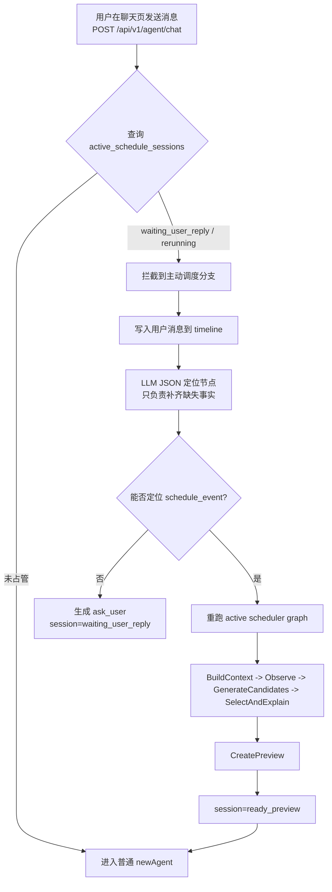

# 主动调度缺口分阶段实施计划

本文档用于把《第二阶段主动调度 MVP 实现方案.md》《主动调度候选生成器讨论稿.md》和当前代码仓库的实际状态收口到一份可执行的推进计划里。

目标只有一个：把主动调度剩下的缺口按阶段补完，并且每个阶段都能明确验收、明确自动化边界、明确是否已经完成。后续我会在这里持续把 `[ ]` 改成 `[x]`。

补充约定：本文档是阶段进度看板，不再重复写设计细节；已经落地的阶段必须及时改成 `[x]`，并保留简短验证记录。实现方案和边界口径以《第二阶段主动调度 MVP 实现方案.md》为准。

---

## 0. 当前仓库基线

先把现在已经有的和还缺的分开，避免后面阶段定义漂移。

### 已经落地的基座

- [x] `backend/active_scheduler` 已经形成准独立模块，包含 `context / observe / candidate / preview / apply / service / job` 等目录。
- [x] `dry-run -> trigger -> preview -> confirm -> apply` 主链路已经存在。
- [x] `active_schedule.triggered`、`notification.feishu.requested`、`notification_records`、用户级飞书 webhook 配置接口已经打通。
- [x] `active_schedule_previews`、`schedule_events.task_source_type / makeup_for_event_id / active_preview_id`、`tasks.estimated_sections` 这些模型层字段已经存在。
- [x] `api / worker / all` 三种启动边界已经有实测基础。
- [x] `important_urgent_task`、`unfinished_feedback` 的主触发链路已经跑过一轮端到端。

### 近期缺口收口状态

- [x] `UserAddTaskRequest`、转换层、quick task / 随口记创建入口已完整透传 `estimated_sections`。
- [x] `CreatePreview` 已切到 graph + 受限 selector，不再是固定 top1 / `Candidates[0]`。
- [x] `active_schedule_sessions` 已正式进入代码，并接好缓存链路。
- [x] 聊天入口已按 session 状态拦截，`waiting_user_reply / rerunning` 会接管补信息链路。
- [x] `unfinished_feedback` 的“定位 -> ask_user -> 重跑 graph”后端闭环已经接上，前端最小适配也已落地。
- [x] 聊天页里的主动调度 preview 卡片 / 微调弹窗已完成最小适配。
- [ ] 剩余极限验收项已做过实测验证，但还在继续脚本化沉淀。

### 近期实测记录（2026-05-02）

这轮重新核验后，主动调度最小闭环已经再次跑通，可作为后续阶段 5 负向边界验收的基线。

1. 测试账号为 `test0424 / 123456`，任务为“做马原大作业”，`mock_now` 固定到 `2026-04-30T01:14:21+08:00` 的周四窗口。
2. 这次链路跑出了 `trigger_id=ast_1bb62e3e-f2cf-48a9-8f29-1461b99bff6b`、`preview_id=asp_e79db789-ba16-4108-a843-cd33c03aa3f6`、`conversation_id=ce525dc0-101a-50ca-8993-7fc466328de2`、`notification_records.id=22`。
3. DB 对账显示 `active_schedule_triggers.status=preview_generated`、`active_schedule_previews.status=ready`、`active_schedule_sessions.status=ready_preview`，而 `schedule_events` 对该 preview 的正式写入计数为 0，说明这次只到预览态，没有执行正式 apply。
4. 浏览器里周四列同时存在已有课程和待确认任务块；周六窗口只剩一个孤立任务块属于正常现象，不是后端漏课程。
5. 这批结果说明：当前收口已经不在“主链路能不能跑通”，而是在“阶段 5 的过期、重复、篡改、冲突、幂等、通知和 outbox 负向边界能不能全部挡住”。

### 代码锚点

后续实施时优先看这些位置：

- `backend/model/task.go`：`Task.EstimatedSections` 已存在，普通创建请求已接入 `estimated_sections`。
- `backend/conv/task.go`：任务创建请求转模型时已透传预计节数。
- `backend/cmd/start.go`：quick task 创建依赖已透传预计节数；主动调度 graph runner / LLM selector / session rerun 也已在启动期装配。
- `backend/active_scheduler/preview/service.go`：preview 已支持 `SelectedCandidateID / ExplanationText / NotificationSummary / FallbackUsed`。
- `backend/active_scheduler/graph`：阶段 1 graph runner 已落地；`backend/active_scheduler/selection` 承载 LLM selector / prompt / DTO。
- `backend/active_scheduler/service/trigger_pipeline.go`：trigger workflow 已调用 graph result，再写 preview 和 notification。
- `backend/service/agentsvc/agent_newagent.go`、`backend/service/agentsvc/agent_active_schedule_session.go`、`backend/api/agent.go`：聊天入口和 graph 执行边界已接 session 管辖。
- `frontend/src/components/dashboard/AssistantPanel.vue`：主动调度卡片与确认按钮做最小分支。
- `backend/notification`：飞书 webhook provider、notification 状态机和重试逻辑的已有基座。

### 与 execute 链路的接缝

主动调度不复制 `task_item`，也不新建一套排程写入链路。

最小接入方式：

1. 主动调度 session 只负责识别当前会话是否处于主动调度占管态，并生成待确认 preview。
2. preview / 微调 / 确认继续复用现有会话维度的 `ScheduleState` 快照；前端拖拽仍走现有暂存语义，后端只更新同一份状态。
3. 用户确认后，后端按 preview / edited changes 做重校验并正式写入 `schedule_events / schedules`。
4. 主动调度释放占管后，后续普通聊天直接回到 newAgent `execute`；`execute` 继续在 `ScheduleState / OriginalScheduleState` 上调用现有 `move / swap / place / unplace` 等工具。

因此，本轮新增的是 session、路由拦截、preview DTO 适配和 graph 裁决；不是新增排程引擎，也不是把待调整任务复制成新任务再排一次。

平滑接回聊天的边界：

1. graph 不直接进入 newAgent `execute`，也不把主动调度包装成 ReAct 工具。
2. graph 结果由后端转换成 conversation timeline：追问写 `assistant_text`，预览写 `business_card.card_type=active_schedule_preview`。
3. `waiting_user_reply / rerunning` 期间，chat 入口拦截用户消息并同步推进 graph；`ready_preview` 或终态后，session 释放，普通聊天自然回到 newAgent。

---

## 1. 分阶段实施总表

| 阶段 | 状态 | 目标 | 验收点 | 自动化测试 |
| --- | --- | --- | --- | --- |
| 阶段 0 | [x] | 补 `estimated_sections` 写入入口 | 创建任务时能稳定写入 1~4 节，主动调度只消费落库值 | 可以，API + DB + `go test` |
| 阶段 1 | [x] | 补主动调度 Eino graph 和 LLM 解释 / 补全兜底 | 产生候选、有限裁决、输出解释、保留 fallback | 可以，后端单测 + API 验证 |
| 阶段 2 | [x] | 补 `active_schedule_sessions`、聊天拦截和缓存链路 | `waiting_user_reply / rerunning` 拦截生效，`ready_preview` 释放 | 可以，API + DB + 路由验证 |
| 阶段 3 | [x] | 完成 `unfinished_feedback`、`ask_user` 闭环和前端最小适配 | 用户在聊天页补信息后能重跑 graph 并刷新 preview | 后端可自动，前端需浏览器验证 |
| 阶段 4 | [x] | 收口飞书通知与会话链接 | `action_url` 指向 `/assistant/{conversation_id}`，通知 payload 从简 | 可以，webhook POST + DB 验证 |
| 阶段 5 | [ ] | 跑完第五阶段剩余验收和失败注入脚本 | 冲突、过期、重复确认、重试、dead/skipped 全覆盖 | 可以，基本全自动 |

---

## 2. 阶段细则

### 阶段 0：补 `estimated_sections` 写入入口

**当前状态**

`model.Task.EstimatedSections` 已经有了，主动调度消费侧也已经接上，这一阶段的写入侧已经补完，并完成 API、聊天 quick task 和数据库三方验收，可以收口。

**已完成内容**

1. 给 `UserAddTaskRequest` 增加 `estimated_sections`。
2. 在 `backend/conv/task.go`、`backend/cmd/start.go` 和 quick task 创建入口里把这个值写入 `model.Task`。
3. 做统一归一化，缺失或非法时兜底为 `1`，超过上限收敛到 `4`。
4. 让 newAgent / 随口记创建任务时能把 LLM 估计结果带入 DB。
5. 让任务查询 DTO 和 quick task 卡片也能回显这个字段，方便验收。

**验收点**

1. 任务创建后，查询结果里能看到最终写入的 `estimated_sections`。
2. 缺失或越界值会被收敛到 `1~4`。
3. 主动调度不再在 graph 内重新猜任务耗时。
4. 旧任务和历史数据仍能按默认 `1` 兼容。

**验证记录**

1. 已执行 `go test ./...`。
2. 已清理本次测试生成的 `.gocache` / `.gopath`。
3. 普通 `POST /api/v1/task/create` + `GET /api/v1/task/get` + MySQL 对账已通过，返回和落库均为 `estimated_sections=3`。
4. `POST /api/v1/agent/chat` 已验证可创建任务，`tasks` 表中 `id=145` 的记录落库为 `title=交实验报告`、`priority=1`、`estimated_sections=1`、`deadline_at=2026-05-02 20:00:00`。
5. 当前仓库没有保留临时 `*_test.go`。

**自动化测试**

- 可以自动跑。
- 建议路径：任务创建 API + DB 断言 + `go test ./...`。
- 若当轮实现了输入输出纯函数，临时单测可写完即删，测试后清理 `*_test.go`。

---

### 阶段 1：补主动调度 Eino graph 和 LLM 解释 / 补全兜底

**当前状态**

现在 graph / selector 已经接上，核心链路是 `BuildContext -> Observe -> GenerateCandidates -> SelectAndExplain -> CreatePreview`，不再停留在固定 top1 过渡实现。

**收口状态**

1. graph 已从固定 pipeline 升级为可复用 runner。
2. LLM 只在受限候选里做有限选择，后端 fallback 仍保留。
3. 这一阶段已经从“待做”转为“已完成”，后续只保留后续调优项。

**已完成内容**

1. 把现有 pipeline 整成可扩展 graph，物理位置固定在 `backend/active_scheduler/graph`，不放进 `newAgent`。
2. 把 LLM 放到“只读 / 受限工具视图”里；后端仍是候选合法性、粗排和默认裁决的主责任方，LLM 只做有限选择、解释生成和信息补全兜底。
3. 给 LLM 的输入分两层：
   - 基础信息：`trigger_type / target / time_window / missing_info / warnings / before-after 摘要`
   - 候选层：`candidate_id / candidate_type / summary / preview_change / dimensions`
   - 不暴露原始全量事实快照
4. 增加选择题协议：

```json
{
  "action": "select_candidate",
  "selected_candidate_id": "xxx",
  "reason": "选择原因",
  "user_message_summary": "给用户看的简短解释",
  "ask_user_question": ""
}
```

5. 支持 `select_candidate / ask_user / notify_only / close`。
6. 保留后端 fallback：LLM 超时、输出非法、候选不存在时回落到后端粗排结果；事实不足时回落到后端 `ask_user` 问题。
7. 模型接入只走一次同步 JSON 调用：启动期复用 `inits.InitEino()` 里的 `aiHub.Pro`，再包装成 `backend/infra/llm.Client`，由 `backend/active_scheduler/selection` 层调用 `GenerateJSON`；默认不走流式、不走 ReAct、不开放工具。
8. 候选维度只保留真正有用的最小集：
   - `capacity_fit`
   - `risk_level`
9. `confidence` 不作为 LLM 可见候选维度；事实可信度只用于内部 trace / `ask_user` 判断，低可信事实不生成正式候选。
10. 明确不把这些东西重新做成第一版主维度：
   - `deadline_fit`
   - `user_preference_fit`
   - `disruption`
   - `reversibility`
   - `explainability`

**验收点**

1. dry-run 和正式 trigger 都能走到 graph。
2. graph 能产出多个合法候选，而不是只剩一个 first-fit。
3. LLM 不直接写正式日程参数，也不替代后端粗排；它的主要价值是解释、在接近候选间有限裁决、以及事实不足时生成更自然的追问。
4. LLM 能看到基础上下文和候选摘要，但不会拿到原始全量快照；候选维度只公开 `capacity_fit / risk_level`。
5. `ask_user` 只有在信息不足时才出现。
6. `compress_with_next_dynamic_task` 仍然默认关闭，不在这阶段打开。
7. LLM selector 能被 fake selector 替换，方便单测覆盖“选第二个候选、输出非法、fallback 命中”这几类情况。

**自动化测试**

- 可以自动跑。
- 建议路径：候选过滤单测、选择题解析单测、dry-run API 验证、trigger 端到端验证。
- 如果 Eino graph 需要调包，实现时要先对照官方文档，再落代码。

**接入方向**

这层 graph 放在 `backend/active_scheduler/graph`，由 active scheduler 自己持有业务编排；`newAgent` 不拥有 graph，只在聊天入口被 session 拦截时同步调用 active scheduler service。后续如果拆微服务，把 graph runner 换成 RPC 同步调用即可，不改聊天、worker、API 三个入口的业务口径。

阶段 1 的落地顺序：

1. 先落 graph / selection 包，把 `BuildContext -> Observe -> GenerateCandidates -> SelectAndExplain` 这条链串起来。
2. 再把 `TriggerWorkflowService` 从固定 pipeline 切到 graph runner，确保 dry-run / trigger 先吃到新裁决结果。
3. 然后改 `preview.CreatePreviewRequest` 和 `preview.Service`，让 `SelectedCandidateID / ExplanationText / NotificationSummary / FallbackUsed` 真正进 preview。
4. 最后在 `cmd/start.go` 做装配，把 `aiHub.Pro -> llm.Client -> selector -> graph runner` 串进启动期依赖图。
5. 完成后先用 API dry-run 和 trigger 验证，再去看 preview detail 是否正确回显 selected candidate。

---

### 阶段 2：补 `active_schedule_sessions`、聊天拦截和缓存链路

**当前状态**

`active_schedule_sessions`、session bridge、聊天入口拦截和缓存回填都已经接上，`waiting_user_reply / rerunning` 会先由主动调度接管，`ready_preview` 之后再释放回普通聊天链路。

**收口状态**

1. session 表已落地，`session_id / user_id / conversation_id / trigger_id / current_preview_id / status / state_json` 这些核心字段都在代码里。
2. 后端 chat 路由已按 session 状态拦截，不会再把占管态消息误进自由聊天。
3. Redis + MySQL 的双写回填链路已经打通，session 状态可回源、可回填。
4. 这一阶段可以收口，后续只继续补 `unfinished_feedback` 闭环和前端最小适配。

**已完成内容**

1. 新增 `active_schedule_sessions`。
2. 先把字段压到最小够用集：

| 字段 | 含义 |
| --- | --- |
| `session_id` | 主动调度会话主键 |
| `user_id` | 归属用户 |
| `conversation_id` | 绑定到现有聊天会话 |
| `trigger_id` | 这次主动调度触发来源 |
| `current_preview_id` | 当前正在展示 / 等待处理的 preview |
| `status` | 会话状态 |
| `state_json` | 轻量业务状态，例如 `pending_question / missing_info / last_candidate_id / last_notification_id / expires_at / failed_reason` |
| `created_at` | 创建时间 |
| `updated_at` | 更新时间 |

3. 状态只保留这几种：
   - `waiting_user_reply`
   - `rerunning`
   - `ready_preview`
   - `applied`
   - `ignored`
   - `expired`
   - `failed`
4. 聊天入口在后端直接查 session 状态：
   - `waiting_user_reply / rerunning`：拦截，先走主动调度补信息链路。
   - `ready_preview / applied / ignored / expired / failed`：释放给普通聊天。
5. session 和 conversation/timeline 分开记账：
   - timeline 记用户可见对话。
   - session 记主动调度路由管辖权。
6. session 要接缓存链路：
   - 先查热缓存。
   - miss 再回源 DB。
   - 状态变化后同步回填。
   - 构造用户消息时把 session / preview / pending question 一起缓存好。
7. `ask_user` pending 不复用 newAgent `PendingInteraction` 作为状态源，只借鉴交互协议。
8. outbox 不作为用户回复重跑 graph 的主驱动；主路径必须同步完成，再给 SSE / timeline 更新。
9. graph 结果接回现有聊天协议：
   - `ask_user`：写 `assistant_text`，session 继续 `waiting_user_reply`。
   - `select_candidate / ready_preview`：写 `assistant_text` + `business_card.card_type=active_schedule_preview`，session 进入 `ready_preview`。
   - `close / notify_only / failed`：写 `assistant_text`，session 进入终态并释放普通聊天。

**验收点**

1. 同一个 conversation 进入聊天页时，能按 session 状态正确拦截或放行。
2. `waiting_user_reply / rerunning` 状态下，用户消息不会直接滑进普通自由聊天链路。
3. session 状态变化后，缓存和 DB 一致。
4. 关键审计链能串起来：`trigger_id -> preview_id -> conversation_id -> apply_id`。
5. 用户刷新会话历史时，主动调度追问和 preview 卡片能从 timeline 重建，不依赖 SSE 临时状态。

**自动化测试**

- 可以自动跑。
- 建议路径：API + DB 断言、路由拦截测试、缓存命中/回源测试。
- 需要你先把对应后端服务按模式起好时，我可以直接接着跑。

---

### 阶段 3：补 `unfinished_feedback`、`ask_user` 闭环和前端最小适配

**当前状态**

`unfinished_feedback` 的后端定位闭环、聊天页最小适配和并发兜底都已经收口，阶段 3 已完成。

**已落地内容**

1. 定位逻辑按这个顺序走：
   - LLM 上下文推断
   - 当前时间
   - 已排日程窗口
2. 定位成功后直接出补做 preview，不移动原任务。
3. 定位失败时，不硬猜，直接 `ask_user`。
4. `ask_user` 的问题由 `missing_info` 驱动，缺什么问什么。
5. 用户在聊天页补全的是当前主动调度缺失事实；偏好类表达不属于 `ask_user` 的缺失项，解锁后直接回到现有 newAgent memory / execute 链路，不在主动调度里新建记忆写入链路。
6. 前端只做最小分支：
   - 复用 `AssistantPanel.vue`
   - 复用现有 `ScheduleResultCard`
   - 复用现有 `ScheduleFineTuneModal`
   - 只是把 timeline 新类型和主动调度 confirm API 接起来
7. 后端负责把主动调度 preview DTO 转成前端容易复用的结构，前端不背脏活。

**补充链路图**



这个定位节点只做一件事：把用户补充的话术转成后端可校验的 JSON 事实，不负责写正式日程，不负责生成新排程策略，也不负责替代后端候选裁决。

**验收点**

1. 用户补完当前主动调度缺失事实后，能刷新 preview 并解除锁定；解锁后再说“我周末不想学习”这类偏好话术时，直接走现有 newAgent memory / execute 链路。
2. `ask_user` 流程没走完时，不能直接进入普通聊天链路。
3. 补做块只新建，不移动原任务。
4. 主动调度卡片能在聊天页显示，微调后走主动调度 confirm API。

**自动化测试**

- 后端部分可以自动跑。
- 前端卡片展示和按钮分支，建议用浏览器实际打开一次做可视确认。
- 如果只是检查 DOM / 路由 / 请求是否发对，能自动；如果要看卡片样式是否真的对齐，还是需要浏览器看一眼。

**验证记录**

1. `go build ./cmd/all` 已通过。
2. `go test ./...` 已通过。
3. 并发补充场景已验证：同一会话两条补充同时到来时，只会有一条抢到 rerun，另一条返回占管提示，不会重复生成 preview。

---

### 阶段 4：收口飞书通知与会话链接

**当前状态**

已完成。用户级 webhook 配置、通知投递、测试接口和会话链接已经统一到 `/assistant/{conversation_id}`，不再把旧的 `/schedule-adjust/{preview_id}` 当作新入口。

**已落地内容**

1. 通知前由后端预创建或绑定 `conversation_id`，保证飞书点击后直接进入同一会话。
2. `action_url` 已统一为 `/assistant/{conversation_id}`；通知 payload 保持从简，只保留会话跳转和排障所需字段。
3. 用户级飞书 webhook 的保存 / 查询 / 删除 / 测试接口已接通，真实投递与测试共用同一套 provider 校验和 JSON 拼装。
4. `notification_records` 已覆盖 `sent / failed / dead / skipped` 和 retry 相关状态。
5. 用户未配置或禁用 webhook 时，通知记录会落 `skipped`，不阻塞主链路。

**验证记录**

1. `PUT /api/v1/notification/channels/feishu` 已跑通。
2. `POST /api/v1/notification/channels/feishu/test` 已跑通，成功时会回写 `last_test_status / last_test_at`。
3. `POST /api/v1/active-schedule/trigger` 后生成的通知请求 payload 中，`message.action_url` 已指向 `/assistant/{conversation_id}`。
4. 真实飞书消息样式和外部页面交互仍属于最终验收，不影响后端收口结论。

**建议保留的边界**

1. 这里不再恢复旧的 `/schedule-adjust/{preview_id}` 主入口。
2. 业务 JSON 继续从简，不把复杂卡片协议塞进 webhook。
3. 后续如果要扩展新的通知渠道，先复用 `notification_records` 状态机和 `FeishuProvider` 的抽象边界。

---

### 阶段 5：跑完第五阶段剩余验收和失败注入脚本

**当前状态**

主链路已经有了，而且周四窗口的最小闭环已经再次跑通；现在阶段 5 的重点只剩极限边界、失败注入和脚本化收口。这里不再重跑阶段 3 的整套 `ask_user` 主链路，只保留 1 条真实 chat 烟测确认入口未回归。

**要做什么**

1. 跑通 `api / worker / all` 三种启动模式。
2. 覆盖以下边界：
   - 冲突失败
   - preview 过期
   - 重复 confirm
   - trigger 幂等
   - notification retry
   - `dead / skipped / failed`
   - outbox 重复消费
3. 把失败注入做成脚本化验收，不靠手工猜。
4. 再扫一遍哪些地方还是空壳，哪些地方只是文档先行。

**验收点**

1. 所有核心状态机都能串起来排障。
2. 同一条 preview / notification / apply 不会被重复落库。
3. 过期、冲突、篡改、失败注入都能拒绝。
4. 预览过期、重复 confirm、错误 candidate / 跨用户 preview / preview-session 不匹配都能挡住。
5. 同一 `idempotency_key / dedupe_key` 不能重复生成有效 trigger / preview / notification。
6. notification 的 `skipped / failed / dead / sent` 状态都能在 DB 里对上。
7. outbox 重复消费不会重复投递或重复写通知记录。
8. `api / worker / all` 三种启动边界相关 handler / job 注册不能缺失。
9. 最终能把这一轮主动调度缺口标成完成。

**自动化测试**

- 可以自动跑，而且这一阶段基本就是为了自动化收口。
- 绝大多数验收都能用 API + DB + 日志完成。

---

## 3. 已拍板、不再反复讨论的口径

这些口径已经在讨论里定过了，后面实施时按这个来，不再重开。

1. 主动调度不做独立的 `/schedule-adjust/{preview_id}` 主入口，主链接统一到 `/assistant/{conversation_id}`。
2. `active_schedule_sessions` 要单独建，不塞进现有 conversation 表，也不只加在 `active_schedule_previews` 上。
3. `waiting_user_reply / rerunning` 的聊天拦截在后端做，前端只做最小分支。
4. `ask_user` pending 不复用 newAgent 的 `PendingInteraction` 作为状态源。
5. `compress_with_next_dynamic_task` 第一版继续关闭，只保留 schema / 口径，不生成候选。
6. 候选维度保持极简，`deadline_fit` 和 `user_preference_fit` 不再作为第一版公开维度。
7. 本轮不再预留独立的健康分支，候选公开维度直接按 `capacity_fit / risk_level` 执行；事实可信度只保留为内部 trace / `ask_user` 门控。
8. `unfinished_feedback` 先定位，再 `ask_user`，定位成功后直接生成补做 preview，不移动原任务。
9. 用户在聊天页说偏好时，不归主动调度接管；解锁后直接走现有 newAgent memory / execute 链路。
10. 只有后台离线自动触达才走飞书；用户已经在会话里时，不需要再先走飞书通知。
11. `ask_user` 闭环只新增一个 LLM JSON 定位节点，沿用正常 `chat` 入口和 session 拦截，不单独再造工具系统。

---

## 4. 自动化测试边界

### 可以自动跑的

- `go test ./...`
- dry-run / trigger / preview / confirm 的 API 验证
- DB 结果核对
- 幂等、重复提交、冲突、过期、失败注入
- notification 状态流转
- webhook test 接口
- api-only / worker-only / all 的后端闭环

### 部分自动、需要浏览器或你配合开服务的

- `AssistantPanel.vue` 的实际页面交互
- 主动调度卡片是否真的长对了
- 飞书真实消息是否真的落到外部页面
- 需要切换启动模式时的服务重启

### 我会怎么标记进度

每个阶段完成后，我会把对应标题从 `[ ]` 改成 `[x]`，并补三件事：

1. 实际跑过的命令。
2. 关键请求 / 响应 ID。
3. DB 核对结果和剩余风险。
