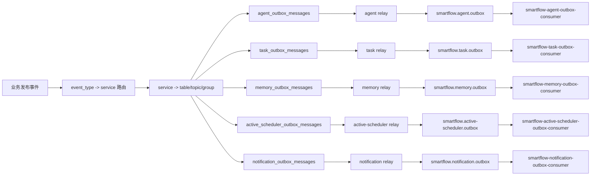
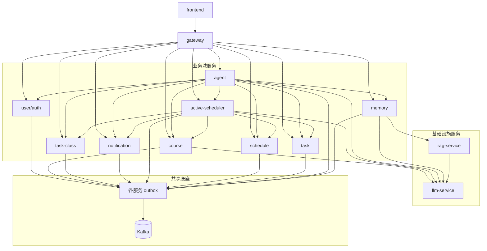

# 微服务迁移与 Gin Gateway + gozero 演进计划

## 1. 文档定位

这份文档是当前后端迁移的主总纲，目标是把阶段 0 的“单体 Gin + 统一 outbox”基线，继续平滑演进到“Gin Gateway + gozero 服务群 + 服务级 outbox + Kafka 共享运输层”。

当前进度口径：

1. 阶段 0 已完成：运行入口、事件契约、路由清单和 outbox 语义已经冻结。
2. 阶段 1 已完成：当前基线已经切成服务级 outbox 表、服务级 Kafka topic、服务级 consumer group；仍在单体进程内装配多个服务级 worker，后续拆微服务时再物理迁出。

本计划遵守两个硬原则：

1. **业务语义不变**。  
   预览、确认、通知、任务、日程的用户可见行为尽量不变，先改边界、再改归属、最后改运行形态。

2. **并行迁移，不一步到位**。  
   允许新旧实现并存，先迁移、再切流、再验证、最后删除旧实现。

---

## 2. 现状判断

当前代码已经具备迁移基础：

1. `api / worker / all` 三种启动边界已经存在。
2. 主动调度已经跑通 `trigger -> dry-run -> preview -> notification` 闭环。
3. `notification_records` 已经有独立状态机、幂等、重试能力。
4. 事件契约已经拆成 `active_schedule.triggered`、`notification.feishu.requested`、`schedule.apply.*` 等独立 payload。

阶段 1 之后，当前 outbox 已经不是共享单表 / 单 topic / 单 group 形态：

1. `agent`、`task`、`memory`、`active-scheduler`、`notification` 已经有各自的 outbox 表。
2. 每个服务都有自己的 relay worker，把本服务 outbox 表投递到本服务 Kafka topic。
3. Kafka 仍是共享运输层，但 topic 已按服务切开，不再把新流量写进共享 topic。
4. 消费侧已经按服务 consumer group 隔离，不再用一个 worker 吃全部事件。
5. 当前仍是单体进程内多 worker 装配；worker 后续会跟随对应服务一起迁出，不在阶段 1 直接拆进程。

所以后续路线不是再补一次 outbox 基建，而是在这个阶段 1 基线上，按服务边界逐个把 gozero 服务、DAO / model / worker 和启动入口迁出去。

---

## 3. 终态形态

### 3.1 网关层

Gin Gateway 只做边缘层职责：

1. 鉴权。
2. 路由聚合。
3. 请求编排。
4. SSE / 流式返回。
5. 前端所需的轻量组合逻辑。

网关不再承担这些职责：

1. 具体业务状态机。
2. 直接写核心业务表。
3. 直接消费所有后台事件。
4. 直接维护服务内部重试与投递状态。

### 3.2 服务层

gozero 服务负责领域能力：

1. `user/auth` 负责用户注册、登录、刷新、登出、JWT 签发、黑名单与 token 额度治理。
2. `course` 负责课程导入、图片解析、课表校验与课程落表。
3. `task-class` 负责任务类别、条目维护与批量入表。
4. `notification` 负责通知投递。
5. `active-scheduler` 负责主动调度建议生成和预览。
6. `schedule` 负责正式日程所有权。
7. `task` 负责任务池和任务状态所有权。
8. `agent` 负责聊天路由、计划/执行编排、工具接入、SSE 输出与会话生命周期。
9. `memory` 负责记忆抽取、检索、管理、用户记忆设置和异步 worker。
10. `llm-service` 负责统一模型调用、provider 路由、流式输出、重试、限流与审计。
11. `rag-service` 负责统一向量化、召回、重排、向量库读写与语料适配，依赖 `llm-service`。

> 说明：`agent` 和 `memory` 都可以单独成服务，不应再被写成“公共能力”；其中 `agent` 更像对外对话编排服务，`memory` 更像其支撑服务/worker 服务。
>
> 说明：`llm-service` 先抽成全仓统一模型出口，`rag-service` 再抽成检索基础设施服务；`rag-service` 只能依赖 `llm-service`，不反向依赖具体业务服务。

### 3.3 事件层

1. 每个服务拥有自己的 outbox。
2. 每个服务有自己的 relay worker。
3. Kafka 作为共享运输层，但业务 topic 不共享。
4. 同一服务的多个实例进入同一个 consumer group，做横向负载均衡。
5. topic 按服务/事件域划分，消费侧按服务 consumer group 隔离。
6. 新增事件必须登记 `event_type -> service` 路由，再由服务 catalog 映射到对应 outbox 表、topic 和 consumer group。
7. 未知事件不能靠“写进共享表再由全局 worker 兜底”处理；必须在路由注册、死信或显式失败之间选一种清晰策略。

当前阶段 1 基线：

| 服务 | outbox 表 | Kafka topic | consumer group |
| --- | --- | --- | --- |
| `agent` | `agent_outbox_messages` | `smartflow.agent.outbox` | `smartflow-agent-outbox-consumer` |
| `task` | `task_outbox_messages` | `smartflow.task.outbox` | `smartflow-task-outbox-consumer` |
| `memory` | `memory_outbox_messages` | `smartflow.memory.outbox` | `smartflow-memory-outbox-consumer` |
| `active-scheduler` | `active_scheduler_outbox_messages` | `smartflow.active-scheduler.outbox` | `smartflow-active-scheduler-outbox-consumer` |
| `notification` | `notification_outbox_messages` | `smartflow.notification.outbox` | `smartflow-notification-outbox-consumer` |

### 3.4 共享层边界

1. `shared` 只放跨进程、跨服务都要认识的契约，不放某个服务自己的业务逻辑。
2. 当前仓库里的 `backend/shared/events` 就是典型用法：事件类型、payload、版本字段。
3. 如果未来确实出现多个服务共同依赖的 DTO、枚举或错误码，可以放到 `shared/contracts` 或 `shared/types`，但前提是它们不依赖数据库，也不依赖某个服务的状态机。
4. 不要把 `dao`、`model`、`service`、`handler` 这类服务私有代码塞进 `shared`；它们应该跟随各自服务归属。
5. `infra` 也不应该是一个大公共篮子：像 `kafka`、`outbox` 这类跨服务底座可以放到 `shared/infra`；`llm-service`、`rag-service` 这类模型与检索能力要单独成基础设施服务，不要塞进 `shared`；`prompt`、`tooling` 这类强业务依赖的适配器则应跟着具体服务走。
6. 换句话说，`shared` 是“跨进程契约层 + 少量跨服务底座”，不是“公共业务层”。

---

## 4. 迁移阶段

### 4.1 阶段总览

| 阶段 | 目标 | 建议 commit 点 | 建议测试 |
| --- | --- | --- | --- |
| 0 | 语义冻结和基线确认（已完成） | 阶段 0 已作为历史基线保存；后续只在契约变化时回看 | `go test ./...`，`api / worker / all` 启动 smoke |
| 1 | Outbox v2 基建（已完成，当前基线） | 当前已具备阶段 1 保存点：服务级 outbox 表、topic、group 和多 worker 装配已打通 | 已完成健康检查、服务级 outbox 写入/投递/消费 smoke、Kafka group lag 核对 |
| 1.5 | 先抽 llm-service | 统一模型调用、provider 路由、流式输出和审计后 commit | course / active-scheduler / memory 模型调用 smoke |
| 1.6 | 再抽 rag-service | 向量化、召回、重排、检索能力跑通后 commit | memory retrieve / rerank smoke |
| 2 | 先拆 user/auth | user 路由、JWT 签发和 token 额度治理独立后 commit | 注册/登录/刷新/登出 smoke + token quota 回归 |
| 3 | 再拆 notification | notification 服务能独立消费和重试后 commit | notification E2E smoke + worker-only smoke |
| 4 | 再拆 active-scheduler | 预览生成和确认链路通过 gozero 服务跑通后 commit | dry-run / preview / confirm smoke |
| 5 | 再拆 schedule / task / course / task-class | 每个领域完成一次切流就 commit 一次 | schedule/task/course/task-class 回归 + 全链路 smoke |
| 6 | 再拆 agent / memory | agent 编排服务、memory 支撑服务和后台 worker 独立后 commit | agent chat / SSE / memory extract / memory retrieve smoke |
| 7 | Gin Gateway 收口 | 网关不再直接碰核心业务表后 commit | Gateway 路由、鉴权、组合逻辑 smoke |

> 建议习惯：每完成一个“可回退的切流点”就留一个 commit。  
> 如果一个阶段会跨好几天，尽量拆成“骨架 commit”和“切流 commit”两次保存进度。

---

### 4.2 阶段 0：语义冻结和基线确认（已完成）

本节保留为历史回顾，用来说明阶段 0 冻结了什么，不是当前待办。

目标：

1. 先不改业务语义。
2. 先把当前单体里哪些接口会迁走、哪些事件会保留，列清楚。
3. 先把当前 `backend` 当成临时网关壳，而不是未来最终形态。

这一步要做的事：

1. 固定对外接口语义。
2. 固定事件类型和 DTO 契约。
3. 固定当前 `api / worker / all` 的启动行为。
4. 固定当前 outbox、llm-service、rag-service、user/auth、course、task-class、notification、active-scheduler 的责任边界。

建议提交点：

1. 文档定稿。
2. 路由和契约清单定稿。

建议测试：

1. `go test ./...`
2. `api` 模式启动 smoke。
3. `worker` 模式启动 smoke。
4. `all` 模式启动 smoke。

---

### 4.3 阶段 1：Outbox v2 基建（已完成）

当前结论：

1. outbox 已经从“单体内部事件泵”升级成“服务级事件总线能力”。
2. 当前基线已经具备 `event_type -> service -> outbox 表 / topic / group` 的服务归属链路。
3. 服务还没有物理拆成多个 gozero 进程；目前是在单体内按服务装配多个 relay worker 和 consumer worker。
4. 后续拆微服务时，worker 会随对应服务迁出，不再重新设计 outbox 边界。

已完成的事：

1. 引入 outbox 服务归属概念，`agent`、`task`、`memory`、`active-scheduler`、`notification` 分别对应自己的 outbox 表。
2. relay worker 已按服务拆开，每个 relay 只扫描本服务 outbox 表并投递到本服务 topic。
3. consumer 已按服务 group 隔离，每个服务只处理归属到自己的事件。
4. topic 已经直接切成服务级 topic，不再把“共享 topic”作为当前终态或过渡依赖。
5. 事件发布入口已经通过路由和 catalog 决定服务归属，避免新事件默认回流到共享 outbox。

当前 outbox 总线结构：



当前切流点：

1. 新事件先按 `event_type` 查服务路由，再按服务 catalog 写入对应 outbox 表。
2. relay 只处理本服务表里的记录，不再全局扫描一个共享表。
3. Kafka topic 已经按服务切开，consumer group 也按服务切开。
4. `agent_outbox_messages` 仍沿用历史默认表名作为 `agent` 服务表；表内旧数据是共享 outbox 时代的历史存量，不代表新流量仍回流 `agent`。

仍保留的旧实现：

1. `backend/cmd/api`、`backend/cmd/worker`、`backend/cmd/all` 仍是当前启动壳，尚未拆成终态的多 gozero 进程。
2. `backend/model/outbox.go` 仍保留兼容模型；实际写入表由 outbox repository 根据服务路由选择。
3. 既有事件契约和 handler 继续保留，后续按服务迁移时再逐步移动到对应服务目录。

已完成验证：

1. 健康检查返回 200。
2. MySQL 当前只有服务级 outbox 表，没有继续依赖共享 `outbox_messages` 表。
3. Kafka 已存在 5 个服务级 topic 和 5 个服务级 consumer group。
4. 最新 smoke 中，`task.urgency.promote.requested` 写入 `task_outbox_messages`，topic 为 `smartflow.task.outbox`，状态流转到 `consumed`，`task` group lag 为 0。
5. 对应任务优先级从 `2` 更新到 `1`，证明发布、投递、消费和业务处理链路已经闭环。

下一步：

1. 不再重复做 Outbox v2 基建。
2. 后续从阶段 1.5 / 1.6 开始，按 `llm-service`、`rag-service`、`user/auth` 等服务边界推进物理拆分。
3. 迁移任何新服务时，必须复用当前 outbox 路由、服务 catalog、relay 和 consumer group 隔离规则。

---

### 4.4 阶段 1.5：先抽 llm-service

目标：

1. 把全仓统一模型出口先从各业务服务里抽出来。
2. 让 `course`、`active-scheduler`、`memory`、`agent` 对模型调用的依赖先收口到统一服务。
3. 先把模型 provider 路由、流式输出、限流、审计这些共性收束起来，避免每个服务各写一份。

这一步要做的事：

1. 把当前分散在业务服务里的模型调用入口改成统一调用 `llm-service`。
2. 把 provider 路由、重试、流式转发、审计日志收进 `llm-service`。
3. 先保留旧调用路径的兼容适配，但新逻辑必须优先走 `llm-service`。
4. 让 `course`、`active-scheduler`、`memory`、`agent` 的模型使用方式先统一，后面再看是否继续做更细的协议抽象。
5. `llm-service` 只负责模型出口，不负责业务 prompt 状态机、工具编排或领域决策。

建议提交点：

1. `llm-service` 可以独立启动时先 commit。
2. 第一批业务服务完成切换并验证稳定后再 commit。

建议测试：

1. `llm-service` 单独启动 smoke。
2. `course` 调模型 smoke。
3. `active-scheduler` 调模型 smoke。
4. `memory` / `agent` 调模型 smoke。
5. 流式输出、重试和审计回归 smoke。

---

### 4.5 阶段 1.6：再抽 rag-service

目标：

1. 把统一检索基础设施从 `memory` / `agent` 里抽出来。
2. 让向量化、召回、重排、向量库读写先进入独立服务。
3. 明确 `rag-service` 只能依赖 `llm-service` 做 embedding / rerank，不反向依赖业务服务。

这一步要做的事：

1. 把当前分散在 `memory`、`agent` 里的检索逻辑改成统一调用 `rag-service`。
2. 把 chunk、embed、rerank、retrieve、store 这些能力收进 `rag-service`。
3. `rag-service` 通过 `llm-service` 获取 embedding 或 rerank 能力，不直接接业务模型出口。
4. 先保留旧检索链路的兼容适配，但新链路必须优先走 `rag-service`。
5. 让 `memory` 退回成记忆管理和编排支撑服务，不再自己持有完整检索基础设施。

建议提交点：

1. `rag-service` 可以独立启动时先 commit。
2. `memory` / `agent` 切到 `rag-service` 后稳定，再 commit。

建议测试：

1. `rag-service` 单独启动 smoke。
2. `memory retrieve` smoke。
3. `memory rerank` smoke。
4. `agent` 检索调用 smoke。
5. `rag-service -> llm-service` 依赖链路 smoke。

---

### 4.6 阶段 2：先拆 user/auth

目标：

1. 把用户入口、登录态签发和 token 额度治理从 Gin 单体里拆出来。
2. 让 gateway 不再直读 `users` 表，先把“用户域”变成独立服务边界。
3. 为后面所有需要鉴权和额度检查的服务提供稳定入口。

这一步要做的事：

1. 把 `/user/register`、`/user/login`、`/user/refresh-token`、`/user/logout` 迁出当前单体。
2. 把 JWT 签发、刷新、黑名单和 token 额度判断收进 `user/auth` 服务。
3. gateway 只保留 access token 校验、路由转发和轻量编排，不再直接碰用户表。
4. `agent/chat` 相关的 token quota 门禁同步改成调用 `user/auth` 能力，避免网关继续直连 `users` 表。
5. 过渡期允许 gateway 保留原 `/user` 路由壳，但业务实现必须已经落到新服务。

建议提交点：

1. `user/auth` 服务可以独立启动时，先 commit。
2. 登录、刷新、登出与 token quota 完整切流后，再 commit。

建议测试：

1. `user/auth` 服务单独启动 smoke。
2. 注册 / 登录 / 刷新 / 登出 smoke。
3. token quota 门禁回归 smoke。
4. 旧网关壳停掉 user 直连后，`agent/chat` 仍能正常鉴权与限额校验。

---

### 4.7 阶段 3：再拆 notification

目标：

1. 把通知投递做成第一条真正独立出来的 gozero 服务。
2. 把通知投递和主动调度闭环解耦。
3. 验证“服务级 outbox + 服务专属 worker + 独立重试”这套新模式。

这一步要做的事：

1. 把 notification 的投递记录、幂等、重试、provider 调用收进 notification 服务，并先按你熟悉的 service 内单体壳收束，避免继续长出新的顶层小包。
2. 主动调度 worker 只负责发布 `notification.feishu.requested`。
3. API 只负责通道配置、测试和轻量查询，不直接发真实通知。
4. notification 服务只消费自己的通知事件。
5. 这一步优先用 gozero 落地。

建议提交点：

1. notification 服务可以独立启动时，先 commit。
2. notification 的独立消费和重试都稳定后，再 commit。

建议测试：

1. notification 服务单独启动 smoke。
2. 通知事件端到端 smoke。
3. 重试扫描 smoke。
4. 停掉 notification 服务后，主动调度预览仍然可用的回归测试。

---

### 4.8 阶段 4：再拆 active-scheduler

目标：

1. 把主动调度的“生成建议”能力独立成服务。
2. 让 gateway 退成边缘编排层，不再承载核心建议生成。
3. 把主动调度的输入输出契约稳定下来。

这一步要做的事：

1. 把 `trigger -> dry-run -> preview` 链路迁出当前单体。
2. 保留清晰的 DTO 和事件契约。
3. `active-scheduler` 用 gozero 落地。
4. 正式确认应用先保持稳定同步语义，等契约更稳后再考虑更深的异步化。

建议提交点：

1. dry-run 能独立跑通时，先 commit。
2. preview / confirm 的 end-to-end 跑通后，再 commit。

建议测试：

1. dry-run smoke。
2. preview 生成 smoke。
3. confirm / apply smoke。
4. `mock_now` 和幂等回归测试。

---

### 4.9 阶段 5：再拆 schedule / task / course / task-class

目标：

1. 把正式日程和任务池的所有权拆出去。
2. 把课程导入和任务类别编排一起纳入计划编排域。
3. 让核心数据服务真正独立。
4. 让 gateway 不再直接读写这些核心表。

这一步要做的事：

1. `schedule` 先独立，再看 `task`、`course`、`task-class`。
2. 每个领域只维护自己的写模型。
3. 通过事件或明确 RPC 契约通信。
4. 继续保持并行迁移，旧实现和新实现可以短期并存。

建议提交点：

1. schedule 切流完成后 commit。
2. course / task-class 切流完成后 commit。
3. task 切流完成后 commit。

建议测试：

1. schedule 回归测试。
2. course 回归测试。
3. task-class 回归测试。
4. task 回归测试。
5. 全链路 smoke。

---

### 4.10 阶段 6：再拆 agent / memory

目标：

1. 把聊天路由、计划/执行编排、工具接入从现有单体里独立出去。
2. 把 memory 的异步抽取、检索、管理拆成独立支撑服务/worker。
3. 让 agent 通过清晰的服务契约调用 user/auth、course、task-class、notification、active-scheduler、schedule、task，不再依赖大装配入口。

这一步要做的事：

1. 把 `newAgent` 里的路由、prompt、graph、tool registry、会话状态和 SSE 输出包装收进 `agent` 服务。
2. 把 `memory` 的 repo、worker、orchestrator 和审计写入收进 `memory` 服务。
3. gateway 只保留鉴权、路由转发和流式透传，不再直接承担 agent 会话编排。
4. 过渡期允许 agent 先通过同进程适配器访问现有能力，但切流点必须清楚。

建议提交点：

1. agent 服务可以独立启动时先 commit。
2. memory 的独立抽取和检索链路稳定后再 commit。

建议测试：

1. agent chat smoke。
2. memory extract smoke。
3. memory retrieve / manage smoke。
4. agent 停用旧网关直连后的回归 smoke。

---

### 4.11 阶段 7：Gin Gateway 收口

目标：

1. 让当前 Gin 服务真正退化成 Gateway。
2. 只保留用户入口转发、鉴权、组合和流式交互。
3. 清掉剩余的核心业务直连路径。

这一步要做的事：

1. 移除 gateway 里的核心领域写路径。
2. 把业务能力全部迁到 gozero 服务。
3. 只保留前端入口的薄编排。
4. 用户入口也只做转发和响应适配，不再直接读写 `users` 表。
5. 把 gateway 当成 BFF，而不是域服务承载体。

建议提交点：

1. gateway 不再直接写核心业务表时 commit。
2. gateway 路由只剩边缘职责时再 commit。

建议测试：

1. 网关路由 smoke。
2. 鉴权 smoke。
3. 前端关键路径 smoke。

---

## 5. 推荐执行顺序

当前建议按这个顺序推进：

1. 以阶段 1 的服务级 outbox 为当前基线，不再回头做共享 outbox 方案。
2. 先切 llm-service，把统一模型出口从各业务服务里抽出去。
3. 再切 rag-service，把检索基础设施从 memory / agent 里抽出去。
4. 先切 user/auth，把登录态和额度门禁从 gateway 拿出去。
5. 再切 notification。
6. 再切 active-scheduler。
7. 然后切 schedule / task / course / task-class。
8. 再切 agent / memory，把聊天编排和记忆链路独立出去。
9. 最后把 Gin 收口成纯 Gateway。

一句话总结：

> outbox 的服务级基础设施已经完成；接下来先把 llm-service 抽成全仓统一模型出口，把 rag-service 抽成统一检索基础设施；然后把 user/auth 从 gateway 里抽出去，清掉用户表直连和额度门禁耦合；接着把 notification 切成第一条事件驱动服务线；然后让 active-scheduler、schedule、task、course、task-class 按稳定边界逐步独立；再把 agent / memory 独立出来，完成聊天编排和记忆链路的服务化；最后把 Gin 收口成真正的 Gateway。

---

## 6. 最终文件结构对齐

### 6.1 参考结论

对照你上一个 `Kitex + Hertz` 项目，这次换成 `Gin Gateway + gozero` 后，**结构理念基本不变，服务承载方式会变**。

不变的部分：

1. 仍然是“入口层 + 多服务层 + 共享契约层”的三段式。
2. 仍然是“一个服务一个目录”，目录内部继续按职责拆分。
3. 仍然保留 `dao / model / handler(or api) / utils / init` 这类服务内部基础分层。
4. 仍然保留按领域拆目录，而不是把所有业务代码堆到一个大包里。

需要变化的部分：

1. `Kitex` 的 `kitex_gen` / `.thrift` / `build.sh` / `script` 这套 RPC 生成结构，会被 gozero 的 `api` / `rpc` / `internal` / `etc` 结构替代。
2. 原来 `client` + `kitex server` 的双模块思路，会变成 `gateway` + `services/*` 的多服务布局。
3. 入口层会从“RPC 客户端网关”转成“HTTP Gateway + gozero 服务调用”。
4. 服务内部的 `start.go` 会收口成 gozero 风格的 `main + config + logic + svc`，或者保留少量自定义启动壳，但不再依赖 Kitex 那套启动模板。

### 6.2 推荐目标树

```text
SmartFlow-Agent/
├── frontend/
├── backend/
│   ├── gateway/
│   │   ├── cmd/
│   │   │   └── gateway/
│   │   │       └── main.go
│   │   ├── api/
│   │   ├── middleware/
│   │   ├── routers/
│   │   └── auth/
│   ├── services/
│   │   ├── user-auth/
│   │   │   ├── start.go
│   │   │   ├── handler.go
│   │   │   ├── sv/
│   │   │   ├── dao/
│   │   │   ├── model/
│   │   │   └── internal/
│   │   │       ├── token/
│   │   │       ├── quota/
│   │   │       └── session/
│   │   ├── course/
│   │   │   ├── start.go
│   │   │   ├── handler.go
│   │   │   ├── sv/
│   │   │   ├── dao/
│   │   │   ├── model/
│   │   │   └── internal/
│   │   │       ├── parse/
│   │   │       ├── import/
│   │   │       ├── conflict/
│   │   │       └── adapter/
│   │   ├── task-class/
│   │   │   ├── start.go
│   │   │   ├── handler.go
│   │   │   ├── sv/
│   │   │   ├── dao/
│   │   │   ├── model/
│   │   │   └── internal/
│   │   │       ├── convert/
│   │   │       ├── batch/
│   │   │       └── item/
│   │   ├── notification/
│   │   │   ├── start.go
│   │   │   ├── handler.go
│   │   │   ├── sv/
│   │   │   ├── dao/
│   │   │   ├── model/
│   │   │   └── internal/
│   │   │       ├── provider/
│   │   │       ├── runner/
│   │   │       ├── dedupe/
│   │   │       ├── channel/
│   │   │       └── retry/
│   │   ├── active-scheduler/
│   │   │   ├── start.go
│   │   │   ├── handler.go
│   │   │   ├── sv/
│   │   │   ├── dao/
│   │   │   ├── model/
│   │   │   └── internal/
│   │   │       ├── graph/
│   │   │       ├── selection/
│   │   │       ├── feedbacklocate/
│   │   │       ├── preview/
│   │   │       ├── apply/
│   │   │       ├── job/
│   │   │       └── trigger/
│   │   ├── schedule/
│   │   │   ├── start.go
│   │   │   ├── handler.go
│   │   │   ├── sv/
│   │   │   ├── dao/
│   │   │   ├── model/
│   │   │   └── internal/
│   │   │       ├── command/
│   │   │       ├── event/
│   │   │       └── conflict/
│   │   ├── task/
│   │   │   ├── start.go
│   │   │   ├── handler.go
│   │   │   ├── sv/
│   │   │   ├── dao/
│   │   │   ├── model/
│   │   │   └── internal/
│   │   │       ├── policy/
│   │   │       ├── event/
│   │   │       └── urgency/
│   │   ├── agent/
│   │   │   ├── start.go
│   │   │   ├── handler.go
│   │   │   ├── sv/
│   │   │   ├── dao/
│   │   │   ├── model/
│   │   │   └── internal/
│   │   │       ├── prompt/
│   │   │       ├── graph/
│   │   │       ├── stream/
│   │   │       ├── tool/
│   │   │       ├── session/
│   │   │       └── router/
│   │   ├── memory/
│   │   │   ├── start.go
│   │   │   ├── handler.go
│   │   │   ├── sv/
│   │   │   ├── dao/
│   │   │   ├── model/
│   │   │   └── internal/
│   │   │       ├── repo/
│   │   │       ├── orchestrator/
│   │   │       ├── worker/
│   │   │       ├── observe/
│   │   │       ├── cleanup/
│   │   │       └── vectorsync/
│   │   ├── llm/
│   │   │   ├── start.go
│   │   │   ├── handler.go
│   │   │   ├── sv/
│   │   │   ├── model/
│   │   │   └── internal/
│   │   │       ├── provider/
│   │   │       ├── router/
│   │   │       ├── stream/
│   │   │       ├── quota/
│   │   │       └── audit/
│   │   └── rag/
│   │       ├── start.go
│   │       ├── handler.go
│   │       ├── sv/
│   │       ├── model/
│   │       └── internal/
│   │           ├── chunk/
│   │           ├── embed/
│   │           ├── rerank/
│   │           ├── retrieve/
│   │           ├── store/
│   │           ├── corpus/
│   │           └── observe/
│   ├── shared/
│   │   ├── events/
│   │   └── infra/
│   │       ├── kafka/
│   │       └── outbox/
│   └── main.go
└── docs/
```

> 说明 1：`sv/` 是本文档里唯一推荐的“服务主业务编排层”目录名；文中若出现 `service/`，默认只表示当前仓库里的旧命名或迁移遗留，不作为终态目录名。
>
> 说明 2：`dao/` 只负责数据库访问，`handler.go` 只负责 HTTP 入口适配，`sv/` 只负责业务用例编排，`internal/` 只放服务私有子模块，禁止被别的服务直接 import。
>
> 说明 3：`start.go` 只负责装配依赖和启动进程，不承载业务规则。
>
> 当前目录到目标目录的映射：
>
> 1. `backend/service/*.go` 这批现有业务逻辑，后面要分别迁到各自服务根目录下的 `sv/`。
> 2. `backend/service/agentsvc/*` 和 `backend/newAgent/*`，后面要收束到 `backend/services/agent/sv/` + `internal/{prompt,graph,stream,tool,session,router}`。
> 3. `backend/notification/*`，后面要收束到 `backend/services/notification/`，其中 `runner/provider/dedupe/channel_service` 归入 `internal/notification/`。
> 4. `backend/active_scheduler/*`，后面要收束到 `backend/services/active-scheduler/`，其中 `graph/selection/feedbacklocate/apply/job` 归入 `internal/`。
> 5. `backend/memory/*`，后面要收束到 `backend/services/memory/`；当前 `memory/service/*` 只是迁移过渡态，终态还是按 `sv/` 或 `internal/` 拆开。
>
> 说明 4：`shared` 先保留 `events` 和少量跨服务底座型 `infra`。以后如果真的出现跨服务 DTO / 枚举 / 常量，再新增 `contracts` 一类目录，但不要把 `dao`、`model`、`sv`、`handler` 这类服务私有层塞进去。

> 说明 5：`notification` 和 `active-scheduler` 的服务内部建议继续收束成你熟悉的“服务内单体壳”风格，不要让一级目录一直长成一排小框架；复杂算法和编排细节可以继续拆文件，但尽量下沉到 `sv/` 或 `internal/` 下面。
>
> 说明 6：`llm-service` 和 `rag-service` 是独立基础设施服务，不放进 `shared`；`rag-service` 依赖 `llm-service` 做 embedding / rerank，不反向依赖业务服务。
>
> 说明 7：目录树里如果暂时写成 `backend/services/llm/` 和 `backend/services/rag/`，那只是目录名写法；后文所有职责判断都以 `llm-service` / `rag-service` 这两个逻辑服务名为准。

### 6.3 哪些可以不用变

1. 课程、任务、日程、通知这些领域模型的名字和业务语义可以保留。
2. `middleware` 的鉴权、限流、幂等这类横切能力可以继续保留，最多是接入方式变化。
3. `conv`、`infra`、`inits` 这类能力可以复用思路，但位置要按服务边界重新归属，不默认做成全局公共层。
4. `shared` 里的事件契约和少量跨服务底座可以继续保留，并作为跨进程通信的稳定锚点。

### 6.4 哪些需要变

1. `backend/cmd/start.go` 这种“大装配入口”后面要逐步拆成 gateway 启动和各服务启动。
2. `api` 这一层会收缩成纯 Gateway 职责，不再承载核心领域逻辑。
3. 当前仓库里的 `backend/service` 目录和相关遗留入口，要按 `user/auth`、`course`、`task-class`、`notification`、`active-scheduler`、`schedule`、`task`、`agent`、`memory` 拆出去；其中 `notification` 和 `active-scheduler` 最终都要收束成更像 seckill 的服务内单体壳，不要长期维持一串顶层小包。
4. 当前单体里的共享启动方式 `api / worker / all`，后面会拆成“gateway 进程 + 服务进程 + worker 进程”的组合。
5. 任何依赖 `users` 表直读、核心表直写的网关路径，都要迁到对应服务里。
6. 不再把服务私有的 `dao` / `model` / `sv` / `handler` 误放进 `shared`，避免它变成新的单体公共层。
7. 当前 `backend/infra/llm` 和 `backend/infra/rag` 只是迁移过渡态，后面分别收束到 `backend/services/llm` 和 `backend/services/rag`。

### 6.5 换对话时要先记住的锚点

1. `shared` 不是公共业务层，只是跨服务契约层。
2. 第一批 gozero 域服务是 `user/auth`、`course`、`task-class`、`notification`、`active-scheduler`、`schedule`、`task`，后面再切 `agent` / `memory`。
3. `agent` 不是公共能力，它应当单独成服务；`memory` 也是独立支撑服务，不应长期挂在 gateway 里。
4. `notification` 和 `active-scheduler` 都应该回到更像 seckill 的服务内单体结构，避免成为“半个框架”。
5. `llm-service` 是全仓统一模型出口；`rag-service` 是统一检索基础设施；`rag-service` 依赖 `llm-service`，不反向依赖业务服务。
6. outbox 已经升级成服务级基础设施，后续直接在当前服务级表 / topic / group 基线上按域边界逐个切出去。
7. 后续任何服务目录调整，都要先对照下面的“典型用例”；如果这次改动说不清它属于哪个用例，就先不要动结构，只补文件或补注释。

### 6.6 `notification` / `active-scheduler` 的服务内结构

1. `notification` 建议直接收束成更标准的服务内单体壳：外层统一成 `dao/`、`model/`、`sv/`、`handler.go`、`start.go`，当前的 `runner.go`、`provider.go`、`dedupe.go`、`channel_service.go` 这类细节先保留在服务内部，但后面要逐步并入 `sv/` 或 `internal/notification/`，不要长期挂成一串平级文件。
2. `active-scheduler` 建议收束成同类服务壳，外层只保留 `dao/`、`model/`、`sv/`、`handler.go`、`start.go`，把 `graph`、`selection`、`feedbacklocate`、`apply`、`job` 这些复杂流程统一下沉到 `internal/`。
3. 这样做的目标，是让后续每个服务的阅读方式都更接近你熟悉的 seckill 风格，而不是把一个服务拆成十几个平级目录。

### 6.7 每个服务的典型用例

> 这段是给后续代理看的硬护栏：先对齐用例，再动目录；如果不是围绕对应用例扩展，不要先拆目录再补理由。

| 服务 | 典型用例 | 结构收束建议 | 不允许的改法 |
| --- | --- | --- | --- |
| `user/auth` | 注册、登录、刷新、登出、JWT 签发、黑名单、token 额度门禁 | `handler.go` / `sv/` / `dao/` / `model/` / `internal/auth/`；认证状态机和额度判断留在服务内 | 不要把 gateway 鉴权逻辑和别的领域规则混进来 |
| `course` | 课程导入、图片解析、课表校验、课程落表，图片解析走 `llm-service` | `handler.go` / `sv/` / `dao/` / `model/` / `internal/{parse,import,conflict,adapter}/` | 不要把课程解析代码写成网关临时脚本 |
| `task-class` | 任务类创建/更新、items 批量 upsert、嵌入时间同步 | `handler.go` / `sv/` / `dao/` / `model/` / `internal/{convert,batch,item}/` | 不要把批处理拼装沉到 handler 里，也不要让 agent 直接改库 |
| `notification` | 消费 `notification.feishu.requested`、写通知记录、幂等、重试、provider 投递 | `start.go` / `handler.go` / `sv/` / `dao/` / `model/` / `internal/{provider,runner,dedupe,channel,retry}/` | 不要把通知投递逻辑散回 worker 或 gateway |
| `active-scheduler` | `trigger -> dry-run -> preview -> confirm`、建议生成、反馈定位；候选选择走 `llm-service` | `start.go` / `handler.go` / `sv/` / `dao/` / `model/` / `internal/{graph,selection,preview,feedbacklocate,apply,job,trigger}/` | 不要把 graph/selection 继续长成对外平级框架 |
| `schedule` | 正式日程所有权、查询、删除、应用命令 | `start.go` / `handler.go` / `sv/` / `dao/` / `model/` / `internal/{command,event,conflict}/` | 不要让 gateway 直接写 schedule 表 |
| `task` | 任务新增、完成/撤销、任务池查询、紧急性平移 | `start.go` / `handler.go` / `sv/` / `dao/` / `model/` / `internal/{policy,event,urgency}/` | 不要把 task 的状态机塞进 agent 或 schedule |
| `llm-service` | 统一模型调用、provider 路由、流式输出、重试、限流、审计 | `start.go` / `handler.go` / `sv/` / `model/` / `internal/{provider,router,stream,quota,audit}/` | 不要把业务 prompt、状态机、工具编排塞进模型出口 |
| `rag-service` | 向量化、召回、重排、向量库读写、语料适配、检索 API | `start.go` / `handler.go` / `sv/` / `model/` / `internal/{chunk,embed,rerank,retrieve,store,corpus,observe}/` | 不要让业务服务直连向量库并绕开统一检索层 |
| `agent` | 多轮对话、SSE、工具调用、计划/执行编排、主动调度会话复跑；模型推理走 `llm-service`，记忆检索走 `memory` / `rag-service` | 当前过渡形态是 `backend/service/agentsvc` + `backend/newAgent/*`；终态应收束为 `start.go` / `handler.go` / `sv/` / `dao/` / `model/` / `internal/{prompt,graph,stream,tool,session,router}/` | 不要把 memory、notification、schedule 的业务实现塞进 agent，只通过契约调用 |
| `memory` | 记忆抽取、检索、管理、worker 执行、观测埋点；抽取走 `llm-service`，检索走 `rag-service` | `start.go` / `handler.go` / `sv/` / `dao/` / `model/` / `internal/{repo,orchestrator,worker,observe,cleanup,vectorsync}/`；当前 `module.go` 只是过渡总门面 | 不要把 memory 变成 gateway 的辅助函数 |

`shared` 和 `shared/infra` 不在这张表里，因为它们不是业务服务，只承载跨服务契约和少量公共底座，不按某一个域服务的用例来改。

### 6.8 最终服务关系图



说明：

1. `rag-service` 只依赖 `llm-service`，不反向依赖业务服务。
2. `agent` 仍然是编排层，实际会通过契约调用 `user/auth`、`course`、`task-class`、`notification`、`active-scheduler`、`schedule`、`task` 和 `memory`。
3. Gateway 不直接碰 `llm-service` / `rag-service`，只把请求转给对应业务服务。
4. 图里的 outbox 是“每个服务自己的 outbox 表 + 专属 relay worker”的抽象，不代表所有服务共用一张表。
5. 当前阶段 1 已完成 `agent`、`task`、`memory`、`active-scheduler`、`notification` 的服务级 outbox 表、topic 和 consumer group；尚未物理拆出的服务后续沿用同一模式补齐。
6. Kafka 是共享运输层，不是共享业务 topic；新流量不应再默认进入单一共享 topic。

### 6.9 切对话交接卡

这段是给下一位代理直接接手用的，不需要再反复问大方向。

1. 先读顺序：`3.2` 服务层、`4.1` 阶段总览、`4.3` Outbox v2、`4.4` llm-service、`4.5` rag-service、`4.6` user/auth、`4.7` notification、`4.8` active-scheduler、`4.10` agent / memory、`6.5` 切对话锚点、`6.7` 典型用例、`6.8` 最终关系图、`6.10` 启动方式、`6.11` 测试自动化、`6.12` 多代理执行闭环。
2. 已冻结的终态是 `Gin Gateway + gozero 服务群 + 服务级 outbox + Kafka 共享运输层`。
3. 阶段 1 已完成，当前 outbox 基线是服务级表、服务级 topic、服务级 consumer group；worker 仍在单体内装配，后续随对应服务迁出。
4. 已冻结的基础设施服务是 `llm-service` 和 `rag-service`，其中 `rag-service` 只依赖 `llm-service`。
5. 下一轮默认从阶段 1.5 / 1.6 继续，先抽 `llm-service` 和 `rag-service`；业务服务优先级仍是 `user/auth -> notification -> active-scheduler -> schedule/task/course/task-class -> agent/memory`。
6. `notification` 和 `active-scheduler` 后续要回到更像 seckill 的服务内单体壳。
7. `shared` 只保留跨进程契约和少量跨服务底座，不承载业务逻辑、DAO、模型或状态机。
8. 如果后续要改目录，必须先回答“这个文件属于哪一个典型用例”，回答不清楚就先别动结构。
9. 当前文档已经可以作为切对话基线；后续代理默认按本文件推进。现阶段的迁移基线入口是 `backend/cmd/api`、`backend/cmd/worker`、`backend/cmd/all`，它们只是当前仓库的启动壳，不是终态。终态仍然是“一个服务一个独立 `main.go`”，只在出现新的契约风险、边界变化或业务语义变化时再重新讨论架构。

### 6.10 启动方式与进程模型

1. 终态里每个 gozero 服务都应当是独立进程：一个服务一个 `main.go`，一份配置，一组日志，一套端口和资源连接。
2. 目录上可以继续采用 `backend/cmd/<service>/main.go` 作为可执行入口，`backend/services/<service>/` 负责 `start.go`、`handler.go`、`sv/`、`dao/`、`model/`、`internal/`。
3. 本地开发为了方便，可以保留 `backend/cmd/all`、`make dev` 或类似聚合启动器，但它只负责拉起多个独立进程，不在同一个 Go 进程里把所有服务 `startXXX()` 混着跑。
4. `go startxxx()` 这种“一个进程里同时起多个服务”的方式只适合作为过渡调试壳，不作为最终部署形态。
5. 如果某些服务需要联动启动，应通过脚本、Makefile、docker compose 或开发编排器去启动多个二进制，而不是把进程边界打穿。
6. 带 worker 的服务可以继续保留多入口角色，例如 `api` / `worker` / `all`，但它们仍然是同一服务的不同可执行角色，不是把多个服务硬塞进一个进程。

### 6.11 测试自动化与 smoke 权限边界

后续 agent 做阶段 smoke 时，默认可以使用下面三类本地测试能力，不需要每次重新讨论测试方式：

1. **注册测试账号**：允许通过本地或测试环境接口创建临时 smoke 账号，用于登录、鉴权、token quota、agent chat、主动调度等链路验证。
2. **curl 调接口**：允许用 `curl` 调本地 `gateway` 或本地服务接口，验证 HTTP 状态码、响应结构、业务状态流转和错误码。
3. **docker exec 查 MySQL**：允许通过 `docker exec` 进入本地 MySQL 容器执行只读查询，核对用户、任务、日程、outbox、notification_records、memory_jobs 等表里的状态。

默认测试账号规则：

1. 账号必须使用明显的测试前缀，例如 `smoke_agent_<timestamp>@example.test`。
2. 不使用真实手机号、真实邮箱、真实姓名或用户个人信息。
3. 密码只用于本地 smoke，不能写入文档、提交记录或日志摘要。
4. 如果接口要求昵称、用户名等字段，统一使用 `smoke_agent_<timestamp>` 这类可识别测试值。

默认允许的 smoke 操作：

1. 启动本地服务或本地 worker。
2. 注册、登录、刷新 token、登出。
3. 调用迁移阶段相关接口，例如课程导入、任务类维护、主动调度 dry-run / preview / confirm、通知投递、agent chat、memory retrieve。
4. 用 `docker exec` + `SELECT` / `SHOW` 查询本地 MySQL 状态。
5. 查看 outbox 是否写入、是否投递、是否被对应服务消费。
6. 查看 notification、schedule、task、memory 等关键表状态是否符合预期。

默认不允许的 smoke 操作：

1. 不访问生产环境接口。
2. 不使用真实用户账号或真实第三方 webhook 做自动化验证。
3. 不直接执行 `DROP`、`TRUNCATE`、`DELETE`、`UPDATE`、`ALTER` 这类破坏性或批量数据库操作。
4. 不直接清空 outbox、任务、日程、用户、通知、记忆等业务表。
5. 不把 token、密码、API key、webhook 地址等敏感值写进文档、提交信息或最终报告。

如果 smoke 需要清理测试数据，优先使用专门测试库、测试前缀、接口级清理能力或一次性测试环境；直接改库清理必须单独确认。

每次 smoke 最终汇报至少包含：

1. 启动了哪些进程或服务。
2. 注册/登录使用的是哪类测试账号前缀，不输出密码。
3. curl 调用了哪些接口、返回了哪些关键状态码。
4. docker exec 查询了哪些表、验证了哪些关键字段。
5. 哪些检查通过，哪些失败，失败时保留可复现命令或最小上下文。

如果本轮还执行了 `go test`，测试结束后必须清理项目根目录下的 `.gocache`，保持仓库整洁。

### 6.12 多代理并行执行闭环

后续迁移任务如果范围较大，推荐按“主代理规划与收口，子代理并行推进”的方式执行。

子代理统一配置：

1. 子代理默认统一使用 `gpt-5.4`，reasoning effort 统一使用 `xhigh`。
2. 除非用户明确指定其他模型，否则迁移实现、代码评审和真实 smoke 子代理都按这个配置开。
3. 主代理给子代理的任务必须写清楚目标、文件范围、禁止改动范围、验收标准和最终输出格式。

整体闭环：

1. **主代理先定边界**：读取本计划和当前代码，明确本轮只处理一个阶段、一个能力域或一类公共件。
2. **主代理拆分任务**：把任务拆成互不冲突的子任务，并给每个子代理指定明确文件范围、责任边界和验收标准。
3. **子代理并行推进**：多个子代理可以并行实现不同服务、不同适配层或不同测试补强，但禁止同时修改同一批核心文件。
4. **主代理耐心等待**：主代理必须等并行推进的子代理返回完整结果后，再进入统一收口；等待期间可以做不冲突的上下文整理，但不能重复实现、覆盖或抢跑子代理负责的任务。
5. **主代理统一收口**：主代理负责合并实现、处理接口命名、依赖注入、配置、启动入口和跨服务契约一致性。
6. **子代理并行 code review + 真实测试**：实现收口后，再开子代理分别做代码评审和真实 smoke；code review 聚焦 bug、边界、回归风险，真实测试按 `6.11` 执行。
7. **主代理再次等待**：主代理必须等 review 子代理和测试子代理都给出结论后，再判断是否修复、回退或扩大测试面。
8. **主代理修主要问题**：主代理根据评审和 smoke 结果修复阻塞问题、高风险问题和明确回归。
9. **主代理最终复核**：复跑关键测试，汇总本轮迁了什么、旧实现保留在哪里、切流点在哪里、下一轮建议继续处理什么。

子代理拆分原则：

1. 每个子代理必须有清晰所有权，例如 `services/notification`、`shared/events`、`gateway route adapter`、`outbox relay`。
2. 子代理之间的写入范围尽量不重叠；如果必须碰同一文件，由主代理自己处理。
3. 子代理不能擅自回滚、删除或覆盖其他代理的改动。
4. 子代理不能自行扩大阶段范围，例如本轮拆 notification 时顺手重构 active-scheduler。
5. 子代理输出必须包含改了哪些文件、为什么改、还有哪些风险没有验证。

主代理收口职责：

1. 统一包名、目录名、接口名和配置名。
2. 统一错误处理、日志、注释语言和启动方式。
3. 确认 `shared` 没有被塞入服务私有业务逻辑。
4. 确认 `sv` / `dao` / `model` / `internal` 的职责没有串层。
5. 确认 outbox、Kafka consumer group、worker 归属没有打乱服务边界。

并行 code review 细则：

1. review 子代理只做评审，不直接改代码，除非主代理明确分派修复任务。
2. review 先报 bug、回归风险、缺测试和边界污染，不写空泛风格建议。
3. review 必须引用具体文件和位置，说明为什么这是迁移风险。
4. review 结果交给主代理统一判断，不由多个子代理分别修同一处。

并行真实测试细则：

1. 测试子代理按 `6.11` 的权限边界执行，只使用本地或测试环境。
2. 可以注册临时 smoke 账号、curl 接口、docker exec 只读查询 MySQL。
3. 测试子代理不能做破坏性数据库操作，不能访问生产环境，不能使用真实用户信息。
4. 测试结果必须包含命令、关键状态码、关键表查询点和通过/失败结论。
5. 如果测试发现阻塞问题，主代理先修复主路径，再决定是否扩大测试面。

提交与保存进度：

1. 不主动 `git commit`，除非用户明确要求。
2. 如果用户要求提交，主代理必须先确认本轮改动范围、测试结果和未解决风险。
3. 每个阶段推荐在“骨架可启动”“切流可回退”“真实 smoke 通过”这几个点分别保存进度。

---

### 6.13 阶段 0 历史基线与阶段 1 当前基线快照

阶段 0 历史基线：

1. 阶段 0 时，仓库入口是 `backend/cmd/api`、`backend/cmd/worker`、`backend/cmd/all`；`backend/main.go` 只保留兼容壳，不作为终态入口。
2. 阶段 0 时，Gin 路由集中在 `/api/v1/...` 下，主要覆盖 `user`、`task`、`course`、`task-class`、`schedule`、`agent`、`memory`、`active-schedule`、`notification`。
3. 阶段 0 时，outbox 还是共享单表 + 单 topic / 单 group 形态；阶段 0 只冻结 envelope、版本号、handler 路由和消费边界，不扩 topic。
4. 阶段 0 时，`notification`、`active-scheduler`、`memory`、`agent` 已有单体内服务化雏形；`user/auth` 仍停留在用户域服务层能力，尚未独立成终态服务。
5. 阶段 0 只做语义冻结和基线确认，不切服务，不搬 DAO / model，不重排目录，只把运行入口、事件契约、路由清单和 outbox 语义定住，作为 Outbox v2 的历史基线。

阶段 1 当前基线：

1. 当前运行入口仍是 `backend/cmd/api`、`backend/cmd/worker`、`backend/cmd/all`，但 worker 已按服务装配多条 outbox 链路。
2. 当前 outbox 已切成服务级表：`agent_outbox_messages`、`task_outbox_messages`、`memory_outbox_messages`、`active_scheduler_outbox_messages`、`notification_outbox_messages`。
3. 当前 Kafka 已切成服务级 topic：`smartflow.agent.outbox`、`smartflow.task.outbox`、`smartflow.memory.outbox`、`smartflow.active-scheduler.outbox`、`smartflow.notification.outbox`。
4. 当前消费侧已切成服务级 consumer group：`smartflow-agent-outbox-consumer`、`smartflow-task-outbox-consumer`、`smartflow-memory-outbox-consumer`、`smartflow-active-scheduler-outbox-consumer`、`smartflow-notification-outbox-consumer`。
5. 当前仍是单体内多 worker 装配，不代表服务已经物理拆出；后续拆服务时，要把对应 outbox 表、relay、topic、consumer group 和 handler 一起迁到服务进程里。
6. `agent_outbox_messages` 沿用历史默认表名作为 `agent` 服务 outbox 表，历史存量不代表新事件仍使用共享 outbox。

---

## 7. 风险与回退

### 风险 1：消息路由不清

表现：

1. 服务误吃别人的事件。
2. 未知事件被错误 dead-letter。
3. 多服务相互污染状态。

回退：

1. 不回退到共享 topic；先冻结新增事件，补齐 `event_type -> service` 路由和 service catalog 配置。
2. 如果某个服务误消费，先暂停对应服务 worker 或 consumer group，不影响其他服务 group。
3. 保留 `all` 模式作为本地运行兜底，但 `all` 内部仍按服务级 worker 装配。

### 风险 2：relay 并行过早

表现：

1. 重复投递。
2. 状态回写打架。
3. 重试窗口失真。

回退：

1. 先保持每服务单 relay。
2. 真要横向扩展时，再补 claim / lease。

### 风险 3：切服务过快

表现：

1. 业务边界还没稳，服务已经拆散。
2. 请求链路变长，但收益没起来。
3. 调试成本先于收益暴涨。

回退：

1. 保留当前单体实现。
2. 只做接口和契约前置拆分。
3. 不提前拆 schedule/task。

### 风险 4：历史 outbox 存量被误判

表现：

1. `agent_outbox_messages` 里存在共享 outbox 时代的旧数据，看起来像所有事件仍写回 `agent`。
2. 后续代理误以为阶段 1 没有完成，又重复设计共享表迁移方案。
3. 清理历史数据时误删仍有业务价值的审计记录。

处理：

1. 以新事件写入表、topic 和 consumer group 为准判断当前链路，不用旧存量判断新路由。
2. 历史数据清理或归档单独立项，不和服务拆分混在同一轮做。
3. 如需清理本地测试存量，必须遵守 `6.11` 的数据库操作边界，破坏性操作单独确认。
