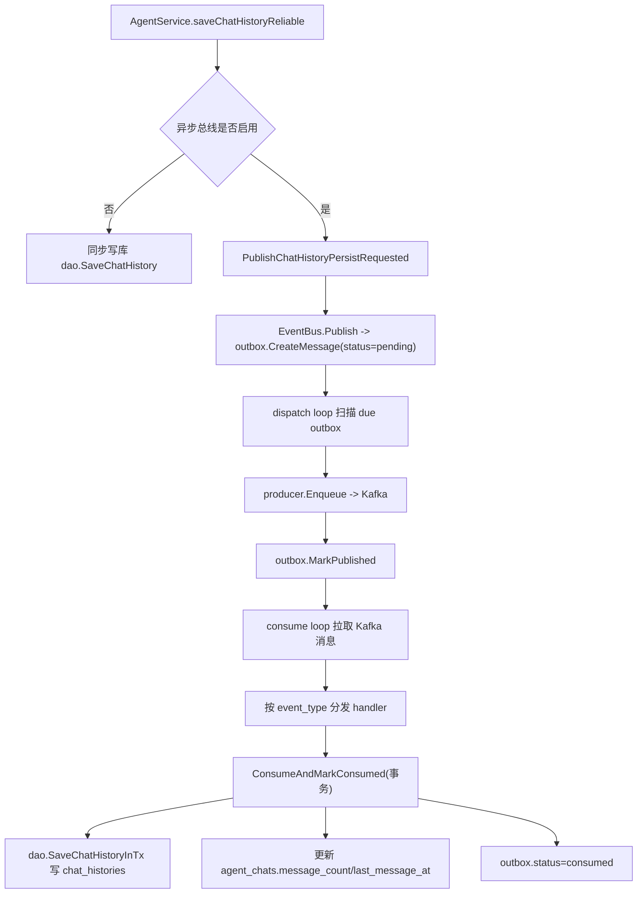

# 功能决策记录（FDR）：Outbox + Kafka 异步持久化链路

## 1. 基本信息
- 记录编号：FDR-2026-03-OUTBOX-KAFKA
- 功能名称：聊天消息异步可靠持久化（Outbox + Kafka）
- 记录日期：2026-03-16
- 决策状态：方案A保留（历史阶段），方案B生效（当前阶段）
- 负责人：项目协作实现（你 + Codex）
- 关联模块：
  - `backend/service/agentsvc`
  - `backend/service/events`
  - `backend/infra/outbox`
  - `backend/infra/kafka`
  - `backend/dao/agent.go`
  - `backend/cmd/start.go`

## 2. 背景与问题
- 业务背景：`/agent/chat` 是流式接口，用户对首字延迟敏感；但聊天记录又必须可靠落库，不能因为 Kafka 瞬时抖动而丢失。
- 决策前的核心矛盾：
  1. 直接同步写 Kafka，会把 broker 网络抖动算进请求耗时。
  2. 只发 Kafka 不落本地，会出现“发送失败即丢消息”的可靠性缺口。
  3. 业务代码直接依赖 Kafka 细节，复用性和可维护性差。

## 3. 决策目标
1. 请求主链路只承担“本地可控成本”，不阻塞外部消息系统。
2. 持久化链路具备明确状态机（`pending/published/consumed/dead`）与可重试能力。
3. 业务层调用尽量简化为“发布业务事件”，不耦合 outbox/kafka 细节。
4. 为后续新增事件类型（不仅聊天）保留扩展空间。

## 4. 方案对比

### 4.1 方案A（历史方案，保留记录）
Outbox 入库 + 扫描投 Kafka + 消费落库，且包含“历史兼容逻辑”。

- 历史实现特征：
  1. 业务入口存在聊天语义适配层（如早期 `chat_history_async` 风格的适配）。
  2. 消费侧路由曾兼容旧字段与旧格式（包括 `biz_type` 兼容路径）。
  3. 代码可运行，但“基础设施层”仍残留业务痕迹。
- 优点：
  1. 可靠性目标已达成，消息不会因 Kafka 瞬时故障直接丢失。
  2. 首字延迟不再直接绑定 Kafka 可用性。
- 缺点：
  1. 兼容分支较多，可读性与长期维护成本偏高。
  2. 不利于沉淀成“通用事件总线”，扩展新业务事件时心智负担大。

### 4.2 方案B（当前生效方案）
把 Outbox + Kafka 沉淀为通用事件总线，仅保留 `event_type` 统一协议，不再保留旧格式回退。

- 当前实现特征：
  1. 业务层通过 `EventPublisher.Publish(...)` 发布事件，不直接操作 Kafka。
  2. outbox payload 统一为事件外壳：`event_id/event_type/event_version/aggregate_id/payload`。
  3. 消费侧仅按 `event_type` 路由 handler，不再做旧协议回退。
  4. 业务 handler 下沉到 `backend/service/events/*`，infra 只负责总线能力与状态机推进。
- 优点：
  1. 解耦更彻底：基础设施和业务语义边界清晰。
  2. 新增业务事件只需“定义事件 + 注册 handler”，复用链路成本低。
  3. 可观测性更统一，排障路径更短。
- 代价：
  1. 对历史旧格式消息不再兼容，切换前需确认无旧积压。
  2. 需要团队统一遵守 `event_type` 协议规范。

## 5. 最终决策
- 采用结果：方案B（当前生效）。
- 保留方案A文档：用于复盘演进路径与面试叙述（从可用到可扩展的重构过程）。
- 关键判断依据：
  1. 方案B在不牺牲可靠性的前提下，显著提升架构清晰度。
  2. 方案B更符合“通用总线”目标，便于后续挂载标题生成、token统计、更多 agent 事件。

## 6. 当前实现细节（方案B）

### 6.1 分层与职责
1. 通用事件总线门面：`backend/infra/outbox/event_bus.go`
2. Outbox 核心引擎（扫描/投递/消费/路由）：`backend/infra/outbox/engine.go`
3. Outbox 状态仓储（状态流转 + 通用消费事务）：`backend/infra/outbox/repository.go`
4. 统一事件协议解析：`backend/infra/outbox/event_contract.go`
5. Kafka 协议包装：`backend/infra/kafka/envelope.go`
6. 业务事件注册与发布（聊天持久化）：`backend/service/events/chat_history_persist.go`
7. 启动接线：`backend/cmd/start.go`

### 6.2 现行主链路（event_type-only）

### 6.3 状态机口径
- `pending`：已入 outbox，待投递。
- `published`：已投递 Kafka，待消费处理。
- `consumed`：业务处理成功并完成状态推进（最终态）。
- `dead`：达到重试上限或不可恢复错误（最终态）。

状态流转：
- 正常：`pending -> published -> consumed`
- 可重试失败：`pending/published -> pending(next_retry_at++)`
- 不可恢复/超限：`pending/published -> dead`

### 6.4 当前关键策略
1. 请求链路只写 outbox，不在主链路做 Kafka 网络 IO。
2. 消费侧统一通过 `ConsumeAndMarkConsumed` 做“业务写入 + consumed 推进”同事务。
3. `event_type` 缺失、payload 非法、未知事件类型等，按不可恢复错误处理并标 `dead`。
4. 重试采用指数退避，上限由配置控制（默认 `max_retry=20`）。

## 7. 与方案A差异清单（本次更新重点）
1. 删除聊天专用 outbox 适配层文件，改为通用事件发布/注册方式。
2. 路由统一收敛为 `event_type`，不再依赖旧 `biz_type` 兼容分发语义。
3. payload 解析仅接受统一事件外壳，不再保留旧业务 JSON 回退逻辑。
4. 业务消费处理器迁移到 `backend/service/events`，infra 不再承载聊天业务语义。

## 8. 影响范围
1. 代码层：
   - `backend/infra/outbox/*`
   - `backend/infra/kafka/*`
   - `backend/service/events/*`
   - `backend/service/agentsvc/agent.go`
   - `backend/cmd/start.go`
2. 数据层：
   - 仍使用 `agent_outbox_messages` 作为状态机表（表结构不变）。
   - 逻辑字段改为 `EventType`（映射数据库列 `biz_type`，仅为兼容历史表结构命名）。
3. 接口层：
   - `/api/v1/agent/chat` 对外协议不变。

## 9. 风险与应对
### 风险1：切换时存在历史旧格式积压消息
- 现象：旧格式消息可能被判定为不可解析并进入 `dead`。
- 应对：
  1. 切换前确认 outbox 积压清零。
  2. 若必须保留旧消息，先做一次人工迁移/回放再切流。

### 风险2：事件类型规范失控（命名冲突/语义漂移）
- 应对：
  1. 统一事件命名规范：`domain.resource.action`。
  2. 通过 `event_version` 控制未来演进，避免“同名不同义”。

### 风险3：消费者停摆导致积压
- 应对：
  1. 启动日志打印核心配置并可观测状态。
  2. 监控 `pending/published/dead` 数量与 `next_retry_at` 老化。

## 10. 验证与回滚
### 10.1 验证项
1. 端到端：确认 outbox 记录从 `pending -> published -> consumed`。
2. 异常注入：Kafka 暂停后消息保留在 outbox 并按退避重试。
3. 恢复验证：Kafka 恢复后积压可继续消费并落库。
4. 一致性：`chat_histories` 与 `agent_chats.message_count` 语义一致。

### 10.2 回滚策略
1. 配置 `kafka.enabled=false`，服务自动降级到同步直写路径。
2. outbox 表数据保留，可在恢复后继续处理或人工回放。

## 11. 后续计划
1. 在总线层补结构化指标（积压量、重试分布、死信速率）。
2. 增加 dead-letter 管理工具（筛选、重放、归档）。
3. 持续扩展事件类型，把标题生成、统计类异步任务挂到同一总线。
