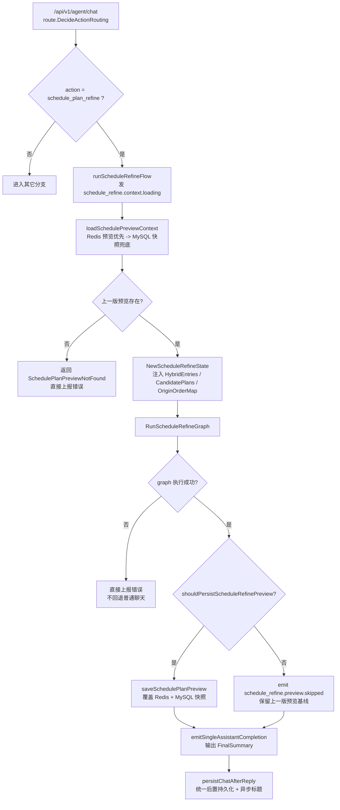
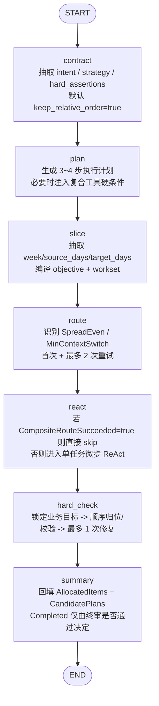
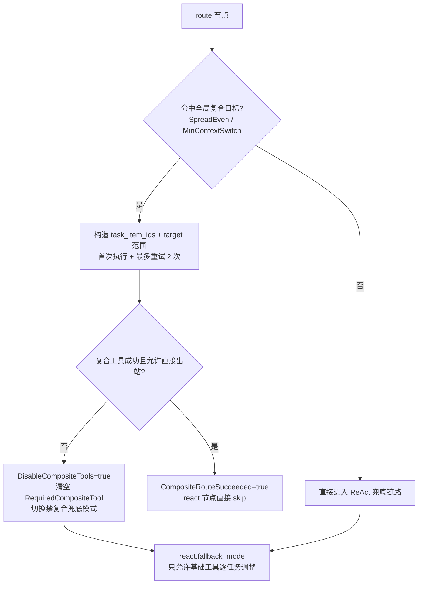
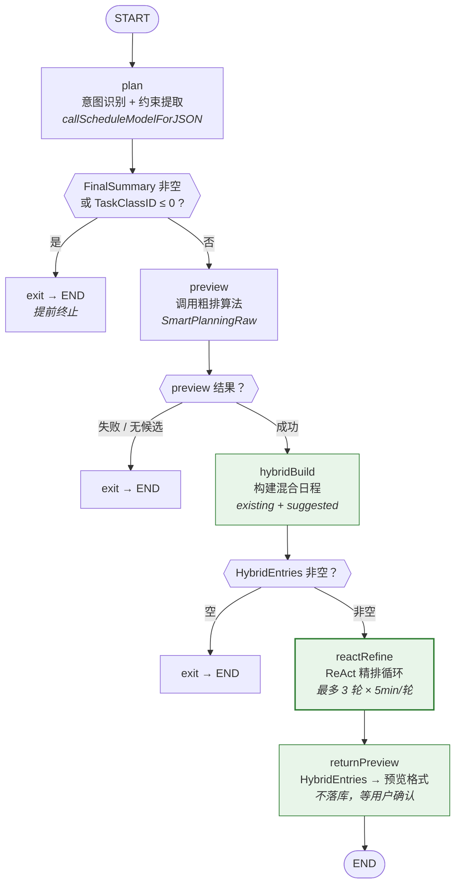
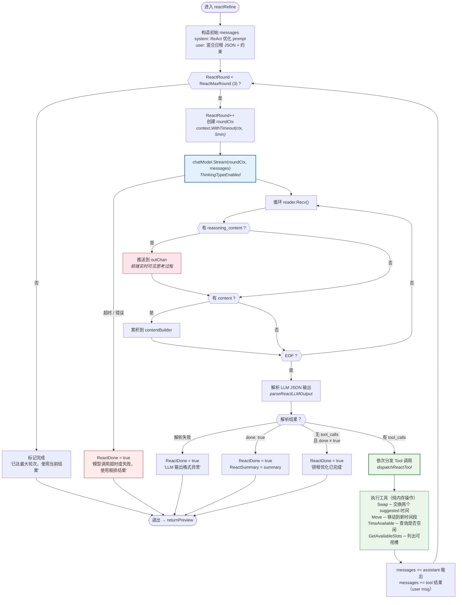

# 智能排程 Agent — ReAct 精排引擎 决策记录（2026-03-28 更新版）

## 0. 文档说明（先看这里）
- 本文档分为两部分：
  1. 上半部分：当前线上代码对应的 `schedule_plan_refine` 连续微调链路。
  2. 下半部分：2026-03-19 的原始决策内容，原样保留作为发展历程。
- 这样做的目的：
  1. 评审时先看“现在连续微调到底怎么跑”；
  2. 复盘时还能追踪“从早期 schedule_plan 内部 ReAct，到当前独立 refine graph”的演进路径。

## 1. 基本信息（当前版本）
- 记录编号：FDR-008C
- 功能名称：智能排程连续微调 ReAct 引擎（`schedule_plan_refine`）
- 记录日期：2026-03-28
- 决策状态：已采纳，已落地
- 负责人：SmartFlow 团队
- 关联需求：FDR-008（初版 ReAct 精排）、FDR-008B（新建排程阶段 2）、连续微调链路独立拆分

## 2. 本轮最终决策（当前最终态）
### 2.1 决策摘要
- 决策 1：连续微调已独立为 `action=schedule_plan_refine`，不再复用 `schedule_plan` 图内的 ReAct 精排逻辑。
- 决策 2：`schedule_refine` 固定采用 7 节点图编排：`contract -> plan -> slice -> route -> react -> hard_check -> summary`。
- 决策 3：全局目标只对两类复合工具开专门路由：
  1. `SpreadEven`：均匀分散；
  2. `MinContextSwitch`：最少上下文切换。
- 决策 4：复合路由在进入 ReAct 前先直达执行一次，并允许最多重试 2 次；若仍失败，则切入“禁复合兜底模式”，后续只允许基础工具逐任务搬运。
- 决策 5：ReAct 执行器采用“单任务微步”模式：当前轮只能围绕 `CURRENT_TASK` 动手，不能同时主动改别的任务。
- 决策 6：顺序约束不再卡执行期；执行期只管把坑位分布排好，顺序统一在终审阶段由后端归位或校验。
- 决策 7：终审优先走后端确定性校验；只有目标无法编译成确定性 objective 时，才退回语义 Review。
- 决策 8：连续微调失败不再回退普通聊天；对用户直接返回错误。只有图执行成功后才进入总结、SSE 输出和后置持久化。
- 决策 9：连续微调沿用排程预览快照作为唯一基线：先读 Redis，未命中再回源 MySQL；最终预览仍写回同一套 `saveSchedulePlanPreview` 通道。

### 2.2 为什么这样改
- 目标 1：降低主路由和 `schedule_plan` 主图的复杂度，让“新建排程”和“局部微调”彻底分治。
- 目标 2：对于“均匀分散/最少切换”这类全局目标，优先一次性调用复合工具，避免模型在逐任务循环里低效试错。
- 目标 3：一旦进入兜底，就彻底禁止再次调用复合工具，避免在同一条失败路径上反复震荡。
- 目标 4：把“执行期的坑位调整”和“终审期的顺序/物理一致性裁决”拆开，减少执行期被顺序约束误卡死。
- 目标 5：保证预览缓存既能优先读缓存，也能在 Redis 失效后通过 MySQL 快照恢复连续微调上下文。

## 3. 当前全链路（代码真实流程）
### 3.1 Agent 总分流与 service 入口
1. `POST /api/v1/agent/chat` 进入 `AgentService.AgentChat`。
2. `route.DecideActionRouting` 返回 `action=schedule_plan_refine`。
3. service 层进入 `runScheduleRefineFlow`，先发 `schedule_refine.context.loading` 阶段块。
4. `loadSchedulePreviewContext` 按“Redis 预览优先 -> MySQL 快照兜底”的顺序加载上一版排程上下文。
5. 若没有上一版预览，直接返回 `SchedulePlanPreviewNotFound`，不回退普通聊天。
6. 有预览时构造 `ScheduleRefineState`，注入：
   1. `HybridEntries`
   2. `AllocatedItems`
   3. `CandidatePlans`
   4. `OriginOrderMap`
7. 调用 `RunScheduleRefineGraph` 执行独立 refine 图。
8. 图执行成功后：
   1. 若允许覆盖预览，则调用 `saveSchedulePlanPreview` 回写 Redis + MySQL 快照；
   2. 若命中“复合路由已出站但终审未通过”，发 `schedule_refine.preview.skipped`，保留上一版预览基线。
9. 最后把 `FinalSummary` 通过 SSE 输出，并走统一聊天后置持久化。



### 3.2 `ScheduleRefineGraph` 编排（当前版本）


### 3.3 `route + react` 组合策略（当前版本）


## 4. 节点级职责边界（当前实现）
### 4.1 `contract`
1. 使用模型把自然语言请求抽成 `RefineContract`。
2. 默认保持顺序：只有用户明确说“可以打乱顺序”才会放开 `keep_relative_order=false`。
3. 优先信任结构化 `hard_assertions`；若模型没给，会按用户表达兜底推断（如“一半/50%”）。
4. 模型调用或 JSON 解析失败时，降级为后端 fallback contract，不中断链路。

### 4.2 `plan`
1. Planner 只生成执行路径，不直接执行动作。
2. 若命中“均匀分散/最少上下文切换”，后端会把“复合工具必须成功后才允许收口”的硬条件注入到计划里。
3. `BatchMove` 不是默认开放能力，只有 plan 文本明确允许时才会放开。
4. Planner 失败或解析失败时，切到后端 fallback plan；必要时可在后续失败后触发 replan。

### 4.3 `slice`
1. 从用户文本提取：
   1. `week_filter`
   2. `source_days`
   3. `target_days`
   4. `exclude_sections`
2. 支持方向型表达解析，例如“从周四到周五收敛到周一到周三”。
3. 基于切片结果构建 `workset`，只把当前要动的 suggested 任务放进微循环。
4. 同时把自然语言目标编译成 `RefineObjective`：
   1. `move_all`
   2. `move_ratio`
   3. `none`
5. 若无法构成来源范围或目标范围，则 deterministic objective 不启用，后续终审退回语义 Review。

### 4.4 `route`
1. 先由后端根据请求和契约识别本轮必用复合工具：
   1. “均匀/分散/铺开” -> `SpreadEven`
   2. “上下文切换最少/同科目连续” -> `MinContextSwitch`
2. 命中后，直接按 `task_item_ids + target 范围` 调复合工具，不先进入逐任务 ReAct。
3. 每次复合成功后，优先走后端确定性校验；若 objective 不可判定，则允许在“复合工具门禁已通过”时直接出站，把最终裁决交给 `hard_check`。
4. 若复合路由失败，会设置：
   1. `DisableCompositeTools=true`
   2. `RequiredCompositeTool=""`
   3. `BatchMoveAllowed=false`
5. 这样后续 ReAct 只能使用基础工具，不能再次回到复合失败路径。

### 4.5 `react`
1. 采用“单任务微步”模式：当前轮只能围绕 `CURRENT_TASK` 改动。
2. 默认预算：
   1. `ExecuteMax=24`
   2. `PerTaskBudget=4`
   3. `ReplanMax=2`
   4. `CompositeRetryMax=2`
   5. `RepairReserve=1`
   6. `MaxRounds=25`
3. 如果 `CompositeRouteSucceeded=true`，`react` 会直接 skip，不再空跑。
4. 执行期顺序约束被放开，只在终审阶段统一收口；这样 Move/Swap 不会因为顺序问题提前被卡死。
5. 后端额外做了多层 guard：
   1. `CURRENT_TASK_MISMATCH`：动作必须包含当前任务；
   2. `COMPOSITE_REQUIRED`：计划要求先成功复合工具时，禁止先走基础写工具；
   3. `COMPOSITE_DISABLED`：进入兜底后禁止复合工具；
   4. `BATCH_MOVE_DISABLED`：未授权时禁止 `BatchMove`；
   5. `QUERY_REDUNDANT`：同版本排程下重复查同一空位范围会被拒绝。
6. 当前任务满足切片目标时会自动收口；全局 objective 满足且复合门禁通过时，也会触发短路结束。

### 4.6 `hard_check`
1. 先锁定“业务目标是否达成”的判定结果，再做顺序归位，避免“为了展示归位而反向改变目标成败”。
2. 终审优先级：
   1. 物理校验（冲突/越界/数量一致性）
   2. 确定性 objective 校验
   3. objective 不可判定时才退回语义 Review
3. `MinContextSwitch` 成功后，顺序重排本身就是业务目标的一部分：
   1. 会跳过按 `origin_rank` 的顺序归位；
   2. 也会跳过顺序约束校验。
4. 若终审失败且预算还够，会尝试 1 次修复动作，再重新终审。
5. 修复失败或修复后仍未通过时，链路照样返回“当前最优结果”，但 `Completed=false`。

### 4.7 `summary`
1. 先把 `HybridEntries` 回填到 `AllocatedItems`，再生成新的 `CandidatePlans`。
2. 然后调用总结 prompt，把终审结果翻译成用户可读的 2~4 句中文结论。
3. 如果总结模型失败，会走后端兜底文案。
4. `Completed` 只表示“最终终审是否通过”，不再等同于“链路执行完毕”。

## 5. 工具、预算与约束（当前版本）
### 5.1 工具集合
| 分组 | Tool | 当前职责 |
|------|------|----------|
| 基础只读 | `QueryTargetTasks` | 查询当前目标任务集合 |
| 基础只读 | `QueryAvailableSlots` | 查询可落点坑位，默认优先纯空位 |
| 基础写入 | `Move` | 移动单个 suggested 任务 |
| 基础写入 | `Swap` | 交换两个 suggested 任务 |
| 基础写入 | `BatchMove` | 原子批量移动，需计划显式允许 |
| 基础只读 | `Verify` | 执行确定性自检 |
| 复合写入 | `SpreadEven` | 按“均匀铺开”一次规划并提交多任务移动 |
| 复合写入 | `MinContextSwitch` | 在固定坑位集合内重排任务映射，降低上下文切换 |

### 5.2 预算默认值
| 字段 | 默认值 | 说明 |
|------|--------|------|
| `PlanMax` | 2 | Planner 最多生成/重生成次数 |
| `ExecuteMax` | 24 | 正常动作总预算 |
| `PerTaskBudget` | 4 | 单个任务最多允许的写动作次数 |
| `ReplanMax` | 2 | 连续失败后的重规划上限 |
| `CompositeRetryMax` | 2 | 复合路由失败后的重试次数（不含首次） |
| `RepairReserve` | 1 | 终审修复保留动作数 |
| `MaxRounds` | 25 | `ExecuteMax + RepairReserve` |

### 5.3 当前硬约束
1. 微调只允许改写 `status="suggested"` 的任务，禁止动 `existing`。
2. 当前微循环只允许围绕 `CURRENT_TASK` 动手，不能跳着改别的任务。
3. 执行期允许先把坑位排对，顺序问题统一后置到终审处理。
4. 复合工具命中后，只有其成功通过门禁，才能允许整体收口。
5. 一旦进入禁复合兜底模式，就不允许再次调用 `SpreadEven / MinContextSwitch / BatchMove`。

## 6. 输出协议与持久化（当前版本）
### 6.1 SSE 主通道
1. 阶段块会持续推送：`context.loading / contract / plan / slice / route / react / hard_check / summary`。
2. 最终正文只输出 `FinalSummary`，不输出结构化排程 JSON。
3. 连续微调链路如果报错，直接通过错误通道返回，不回退普通聊天。

### 6.2 预览快照通道
1. 连续微调和新建排程共用同一套预览快照读写：`saveSchedulePlanPreview`。
2. refine 开始前先用 `loadSchedulePreviewContext` 读取上一版预览：
   1. Redis 优先；
   2. MySQL 快照兜底；
   3. DB 命中时会回填 Redis。
3. refine 成功后通常会覆盖上一版预览；唯一例外是：
   1. `CompositeRouteSucceeded=true`
   2. 但 `FinalHardCheckPassed=false`
4. 这时会发 `schedule_refine.preview.skipped`，明确保留上一版预览基线，防止未通过终审的复合结果污染后续连续微调。

## 7. 失败策略与回退策略（当前版本）
1. 无上一版预览：直接返回 `SchedulePlanPreviewNotFound`。
2. refine graph 执行失败：直接上报错误，不回退普通聊天。
3. 复合路由失败：切入禁复合 ReAct 兜底，不直接判整轮失败。
4. 单任务 ReAct 连续失败：允许 replan，但仍受 `ReplanMax` 限制。
5. 终审失败：最多再做 1 次修复动作；若仍失败，返回 best-effort 结果，`Completed=false`。
6. 总结模型失败：走后端兜底总结，不影响结果交付。
7. 预览快照写失败：只影响结构化查询，不影响 SSE 主通道回复。

## 8. 影响范围（当前版本）
### 8.1 关键代码位置
1. `backend/service/agentsvc/agent.go`：总分流，决定 `schedule_plan_refine` 如何进入 service。
2. `backend/service/agentsvc/agent_schedule_refine.go`：连续微调 service 入口、上下文读取、结果持久化策略。
3. `backend/agent/graph/schedule.go`：`ScheduleRefineGraph` 编排。
4. `backend/agent/node/schedule_refine.go`：contract / plan / slice / route / react / hard_check / summary 主逻辑。
5. `backend/agent/node/schedule_refine_tool.go`：基础工具与复合工具实现。
6. `backend/agent/prompt/schedule_refine.go`：contract/planner/react/review/summary/repair prompt。
7. `backend/service/agentsvc/agent_schedule_preview.go`：预览快照读写。

### 8.2 数据与存储
1. 连续微调本身不直接写最终排程库。
2. 只读写预览缓存/快照，用于下一轮连续微调延续上下文。
3. 聊天消息仍走统一后置持久化（Redis + outbox/DB）。

## 9. 验证与回滚（当前版本）
### 9.1 验证要点
1. 路由能正确分出 `schedule_plan_create` 与 `schedule_plan_refine`。
2. 没有上一版预览时，refine 必须直接报错，而不是回退普通聊天。
3. “均匀分散/最少上下文切换”类请求，会先经过 `route` 复合路由，再决定是否进入 ReAct。
4. 一旦进入兜底模式，复合工具必须被禁用，只能逐任务搬运。
5. `MinContextSwitch` 成功后，终审必须跳过 origin_rank 归位与顺序校验。
6. `Completed` 只能在终审完全通过时为 `true`。
7. 复合路由出站但终审失败时，预览不能覆盖上一版基线。

### 9.2 回滚策略
1. 软回滚：在路由层下线 `schedule_plan_refine` 命中，临时回到新建排程或普通聊天解释。
2. 逻辑回滚：关闭 `route` 复合直达，只保留基础 ReAct 逐任务链路。
3. 数据回滚：由于 refine 只写预览快照，不写最终排程库，风险面主要集中在缓存/快照，不涉及正式排程落库回滚。

---
## 附录 A：2026-03-19 原始内容（原文保留，作为发展历程）

# 智能排程 Agent — ReAct 精排引擎 决策记录

## 1. 基本信息
- 记录编号：FDR-008
- 功能名称：智能排程 ReAct 精排引擎（阶段 1.5：粗排 + AI 语义化微调）
- 记录日期：2026-03-19
- 决策状态：已采纳，开发中
- 负责人：SmartFlow 团队
- 关联需求：FDR-007（智能排程 Agent 阶段 1）

## 2. 背景与问题
- 业务背景：阶段 1 已打通"意图识别 → 粗排 → 落库"全链路，但粗排算法是纯规则的线性分配（cursor-based），不考虑科目特性、学习效率曲线、上下文切换成本等语义因素。
- 现状问题：
  1. 粗排结果机械化：高认知负荷科目可能被安排在低效时段（如晚间安排数学）；
  2. 缺乏科目间协调：同类任务可能被分散到不连贯的时间段，增加上下文切换成本；
  3. 用户无法感知 AI 的"思考过程"，排程结果缺乏可解释性。
- 不做此决策的后果：排程质量停留在"能用但不好用"阶段，无法体现 AI 的语义理解能力。

## 3. 决策目标
- 目标 1：在粗排之后引入 LLM 精排环节，通过 ReAct 范式对任务时间进行语义化优化。
- 目标 2：精排过程中 LLM 的深度思考（reasoning）实时流式推送到前端，用户可见。
- 目标 3：精排结果仅作为预览返回，不自动落库，用户确认后再持久化。
- 目标 4：向后兼容——未注入精排依赖时自动走原有 materialize 路径。
- 非目标：
  - 本阶段不做用户确认后的落库链路（后续阶段）；
  - 本阶段不做 RAG 规则注入（阶段 3）；
  - 本阶段不做多方案对比（只输出一个优化后的方案）。

## 4. 备选方案

### 方案 A：后处理脚本（规则引擎）
- 描述：在粗排之后用硬编码规则（如"数学只排上午"）做二次调整。
- 优点：确定性强，无 LLM 调用开销。
- 缺点：规则维护成本高，无法处理复杂的多科目协调；不可解释。
- 复杂度 / 成本：低，但扩展性极差。

### 方案 B：ReAct 范式 + 手动 Tool 调用（采纳）
- 描述：LLM 开启深度思考，分析粗排结果后通过 Tool（Swap/Move/TimeAvailable/GetAvailableSlots）在内存中调整任务时间，多轮循环直到满意。
- 优点：
  1. 充分利用 LLM 的语义理解能力，优化维度丰富；
  2. reasoning_content 实时推送，用户可见思考过程；
  3. Tool 操作内存数据，天然支持预览模式（不落库）；
  4. 手动 ReAct 循环给予完全的流式控制权。
- 缺点：依赖 LLM 输出质量；深度思考模式耗时较长。
- 复杂度 / 成本：中高，约 1 周。

### 方案 C：Eino 内置 ToolsNode
- 描述：使用 Eino 框架的 ToolsNode + function_calling 原生能力。
- 优点：框架原生支持，代码量少。
- 缺点：无法在 Tool 执行过程中流式推送 reasoning_content；无法精细控制每轮 SSE 输出；项目中无现有 function_calling 基础设施。
- 复杂度 / 成本：中，但灵活性不足。

## 5. 最终决策
- 采纳方案：方案 B（ReAct 范式 + 手动 Tool 调用）
- 关键理由：
  1. 手动 ReAct 循环可以精确控制 SSE 流式输出（reasoning + stage + tool_call 穿插）；
  2. Tool 操作纯内存数据，预览模式零风险；
  3. 与现有 graph 架构无缝集成（新增 3 个节点，不破坏原有链路）。

## 6. 技术方案

### 6.1 新流程（graph 结构）
```
plan → preview(粗排) → hybridBuild(混合日程) → reactRefine(ReAct循环) → returnPreview → END
```
智能排程仅返回预览结果，不自动落库。用户确认后由前端调用独立落库接口完成持久化。

#### 6.1.1 整体 Graph 流程图

> 下图展示完整的 SchedulePlanGraph 编排结构（ReAct 精排路径）。



#### 6.1.2 ReAct 精排内部循环

> 下图展开 `reactRefine` 节点内部的 ReAct 循环逻辑（`react.go`）。
> 每轮独立设置 5 分钟超时（`reactRoundTimeout`），reasoning_content 实时推送到 SSE。



### 6.2 混合日程（HybridScheduleEntry）
将既有日程（existing）和粗排建议（suggested）统一到同一结构：
- `existing` + `course/task`：不可移动
- `suggested` + `task`：LLM 可通过 Tool 调整

### 6.3 ReAct Tool 设计
| Tool | 功能 | 操作对象 |
|------|------|---------|
| Swap | 交换两个 suggested 任务的时间 | 内存 HybridEntries |
| Move | 移动一个 suggested 任务到新时间 | 内存 HybridEntries |
| TimeAvailable | 检查目标时间是否可用 | 只读查询 |
| GetAvailableSlots | 返回可用时间段列表 | 只读查询 |

### 6.4 SSE 推送设计
- `schedule_plan.hybrid.building/done` — 混合日程构建阶段
- `schedule_plan.react.round` — 第 N 轮优化开始
- `reasoning_content` 流式 chunk — LLM 深度思考过程（实时推送）
- `schedule_plan.react.tool_call` — Tool 执行结果
- `schedule_plan.react.done` — 优化完成
- `schedule_plan.preview_return.done` — 预览生成完成

## 7. 影响范围
- 新增文件：
  - `backend/agent/scheduleplan/tools_react.go`：4 个 Tool + dispatcher + LLM 输出解析
  - `backend/agent/scheduleplan/react.go`：ReAct 循环核心 + 流式推送
- 修改文件：
  - `backend/model/schedule.go`：+HybridScheduleEntry
  - `backend/agent/scheduleplan/state.go`：+ReAct 字段
  - `backend/agent/scheduleplan/prompt.go`：+ReAct system prompt
  - `backend/agent/scheduleplan/nodes.go`：+hybridBuild/returnPreview 节点
  - `backend/agent/scheduleplan/runner.go`：+outChan/modelName/新节点适配
  - `backend/agent/scheduleplan/graph.go`：+3 节点/重新连线
  - `backend/agent/scheduleplan/tool.go`：+HybridScheduleWithPlan 依赖
  - `backend/service/schedule.go`：+HybridScheduleWithPlan 方法
  - `backend/service/agent_bridge.go`：+注入新依赖
  - `backend/service/agentsvc/agent.go`：+字段/传参
  - `backend/service/agentsvc/agent_schedule_plan.go`：+outChan/modelName/新依赖
- 数据与存储影响：无。所有 Tool 操作纯内存，不涉及 DB。
- 接口 / 协议影响：无新增接口。SSE 新增 react 相关阶段推送（向下兼容）。

## 8. 已知问题与后续优化

### 8.1 深度思考超时（当前）
- 现象：模型开启深度思考后 reasoning 阶段耗时较长，当前 5 分钟超时仍可能不够。
- 影响：超时后使用粗排结果，精排未生效。
- 后续方案：
  - [ ] 调整超时策略（按模型实际耗时动态设置，或改为不设超时由父 context 控制）
  - [ ] 优化 prompt，引导模型减少冗余推理
  - [ ] 评估是否关闭深度思考，改用普通模式 + 多轮调用换取稳定性

### 8.2 模型输出质量
- 现象：模型思考过程较啰嗦，可能输出无效的 tool 调用。
- 后续方案：
  - [ ] 精炼 ReAct system prompt，加入 few-shot 示例
  - [ ] 对 tool_calls 做预校验，过滤明显无效的调用
  - [ ] 收集真实案例建立评测集

### 8.3 用户确认落库链路
- 现象：当前精排结果仅预览，用户确认后的落库链路尚未实现。
- 后续方案：
  - [ ] 新增"确认落库"接口或对话指令
  - [ ] 复用现有 materialize → apply 路径，从 HybridEntries 转换

### 8.4 连续对话微调
- 现象：精排后的连续对话微调（如"把数学挪到上午"）尚未与 ReAct 引擎打通。
- 后续方案：
  - [ ] 将上一轮 HybridEntries 序列化到对话历史
  - [ ] 支持增量 ReAct（只调整用户指定的部分）

## 9. 验证与回滚
- 验证方式：
  1. `go build ./...` + `go vet ./...` 编译通过
  2. 发送排程请求，验证 SSE 流中出现 react 阶段推送和 reasoning_content
  3. 验证不落库：数据库 schedules 表无新增记录
  4. 向后兼容：不注入 HybridScheduleWithPlan 时走原有 materialize 路径
- 回滚方案：在 `agent_bridge.go` 中注释掉 `HybridScheduleWithPlanFunc` 注入即可，preview 后自动回退到 materialize 路径。

## 10. 复盘结论（上线后补充）
- 实际效果：待补充
- 与预期偏差：待补充
- 后续是否需要二次决策：待补充

