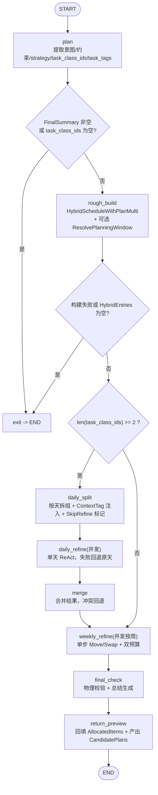

# 智能排程 Agent — ReAct 精排引擎 决策记录（2026-03-21 更新版）

## 0. 文档说明（先看这里）
- 本文档分为两部分：
  1. **上半部分**：当前线上代码对应的“最终链路决策”（2026-03-21 版本）。
  2. **下半部分**：2026-03-19 的原始决策内容，**原样保留**作为发展历程。
- 这样做的目的：
  1. 评审时先看“现在系统到底怎么跑”；
  2. 复盘时还能追踪“从旧方案到现方案”的演进路径。

## 1. 基本信息（当前版本）
- 记录编号：FDR-008B
- 功能名称：智能排程 ReAct 精排引擎（阶段 2：多任务类分流 + 日级并发 + 周级并发单步优化 + 双通道交付）
- 记录日期：2026-03-21
- 决策状态：已采纳，已落地
- 负责人：SmartFlow 团队
- 关联需求：FDR-008（初版）、FDR-007（智能排程 Agent 阶段 1）

## 2. 本轮最终决策（A->B 最终态）
### 2.1 决策摘要
- 决策 1：智能排程入口继续走统一 Agent 分流（`action=schedule_plan`），不新增独立聊天接口。
- 决策 2：图内分流改为“**按 task_class_ids 长度**”：
  1. `len(task_class_ids) == 1`：跳过 `daily_split/daily_refine/merge`，直接周级优化；
  2. `len(task_class_ids) >= 2`：先日级并发优化，再周级并发优化。
- 决策 3：周级优化改为“**单步动作模式**”（每轮只允许 1 个 `Move/Swap` 或 `done`）。
- 决策 4：周级预算改为“双预算 + 每有效周保底 + 负载加权”：
  1. 总预算：成功/失败都扣；
  2. 有效预算：仅成功动作扣；
  3. 每个有效周至少 1 个总预算和 1 个有效预算；
  4. 额外预算按周负载加权分配。
- 决策 5：输出采用双通道：
  1. SSE 主通道仅返回终审自然语言（`FinalSummary`）；
  2. 结构化 `candidate_plans` 走 `/api/v1/agent/schedule-preview` 查询（Redis 快照）。

### 2.2 为什么这样改
- 目标 1：把“单任务类”和“多任务类混排”拆开治理，减少无效模型调用。
- 目标 2：把周级优化从“模型大段犹豫”改成“走一步看一步”，缩短长尾。
- 目标 3：前端同时拿到“可读结论”和“结构化预览”，避免 SSE 里吐 JSON 影响体验。
- 目标 4：预算治理可解释，避免某些有效周被分配为 0 导致“看起来没优化”。

## 3. 当前全链路（代码真实流程）
### 3.1 Agent 总分流（与 schedule_plan 的关系）
1. `POST /api/v1/agent/chat` 进入 `AgentService.AgentChat`。
2. 先做会话存在性检查（Redis -> DB -> 必要时创建）。
3. 调 `route.DecideActionRouting` 获取 action。
4. 若 `RouteFailed=true`：直接返回内部错误（不再回落聊天）。
5. 若 `action=schedule_plan`：进入 `runSchedulePlanFlow`。
6. 若 `runSchedulePlanFlow` 报错：当前策略是记录日志 + 发 fallback 阶段块 + 回退普通聊天（可用性优先）。

### 3.2 schedule_plan 图编排（当前版本）


## 4. 节点级职责边界（当前实现）
### 4.1 `plan`
1. 先合并 `extra.task_class_ids`（显式参数优先）；
2. 再用模型抽取 `intent/constraints/strategy/task_tags`；
3. 模型失败但有 `task_class_ids` 时，使用参数兜底继续；
4. 最终仍无任务类时，写入 `FinalSummary` 并提前退出。

### 4.2 `rough_build`
1. 调 `HybridScheduleWithPlanMulti` 统一构建混合条目（existing + suggested）；
2. 生成 `CandidatePlans`（预览结构）；
3. 可选解析全局窗口边界（`PlanStartWeek/Day` ~ `PlanEndWeek/Day`），供周级 Move 硬校验；
4. 失败时写 `FinalSummary` 并提前退出。

### 4.3 `daily_split`
1. 按 `(week, day)` 拆成 `DayGroup`；
2. 按 `task_item_id -> tag` 注入 `ContextTag`；
3. `suggested <= 2` 标记 `SkipRefine=true`，减少低收益模型调用。

### 4.4 `daily_refine`（并发）
1. 按天并发执行单天 ReAct；
2. 单天失败只回退该天，不拖垮全局；
3. 发“day_start/day_done”阶段块，并携带进度；
4. Thinking 默认关闭（降低并发阶段长尾）。

### 4.5 `merge`
1. 合并 `DailyResults`；
2. 做冲突校验（同一 `(week,day,section)` 不能被阻塞条目重复占用）；
3. 有冲突则整体回退到 merge 前快照；
4. 产出 `MergeSnapshot`，供 `final_check` 二次回退。

### 4.6 `weekly_refine`（并发按周 + 单步动作）
1. 先按周拆数据，仅对“有 suggested 的周”分配预算；
2. 强制每个有效周至少 1 总预算 + 1 有效预算；
3. 剩余预算按周负载加权分配；
4. 单周 worker 循环：
   1. 每轮仅 1 个工具调用（`Move/Swap`）或 `done`；
   2. 总预算：调用即扣；
   3. 有效预算：成功才扣；
   4. Move 必须留在 worker 当前周，且受全局窗口 day 边界约束；
   5. 工具结果回灌到下一轮上下文，形成“走一步看一步”。

### 4.7 `final_check`
1. 物理校验三项：
   1. 时间冲突；
   2. 节次越界；
   3. suggested 数量与 `AllocatedItems` 数量一致性。
2. 校验失败时回退 `MergeSnapshot`；
3. 再由模型生成 2-3 句最终总结（thinking 关闭）。

### 4.8 `return_preview`
1. 把 `HybridEntries` 中 suggested 的最终位置回填到 `AllocatedItems`；
2. 转换为 `CandidatePlans`；
3. 若 `FinalSummary` 为空则兜底填充；
4. 仅返回预览，不直接落库。

## 5. 工具与约束（当前版本）
### 5.1 工具集合
1. `Swap`：交换两个 suggested 任务时间；
2. `Move`：移动一个 suggested 任务到新时间；
3. `TimeAvailable`：检查时间段可用性；
4. `GetAvailableSlots`：列出可用槽位。

### 5.2 周级单步模式硬约束
1. 仅允许 `Move/Swap`；
2. 不允许跨 worker 周移动；
3. 若启用全局窗口，`Move` 必须落在窗口允许的 day 区间；
4. 失败返回工具失败结果，不抛异常中断整周。

## 6. 输出协议与接口契约（当前版本）
### 6.1 SSE 主通道
1. 阶段块（伪装 reasoning chunk）用于进度反馈；
2. 最终正文为 `FinalSummary`（不再吐 JSON）；
3. 结束块遵循 OpenAI 兼容流式格式。

### 6.2 结构化预览通道
1. 排程结束后把快照写 Redis（`user_id + conversation_id` 作用域）；
2. 查询接口：`GET /api/v1/agent/schedule-preview?conversation_id=...`；
3. 未命中返回业务错误码（预览不存在/过期）；
4. 写预览失败只记日志，不阻塞聊天主链路。

## 7. 失败策略与回退策略（当前版本）
1. 路由控制码失败：直接报内部错误（不回落 chat）。
2. schedule_plan 分支内部失败：上层当前策略仍回落普通聊天（可用性优先）。
3. daily 单天失败：回退该天原方案。
4. merge 冲突：回退 merge 前快照。
5. final_check 失败：回退 `MergeSnapshot`。
6. 预览缓存写失败：仅影响结构化查询，不影响 SSE 文本回复。

## 8. 影响范围（当前版本）
### 8.1 主要模块
1. `backend/agent/scheduleplan/*`（图编排、日级并发、周级并发、工具、预算、终审）
2. `backend/service/agentsvc/agent_schedule_plan.go`（服务层接入 graph）
3. `backend/service/agentsvc/agent_schedule_preview.go`（预览缓存读写）
4. `backend/dao/agent-cache.go`（预览 Redis DAO）
5. `backend/api/agent.go` + `backend/routers/routers.go`（预览查询接口）
6. `backend/agent/route/route.go`（统一 action 分流）

### 8.2 数据与存储
1. 主排程流程不直接写最终排程库；
2. 新增 Redis 预览快照读写；
3. 聊天消息仍走统一后置持久化（Redis + outbox/DB）。

## 9. 验证与回滚（当前版本）
### 9.1 验证要点
1. `task_class_ids=1` 时应跳过日级并发，直接周级优化；
2. `task_class_ids>=2` 时应进入日级并发 + merge + 周级并发；
3. SSE 正文应是自然语言，不应出现粗排 JSON；
4. `/agent/schedule-preview` 能按 `conversation_id` 读到 `candidate_plans`；
5. 预算日志应能解释每周预算分配和消耗。

### 9.2 回滚策略
1. 软回滚：关闭 schedule_plan 路由命中（临时回落聊天解释）；
2. 逻辑回滚：周级并发退回单线程或关掉 daily_refine；
3. 通道回滚：保留 SSE 文本，临时下线 `schedule-preview` 查询。

---

## 附录 A：2026-03-19 原始内容（原文保留，作为发展历程）

# 智能排程 Agent — ReAct 精排引擎 决策记录

## 1. 基本信息
- 记录编号：FDR-008
- 功能名称：智能排程 ReAct 精排引擎（阶段 1.5：粗排 + AI 语义化微调）
- 记录日期：2026-03-19
- 决策状态：已采纳，开发中
- 负责人：SmartFlow 团队
- 关联需求：FDR-007（智能排程 Agent 阶段 1）

## 2. 背景与问题
- 业务背景：阶段 1 已打通"意图识别 → 粗排 → 落库"全链路，但粗排算法是纯规则的线性分配（cursor-based），不考虑科目特性、学习效率曲线、上下文切换成本等语义因素。
- 现状问题：
  1. 粗排结果机械化：高认知负荷科目可能被安排在低效时段（如晚间安排数学）；
  2. 缺乏科目间协调：同类任务可能被分散到不连贯的时间段，增加上下文切换成本；
  3. 用户无法感知 AI 的"思考过程"，排程结果缺乏可解释性。
- 不做此决策的后果：排程质量停留在"能用但不好用"阶段，无法体现 AI 的语义理解能力。

## 3. 决策目标
- 目标 1：在粗排之后引入 LLM 精排环节，通过 ReAct 范式对任务时间进行语义化优化。
- 目标 2：精排过程中 LLM 的深度思考（reasoning）实时流式推送到前端，用户可见。
- 目标 3：精排结果仅作为预览返回，不自动落库，用户确认后再持久化。
- 目标 4：向后兼容——未注入精排依赖时自动走原有 materialize 路径。
- 非目标：
  - 本阶段不做用户确认后的落库链路（后续阶段）；
  - 本阶段不做 RAG 规则注入（阶段 3）；
  - 本阶段不做多方案对比（只输出一个优化后的方案）。

## 4. 备选方案

### 方案 A：后处理脚本（规则引擎）
- 描述：在粗排之后用硬编码规则（如"数学只排上午"）做二次调整。
- 优点：确定性强，无 LLM 调用开销。
- 缺点：规则维护成本高，无法处理复杂的多科目协调；不可解释。
- 复杂度 / 成本：低，但扩展性极差。

### 方案 B：ReAct 范式 + 手动 Tool 调用（采纳）
- 描述：LLM 开启深度思考，分析粗排结果后通过 Tool（Swap/Move/TimeAvailable/GetAvailableSlots）在内存中调整任务时间，多轮循环直到满意。
- 优点：
  1. 充分利用 LLM 的语义理解能力，优化维度丰富；
  2. reasoning_content 实时推送，用户可见思考过程；
  3. Tool 操作内存数据，天然支持预览模式（不落库）；
  4. 手动 ReAct 循环给予完全的流式控制权。
- 缺点：依赖 LLM 输出质量；深度思考模式耗时较长。
- 复杂度 / 成本：中高，约 1 周。

### 方案 C：Eino 内置 ToolsNode
- 描述：使用 Eino 框架的 ToolsNode + function_calling 原生能力。
- 优点：框架原生支持，代码量少。
- 缺点：无法在 Tool 执行过程中流式推送 reasoning_content；无法精细控制每轮 SSE 输出；项目中无现有 function_calling 基础设施。
- 复杂度 / 成本：中，但灵活性不足。

## 5. 最终决策
- 采纳方案：方案 B（ReAct 范式 + 手动 Tool 调用）
- 关键理由：
  1. 手动 ReAct 循环可以精确控制 SSE 流式输出（reasoning + stage + tool_call 穿插）；
  2. Tool 操作纯内存数据，预览模式零风险；
  3. 与现有 graph 架构无缝集成（新增 3 个节点，不破坏原有链路）。

## 6. 技术方案

### 6.1 新流程（graph 结构）
```
plan → preview(粗排) → hybridBuild(混合日程) → reactRefine(ReAct循环) → returnPreview → END
```
智能排程仅返回预览结果，不自动落库。用户确认后由前端调用独立落库接口完成持久化。

#### 6.1.1 整体 Graph 流程图

> 下图展示完整的 SchedulePlanGraph 编排结构（ReAct 精排路径）。


#### 6.1.2 ReAct 精排内部循环

> 下图展开 `reactRefine` 节点内部的 ReAct 循环逻辑（`react.go`）。
> 每轮独立设置 5 分钟超时（`reactRoundTimeout`），reasoning_content 实时推送到 SSE。


### 6.2 混合日程（HybridScheduleEntry）
将既有日程（existing）和粗排建议（suggested）统一到同一结构：
- `existing` + `course/task`：不可移动
- `suggested` + `task`：LLM 可通过 Tool 调整

### 6.3 ReAct Tool 设计
| Tool | 功能 | 操作对象 |
|------|------|---------|
| Swap | 交换两个 suggested 任务的时间 | 内存 HybridEntries |
| Move | 移动一个 suggested 任务到新时间 | 内存 HybridEntries |
| TimeAvailable | 检查目标时间是否可用 | 只读查询 |
| GetAvailableSlots | 返回可用时间段列表 | 只读查询 |

### 6.4 SSE 推送设计
- `schedule_plan.hybrid.building/done` — 混合日程构建阶段
- `schedule_plan.react.round` — 第 N 轮优化开始
- `reasoning_content` 流式 chunk — LLM 深度思考过程（实时推送）
- `schedule_plan.react.tool_call` — Tool 执行结果
- `schedule_plan.react.done` — 优化完成
- `schedule_plan.preview_return.done` — 预览生成完成

## 7. 影响范围
- 新增文件：
  - `backend/agent/scheduleplan/tools_react.go`：4 个 Tool + dispatcher + LLM 输出解析
  - `backend/agent/scheduleplan/react.go`：ReAct 循环核心 + 流式推送
- 修改文件：
  - `backend/model/schedule.go`：+HybridScheduleEntry
  - `backend/agent/scheduleplan/state.go`：+ReAct 字段
  - `backend/agent/scheduleplan/prompt.go`：+ReAct system prompt
  - `backend/agent/scheduleplan/nodes.go`：+hybridBuild/returnPreview 节点
  - `backend/agent/scheduleplan/runner.go`：+outChan/modelName/新节点适配
  - `backend/agent/scheduleplan/graph.go`：+3 节点/重新连线
  - `backend/agent/scheduleplan/tool.go`：+HybridScheduleWithPlan 依赖
  - `backend/service/schedule.go`：+HybridScheduleWithPlan 方法
  - `backend/service/agent_bridge.go`：+注入新依赖
  - `backend/service/agentsvc/agent.go`：+字段/传参
  - `backend/service/agentsvc/agent_schedule_plan.go`：+outChan/modelName/新依赖
- 数据与存储影响：无。所有 Tool 操作纯内存，不涉及 DB。
- 接口 / 协议影响：无新增接口。SSE 新增 react 相关阶段推送（向下兼容）。

## 8. 已知问题与后续优化

### 8.1 深度思考超时（当前）
- 现象：模型开启深度思考后 reasoning 阶段耗时较长，当前 5 分钟超时仍可能不够。
- 影响：超时后使用粗排结果，精排未生效。
- 后续方案：
  - [ ] 调整超时策略（按模型实际耗时动态设置，或改为不设超时由父 context 控制）
  - [ ] 优化 prompt，引导模型减少冗余推理
  - [ ] 评估是否关闭深度思考，改用普通模式 + 多轮调用换取稳定性

### 8.2 模型输出质量
- 现象：模型思考过程较啰嗦，可能输出无效的 tool 调用。
- 后续方案：
  - [ ] 精炼 ReAct system prompt，加入 few-shot 示例
  - [ ] 对 tool_calls 做预校验，过滤明显无效的调用
  - [ ] 收集真实案例建立评测集

### 8.3 用户确认落库链路
- 现象：当前精排结果仅预览，用户确认后的落库链路尚未实现。
- 后续方案：
  - [ ] 新增"确认落库"接口或对话指令
  - [ ] 复用现有 materialize → apply 路径，从 HybridEntries 转换

### 8.4 连续对话微调
- 现象：精排后的连续对话微调（如"把数学挪到上午"）尚未与 ReAct 引擎打通。
- 后续方案：
  - [ ] 将上一轮 HybridEntries 序列化到对话历史
  - [ ] 支持增量 ReAct（只调整用户指定的部分）

## 9. 验证与回滚
- 验证方式：
  1. `go build ./...` + `go vet ./...` 编译通过
  2. 发送排程请求，验证 SSE 流中出现 react 阶段推送和 reasoning_content
  3. 验证不落库：数据库 schedules 表无新增记录
  4. 向后兼容：不注入 HybridScheduleWithPlan 时走原有 materialize 路径
- 回滚方案：在 `agent_bridge.go` 中注释掉 `HybridScheduleWithPlanFunc` 注入即可，preview 后自动回退到 materialize 路径。

## 10. 复盘结论（上线后补充）
- 实际效果：待补充
- 与预期偏差：待补充
- 后续是否需要二次决策：待补充
